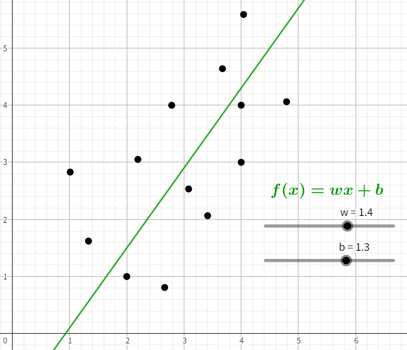
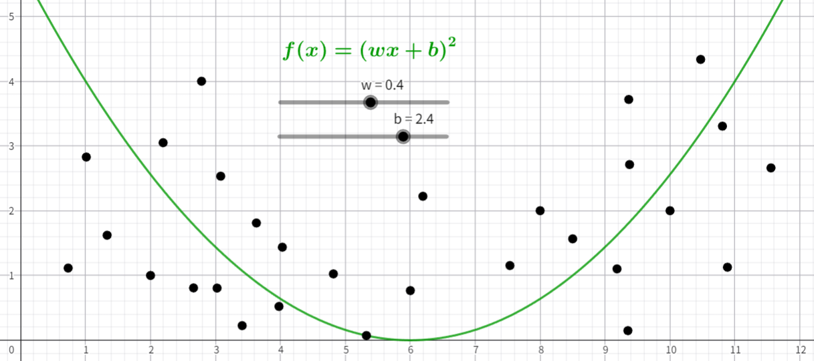
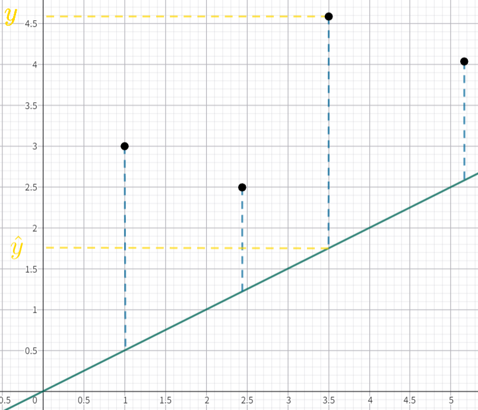

<script>
MathJax = {
  tex: {
    inlineMath: [['$', '$'], ['\\(', '\\)']]
  }
};
</script>
<script id="MathJax-script" async
  src="https://cdn.jsdelivr.net/npm/mathjax@3/es5/tex-chtml.js">
</script>

# Fundamentals of Artificial Intelligence

本系列文档着重探讨 AI 的基本原理

目录：

- [Back Propagation](Back_Propagation.md)

- [Epsilon-Delta Definition](Epsilon-Delta_Definition.md)

- [Gradient](Gradient.md)

- [Loss](Loss.md)

## 正文

人类的思考过程为：

```plaintext
输入 → 思考 → 输出
```

我们可以将其看作一个函数，但是我们很难明确这个函数，毕竟人类的思考过程很复杂。

但是我们知道输入和输出，比如在对话上输入“现在几点”会输出“九点”，所以我们就可以让 AI 来慢慢近似这个函数。

很多时候我们难以找到一个完全吻合所有数据的函数，但没有关系，我们只需从结果上看尽量近似就行了,比如像这样：



但是线性函数 $f(x) = wx + b$ 在很多情况下并不好用，这个时候我们就需要使用非线性函数比如：



这里的函数就是将原先的 $wx + b$ 外面再套一层非线性运算：$(wx + b)^2$, $\sin(wx + b)$, $\log(wx + b)$，表示为 $f(x) = g(wx + b)$

我们还可以用图像表示：


这些函数称作激活函数 ，常用的激活函数其实并不复杂，比如：

- **Sigmoid**

  $$
  \sigma(x) = \frac{1}{1 + e^{-x}}
  $$

- **Tanh**（双曲正切）

  $$
  \tanh(x) = \frac{e^x - e^{-x}}{e^x + e^{-x}} = \frac{\sinh(x)}{\cosh(x)}
  $$

- **ReLU**（Rectified Linear Unit）

  $$
  f(x) = \max(0, x)
  $$

- **Leaky ReLU**

   ($\alpha$ 通常取较小的正数，比如 $0.01$)

  $$
  f(x) = \max(\alpha x, x) \quad
  $$

- **ELU**（Exponential Linear Unit）

  （$\alpha$ 通常取 $1.0$）

  $$
  f(x) = \begin{cases} x & \text{if } x > 0 \\ \alpha (e^x - 1) & \text{if } x \leq 0 \end{cases} \quad
  $$

- **Swish**（一种自门控激活函数）

  $$
  f(x) = x \cdot \sigma(x) = \frac{x}{1 + e^{-x}}
  $$

- **Softmax**（常用于多分类输出层）

  对于输入向量 $\mathbf{z} = (z_1, z_2, \dots, z_n)$，第 $i$ 个输出为：  

  $$
  \text{Softmax}(z_i) = \frac{e^{z_i}}{\sum_{j=1}^n e^{z_j}}
   $$

输入一般不止一个，两个输入的函数为 $f(x_1, x_2) = g(w_1 x_1 + w_2 x_2 + b)$，图像为：


有时候即使使用了一次激活函数也不能很好拟合数据，于是我们就会进行“套娃”：

将 $g(w_1 x_1 + w_2 x_2 + b)$ 看做一个整体

先进行一次线性变换：$w_3 g(w_1 x_1 + w_2 x_2 + b) + b_2$

再套上一层激活函数 $g(w_3 g(w_1 x_1 + w_2 x_2 + b) + b_2)$，这时的图像就会向前多一个神经元：


中间的 $g(w_1 x_1 + w_2 x_2 + b)$ 就成了隐藏层 $a$

以此类推还可以 $g(w_4 g(w_3 g(w_1 x_1 + w_2 x_2 + b) + b_2) + b_3)$

理论上我们可以构建出非常复杂的线性关系，并逼近任意连续函数

再次说明我们需要干的事：以 $y = g(w_3 g(w_1 x_1 + w_2 x_2 + b) + b_2)$ 举例，我们知道 $y, x_1, x_2$，我们需要得出 $w_1, w_2, b_1, b_2$

我们需要知道我们函数是否拟合数据，这个时候我们就要使用损失函数，以这张明显拟合的不好的图像举例：



真实值为 $y$，预测值为 $\hat{y}$，所以误差就为 $|y + \hat{y}|$

损失函数（Loss）的定义为：

> 用一个非负函数来度量预测值 $\hat{y}$ 与真实值 $y$ 的不一致程度

我们需要的整体误差即损失函数为：

$$
\sum^{N}_{i = 1} |y_i - \hat{y}|
$$

这是 L1 Loss

我们一般使用平方即 L2 Loss，而不使用绝对值：

$$
\sum^{N}_{i = 1} {(y_i - \hat{y})}^2
$$

这是因为平方能够：

- 消除正负性

- 对大误差惩罚更重

- 光滑、可导

- 小误差被放得更小

Loss 更具体内容详见 [这里](Loss.md)

我们再使用 MSE, Mean Squared Error（均方误差）来消除样本数量的差异：

$$
\frac{1}{N} \sum^{N}_{i = 1} {(y_i - \hat{y})}^2
$$

这是一个关于 $w, b$ 的函数：

$$
Loss(w, b) = \frac{1}{N} \sum^{N}_{i = 1} {(y_i - \hat{y})}^2
$$

对于一个多元函数求最小值，就是让每个参数的偏导数等于 $0$：

$$
\frac{2}{}
$$
