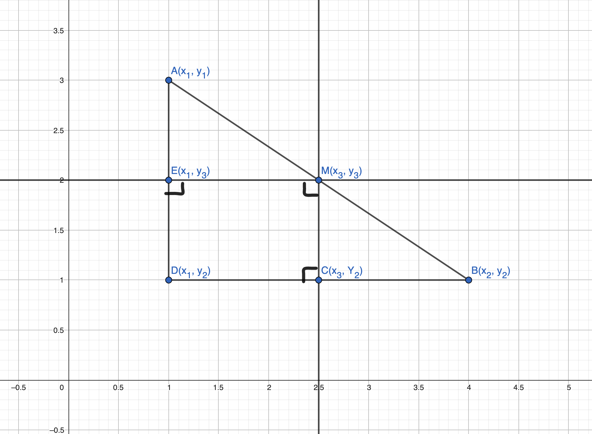

# 线段中点的坐标公式

## 公式:

设线段端点为$A(x_1, y_1)$, $B(x_2,y_2)$,那么中点$M$的坐标为$(\dfrac{x_1+x_2}{2}, \dfrac{y_1+y_2}{2})$

## 分析:

### 先考察一维单轴(轴为直线)的情况:

设$M(x_3)$是线段$AB$的中点

$\vert AM \vert = \vert MB \vert$

不妨设 $x_1<x_3<x_2$

$\therefore x_3-x_1=x_2-x_3$

$\therefore 2x_3=x_1+x_2$

$\therefore x_3=\dfrac{x_1+x_2}{2}$

### 扩展至二维欧几里德平面:

点$E$是直线$AD$的中点,点$C$是直线$DB$的中点

根据上文单轴情况得出的结论,可以推出:

$x_3=\dfrac{x_1+x_2}{2}$

$y_3=\dfrac{y_1+y_2}{2}$

所以$M(\dfrac{x_1+x_2}{2}, \dfrac{y_1+y_2}{2})$

本文绘图参:
1. 一维单轴(轴为直线)[geogebra.org](https://www.geogebra.org/calculator/kkhbjuzj)
2. 二维欧几里德平面[geogebra.org](https://www.geogebra.org/calculator/hyg232ek)