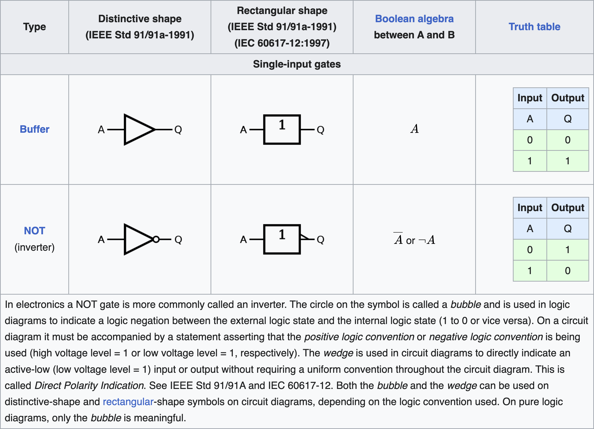
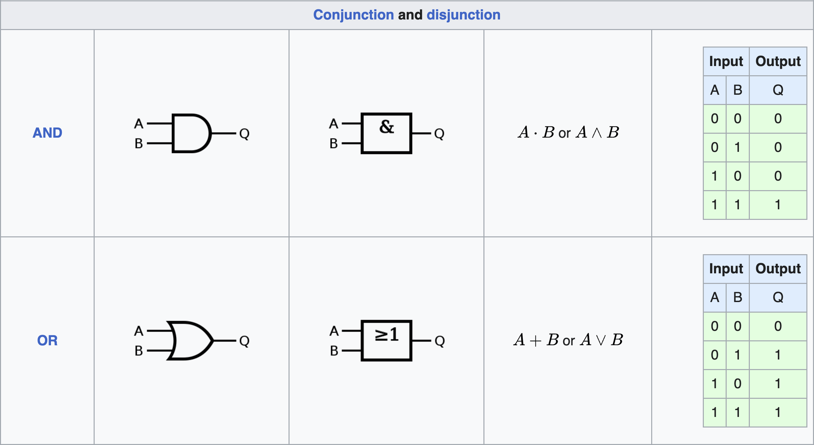
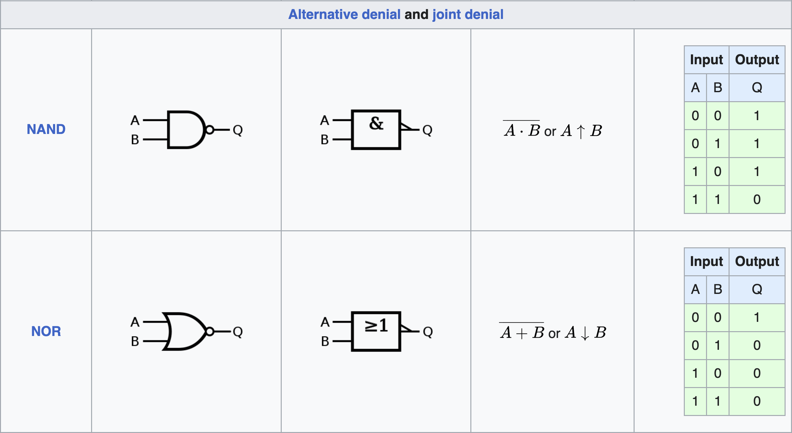
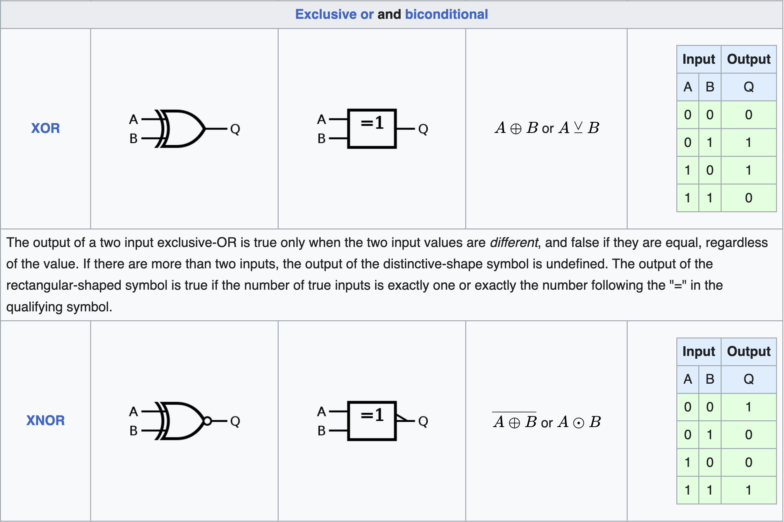
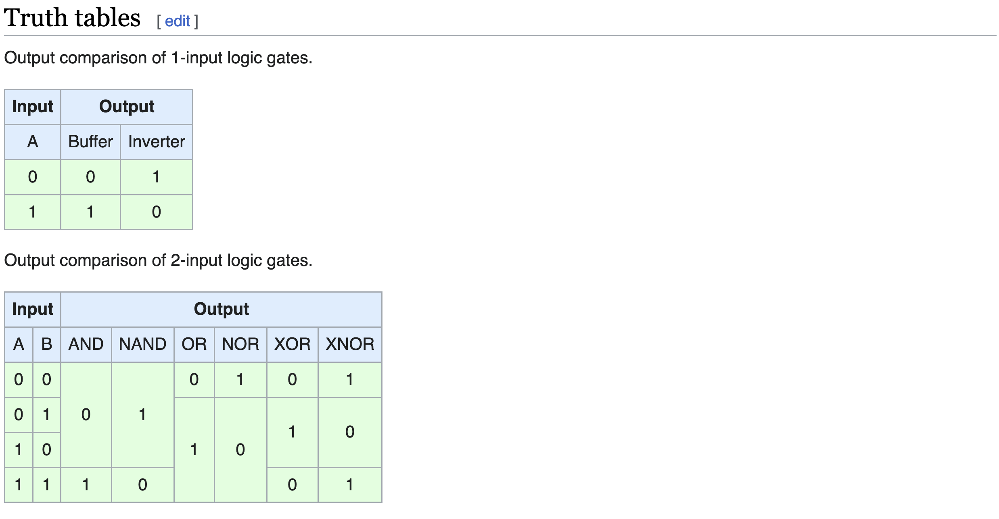
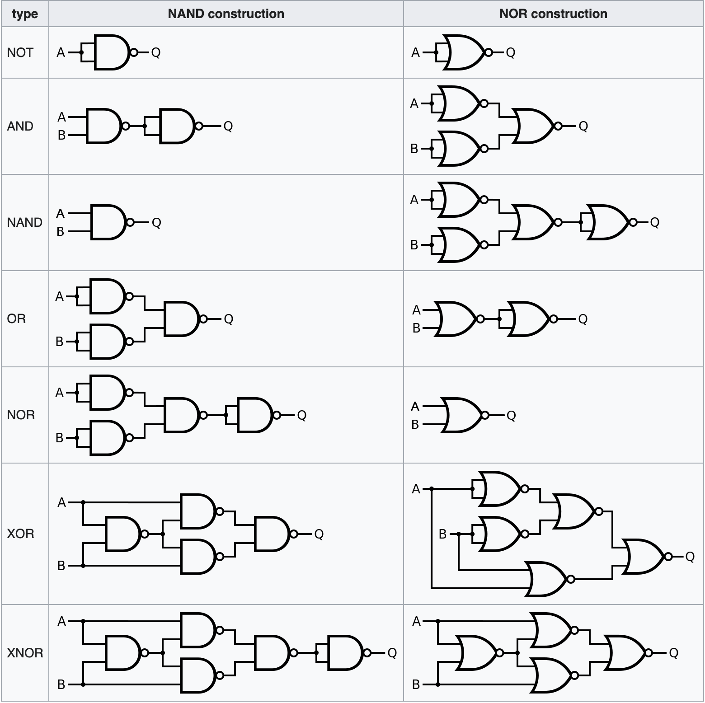

# Minecraft Redstone Digital Circuits Basis Introduction One

### ♟00丨导读

### ■ 导读

本教程面向两类玩家,一类是需要快速学会各种红石电路制作方法的入门玩家.
另一类是掌握一定基础,但需要学习进阶电路理论与高级设计的进阶玩家

为照顾不同类型读者,在此为两类玩家提供不同的阅读方法与目标参考:

• 对"入门"玩家的建议

快速浏览,以看图为主

如果你只想知道红石电路怎么做,不想学专业概念术语,请将重心放在文中所有有关红石电路的动图和静图,并忽略所有看不懂的文字内容

文中提供了大量红石电路的图片,你可以在游戏中复现它们.
你只需要明白这些红石电路有什么用,并且知道这些电路怎么做就行.
最好能记住电路叫什么名字

当然,如果你能理解并学会所有内容的话,那就更好了!

本教程重点在于逻辑电路原理,而不是红石元件的性质.
但如果你对教程里红石元件的各种性质有比较大的困惑,甚至阻碍了对逻辑电路原理的理解.
可以先看"剖析MC系列":

<https://youtu.be/oHmTDLE6geE>

剖析MC系列讨论了各种红石元件的特性,这也是它们的侧重点,本教程主要侧重红石数电

• 对"进阶"玩家的建议

将所有内容完整看一遍

02,03,04节讨论了有关逻辑门,触发器和锁存器的一些专业概念与术语

05节介绍了各种可利用的红石特性

05节介绍了用于辅助红石电路建造,快速复制粘贴电路的工具

07节展示了一些实用的红石逻辑门,触发器方案

06节讨论了逻辑表达式,及相关的简化技巧

• 关于本部分

本部分是“数字电路”中的第一部分,主要讨论红石逻辑电路基础元件的知识和理论,最好了解过逻辑门和集合论,Minecraft必须相对熟练,不然很麻烦!还有基本的数学,其他不做硬性要求

在此希望各位也去看看第二部分!

## 目录索引

01 • 为什么要了解逻辑电路,有什么用?

    ■ 逻辑电路在各个红石领域中的用途

02 • 在MC中的基础逻辑门元件方案

    ■ 非门,与门,或门 ■ 异或门,同或门 ■ 用逻辑门设计电路

03 • 在MC中的基础触发器与锁存器元件方案

    ■ 触发方式 ■ T触发器 ■ RS锁存器 ■ D锁存器 ■ 用触发器和锁存器设计电路

04 • 电路符号,模块化

    ■ 逻辑门符号 ■ 触发器符号 ■ 模块化

05 • 红石电路特有的性质(特性),红石设计辅助工具

    ■ 红石线的线或 ■ 信号强度 ■ 信号衰减 ■ 活塞,半砖,投掷器 ■ 无延迟电路 ■ bud ■ tick流水 ■ 红石设计辅助工具

06 • 逻辑表达式,真值表

    ■ 逻辑运算符号 ■ 逻辑表达式与公式化简 ■ 真值表

07 • [附页] 布线分类,常用红石基础电路模块大全

    ■ 布线分类 ■ 与,或,非门 ■ 异或门 ■ 同或门 ■ D锁存器/触发器 ■ RS锁存器 ■ T锁存器 ■ 无延迟元件

08 • 引用声明

    ■ 内容 ■ 图片 ■ 网址链接🔗

## 正文

### ♟01丨为什么要了解逻辑电路,有什么用?

在现实生活中,逻辑电路与我们息息相关,我们熟知的产品:电脑,手机,数字电视,数码相机,这些数字产品都离不开逻辑电路的原理

在MC中,我们同样离不开逻辑电路,各种红石电路设计都与逻辑电路原理紧密相连,在MC的红石数字电路中,我们会用到所谓的"逻辑电路"来设计一个数字电路系统

逻辑电路由各种基础的"逻辑门","触发器"和"锁存器"以及将他们相连接的导线组成,他们各有不同功能.
将这些功能不同的器件进行组合,我们就可以得到任何所需功能的电路

#### ■ 及逻辑电路在各个红石领域中的用途:

逻辑电路与红石密不可分,下图就展示了逻辑电路在红石各个领域的用途:

对于红石数字电路和红石计算机玩家来说,本教程会是一个基础入门教程,但同时对其他领域的玩家来说,也是一个值得学习的拓展进阶教程,因为逻辑电路在红石电路里几乎无所不在

相较其他的红石逻辑电路教程,本教程用图说话,简洁明了,教程里的所有基础红石元件都是我做的(或找到的)最优秀设计

### ♟02丨在MC中的基础逻辑门元件方案

下文图中方块各颜色含义

为了方便理解电路,我们今后约定在图中:

绿色方块表示数据输入   红色方块表示数据输出   粉色方块表示触发或控制输入   橙色方块表示电路本体

在描述中,我们约定:用"1"表示红石信号强度非零.(即红石灯能亮)

用"0"表示红石信号强度为零.(即红石灯不能亮)

(可以将这几个约定复制到备忘录📕里,在阅读下文时方便随时对照参考)

#### ■ 非门,与门,或门

与,或,非门是3个最基础的逻辑门,下面就分别展示了它们的功能和电路:

非门,输入反转为输入,输入亮则输出灭(或者说有一个输入1,输出0),输入灭则输出亮(或者说有一个输入0,输出1),因此得名"非"门(图见下)

与门,两输入都亮(或者说输入都为1)时才有输出(或者说输出为1).因此得名"与"门(图见下)

或门,只要两输入中有一个亮(或者说有一个输入为1),就会有输出(或者说输出为1).因此得名"或"门(图见下)

• 非门: 输出与输入相反

• 与门: 输入都为亮,时输出才亮

• 或门: 只要有一个输入为亮,输出就会亮

其中或门电路用到了半砖只能单向传递信号的性质防止了信号的回流.
这是一个非常有用的性质,因为它没有延迟(如果用中继器防止了信号回流,那将有延迟)

#### ■ 异或门,同或门

异或,同或门比与,或,非门稍复杂一些,它们的功能和电路如下:

异或门,两输入不同时输出亮起(或者说两输入不同时输出为1).因此得名"异"或门(图见下)

同或门,两输入相同时输出亮起(或者说两输入相同时输出为1),因此得名"同"或门(图见下)

• 异或门: 仅两个输入中仅有一个亮起时,输出才会亮

• 同或门: 仅两个输入中仅有一个亮起时,输出才不亮

也可以这样把同或门变成异或门:用红石火把(或者说非门)反转异或门的输出就能把异或门变成同或门

▶附页补充了其它逻辑门设计◀

#### ■ 用逻辑门设计电路

现在让我们来用逻辑门做简易几个电路,以熟悉它的使用

• 例: 三控开关

描述:用3个开关同时控制一个灯,相当于一个3输入的异或门(图见下)

注:

1,本三控开关如图,其实就是2个异或门连起来了

2,本三控开关可延伸至加法器

• 例: 1010判断器

描述:当电路输入为1010时候,输出为1,否则为0(图见下)

注:

1,本1010判断器在红石数字电路上没有用处

• 例: 数据选择器

描述:这个数据选择器有A和B共2个数据输入和1个数据选择.
当数据选择为1时,这个电路将输出A,否则输出B(图见下)

注:

1,为了能看清内部电路细节,粉色输入相连的线上用了一些透明方块,实际上它们是屏障方块.
可以替换为普通实心方块(数据选择器)

2,本数据选择器可延伸至解析器

### ♟03丨在Minecraft中的基础触发器与锁存器元件方案

如果说逻辑门主要是用来实现经典逻辑的,那么触发器与锁存器就是主要用来实现时态逻辑的

• 触发器和锁存器与逻辑门的区别

对于单个逻辑门,其输出完全取决于当下的输入,而不取决于曾经的输入

但对于触发器和锁存器,其输出不仅取决于输入,还取决于其内部的状态.
触发器和锁存器可以存储状态

过去的输入会改变触发器和锁存器的内部状态,而触发器和锁存器的输出会被内部状态影响(一般就是直接根据它的内部状态产生输出)

所以对于触发器和锁存器,以前的输入会影响到现在的输出,由此沟通了过去,现在,未来

#### ■ 触发方式

我们先来讨论边沿触发方式,边沿触发分别为:上升沿触发,下降沿触发,双边沿触发

上升沿和下降沿分别对应信号变化的两个相反的过程:

• 上升沿: 信号从"0"变为"1"的过程

• 下降沿: 信号从"1"变为"0"的过程

• 双边沿: 上升沿和下降沿的统称

直观的例子如下图:

如上图边沿触发的例子,左边是上升沿触发,中间是下降沿触发,右边是双边沿触发.
观察者方块能直接实现双边沿检测,是非常有用的方块

如果按下按钮的瞬间,红石灯闪一下,就说这个红石灯是上升沿触发的

如果按钮按下后,按钮回弹的瞬间,红石灯才闪,就说这个红石灯是下降沿触发的

如果按下瞬间,回弹瞬间都会闪一下,就说这个红石灯是双边沿触发的

除了边沿触发方式还有别的触发方式,在这里一起总结它们:

• 边沿触发方式: 在信号跳变的一瞬间触发

• 电平触发方式: 在信号为"1"的时间内,电路保持触发,为"0"时保持不触发.
这叫高电平触发(这句话的"1"和"0"互换后同样也可以成立,叫低电平触发)

• 其它触发方式: 当然也可以有其它触发方式,只要电路需要某种其它的触发方式.
但这些其它触发方式可能相对特殊,运用不广.
只需要在用某个元件时能明白它的触发方式就行了!

#### ■ T触发器

T触发器能实现按钮变拉杆的效果(按一下亮,再按一下灭),它的作用如下图: 

如上图T触发器,按一下翻转一下.
图中方案没有使用到活塞瞬推特性(属于能正常在现实中复制的机器),因此在BE和JE通用.
两个漏斗间有一个漏斗里有物品,按下按钮会让这个物品传到对面那个漏斗

• 这个T触发器涉及的红石特性

这个T触发器用到了漏斗的一个特性:漏斗被充能时会锁住里面的物品而不漏出去

所以左边输入让漏斗上方的红石线就会突然熄灭一下,然后漏斗解锁一下,把物品传到对面,然后马上又被锁住了.
在游戏里试试就知道是什么情况了

• 这个T触发器的功能

T触发器有"1","0"两种状态,我们根据这个电路输出的判断T触发器状态.
输出"1"就说明处于状态"1",输出"1"说明处于状态"0".
按下按钮则会让T触发器状态翻转

翻转的意思就是状态在"1"和"0"之间翻转,比如,当前状态为"1",翻转一下就成"0"了,反之亦然

习惯上,图里T触发器的绿色按钮对应的输入被称为"时钟端"之所以叫时钟端,因为在现实中它经常被连到时钟电路上

本来T触发器还应该有一个"T端",T端为0时,时钟端触发不能翻转内部状态.
为1时,时钟端触发才能翻转内部状态.但为了优化体积,删去了.
或者说有个隐含的,永远为1的T端

• 以这个T触发器为例讨论触发器触发方式

T触发器可以有"上升沿T触发器"和"下降沿T触发器"两种子类型

从名字我们就知道它们分别采用了上,下边沿触发的触发方式.
"上升沿T触发器"在时钟端上升沿触发,"下降沿T触发器"在时钟端下降沿触发

从动图可以看出,图中的红石T触发器属于"上升沿T触发器"

• 触发器和锁存器的触发方式之分

触发器和锁存器的触发有触发方式之分,可能是上升沿,下降沿,双边沿触发.
或者是电平触发等其它触发方式.
等下我们要介绍的D锁存器就属于电平触发方式

在下节会详细讨论触发器和锁存器两者之间的区别,有很多人混淆二者!

一般来说,触发器都是边沿触发,锁存器都是电平触发

我们也可以通过调整电路结构可以改变电路的触发方式.
在实践中请自行考虑

#### ■ RS锁存器

RS锁存器如下图:

RS锁存器有两个按钮输入,按下可让RS锁存器进入对应状态.
RS锁存器有两个输出,分别叫"正逻辑输出"和"负逻辑输出",一般我们只使用两个输出中的一个

• 这个RS锁存器涉及的红石特性

这个RS锁存器其实就是两个首尾相接的红石火把.
事实上,在MC里只要把两个非门元件首尾相接起来,就可以做一个RS锁存器

在现实电路中就不能直接用两个非门首尾相接了!因为现实中不能随意支持所谓的"线或",这个话题后文会进行讨论

并且同时,在两个非门(图中是红石火把)那里放输入按钮,这样按一下就可以转换RS锁存器的状态.
然后再把两个非门的输出拉出来,就得到了电路的输出,就像图中那样

• 这个RS锁存器的功能

RS锁存器本身可能处于"1"或者"0"两种状态之一.
按下两输入端上的按钮可以改变RS触发器的状态.
两按钮中的一个按钮能把RS锁存器状态重置为"1",另一个则相反,重置为"0"

输出端输出了RS锁存器的状态,图中的RS锁存器有两个输出,我们一般只使用其中一个,因为很显然其中一个输出为"1"时,另一个输出必为"0"

所以只需要给其中一个输出加一个非门反转,就能得到另一个输出的值

习惯上,图中两个绿色按钮输入分别可以称为"R端"和"S端".
能分别将RS锁存器状态设置为"0"和"1"

• 正逻辑和负逻辑

图中的RS锁存器有两个输出,它们分别是"正逻辑输出"和"负逻辑输出".
顾名思义,它们是相反的,一般来说我们只会用到其中的一个

如果内部状态为"1",却输出"0",而状态为"0"时输出"1".
就说这个输出是负逻辑的

反之,如果状态为"1"输出"1",状态为"0"时候输出"0".
就说这个输出是正逻辑的

总之正,负逻辑是相反的.
有时电路元件会同时提供正,负逻辑两种输出

也正因为正,负逻辑是相反的,所以正逻辑输出加一个非门就能得到负逻辑输出,负逻辑输出同理.
它们之间可以相互推导得出,因此一般只需要两者之一,通常用正逻辑,有时用负逻辑

正,负逻辑也不一定就体现在输出上,一些电路输入也会标注是正逻辑或者负逻辑的,如果某个电路输入是负逻辑的,那就相当于这个输入被取反了.
就相当于加了个非门

#### ■ D锁存器

D锁存器如下图:

电平触发的D锁存器,在MC中可以利用中继器的锁存态制造出又小又快的D触发器

• 这个D锁存器涉及的红石特性

这个方案用到了中继器锁存态的特性.
如果你看到中继器上面多出了一个奇怪的小棒子,就说明这个中继器处于锁存态,这个中继器的信号被"锁住了"

当中继器被另一个中继器或者比较器在侧面充能时候,他会进入锁存态并保持住自己的状态(亮或者灭),并且忽略输入端的输入,在游戏里试试就知道是什么情况了

• 这个D锁存器的功能

D锁存器也有"1","0"两状态,我们也同样直接根据输出判断它的状态是什么

按下图中的按钮后,D锁存器的状态会被更新到输入.
比如说,如果现在输入是"1",按一下按钮,锁存器状态就变成"1"了,如果输入是"0",按下按钮,锁存器状态就会变成"0"

也就是说,按下那个按钮,D锁存器的状态就会更新为输入的值

图中绿色的拉杆输入习惯上被叫做"D端"

• 以这个D锁存器为例讨论电平触发

先把前文中电平触发的定义搬下来,方便你懒得翻来翻去:

• 电平触发方式: 
在信号为"1"的时间内,电路保持触发,为"0"时保持不触发.
这叫高电平触发.
(这句话的"1"和"0"互换后同样也可以成立,叫低电平触发)

那么我们就来结合实例讨论电平触发

图中的D锁存器就是"电平触发"的.
因为在粉输入端"持续输入1"时,图中的中继器被"解锁"了.
此时它变回了普通的中继器,是亮是灭全取决于输入.
也就是说处于"保持触发"中

而当粉输入端恢复到"持续输入0"时,中继器又进入了锁存态,于是内部状态被锁住了,也就是说处于"保持不触发"中.
这就是电平触发方式

如果说边沿触发检测的是信号改变的一瞬间,那么电平触发就是直接检测信号是什么,为"1"时该做什么,为"0"时该做什么

电平触存在一些缺点,所以在现实中的设计时常会避免使用电平触发方式.
但在Minecraft中我们一般可以忽略

▶附页补充了其它触发器设计◀

#### ■ 用触发器和锁存器设计电路

• 例: 4位暂存器

描述:用D锁存器设计一个4位的暂存器,电路会输入4个1或0.要求按下控制输入端按钮时,电路能将内部的存储数据更新为电路的输入.
且能输出内部的存储数据

4位暂存器,其实就是4位"二进制"暂存器,竖着布线的

• 例: 1010时序脉冲发生器

现在我们来做一个"1010时序脉冲发生器",它的功能就是循环输出1,0,1,0,1,0...

描述:电路会提供一个按钮输入,按一下输出1,再按一下输出0,再按一下输出1,以此类推

1010节拍发生器,没错它就是一个T触发器

我们发现T触发器刚好可以直接实现这个功能,所以就直接用T触发器了

### ♟04丨电路符号,模块化

电路符号是实际电路的抽象符号,为了方便我们设计电路,我们一般需要绘制所谓的"电路图",以抽象符号的形式表示电路的结构

对于较复杂的电路设计,几乎不可能离开电路图(HDL除外!)的帮助,电路图还能导入到某些软件进行仿真测试,为我们的设计检测错误以及优化

下图就是一个电路图的例子,它的功能就是曾经给过的例子"三控开关"

逻辑电路图,左边的方块表示输入,右边的圆圈表示输出,中间的符号意思其实是异或门,我们马上就会了解到

为了理解电路图的含义,我们就要搞懂这些电路符号的意思

#### ■ 逻辑门符号

(上图源至<https://en.wikipedia.org/wiki/Logic_gate>强烈推荐👀原文,因为我只转载了符号部分,原文更全面)

#### ■ 触发器符号

我只讲最简单的图(其他都可以以此类推,暂且相信各位得很聪明🤪),因为我懒得转载(实在是太多了),追求完美的请👀<https://en.wikipedia.org/wiki/Logic_gate>

一些触发器符号,JK触发器我们用不到不用了解.
左边的方块是输入,右边的圆圈是输出.触发器下面3根线我们也不用管,用不到.(符号来自"Logisim"内置库)

可以发现这些现实触发器符号的输入输出跟我们之前讲的不太一样,比我们的红石元件多出了一些其它的输入输出.
红石元件不提供完整的输入输出,主要是为了优化体积速度

跟逻辑门符号一样,触发器同样也有不同的符号标准,根据自己的习惯以其中一套为主就行

• 锁存器与触发器的区别(上)

之前介绍的是RS锁存器和D锁存器,图里却变成了触发器,这是为什么呢?

其实锁存器和触发器完全是两个东西,但在Minecraft中我们很少区分

这就涉及到锁存器和触发器的区别.
很明显,我们之前介绍的RS锁存器没有时钟端,但是图里这个RS触发器有.
有无时钟端,这就是锁存器与触发器的最大区别

我们先了解图中这些触发器的功能,再继续讨论这个问题

• 图中触发器的功能

现在我们来看看,当图里这些触发器的时钟端触发时,会怎么样:

时钟端触发,就比如举例来说,假设时钟端是"上升沿触发"的,那当时钟端信号"由0变1"时,这个触发器就会被触发.
如果把这个例子中的"上升沿触发"换成下降沿触发等,"由0变1"换成"由1变0"等,也同理!以此推广.

1. 对于图中T触发器,时钟端触发时:

   如果触发器的T端为1则翻转触发器状态,为0则不翻转

2. 对于图中RS触发器,时钟端触发时:

   如果R端为1,则置触发器状态为0,S端为1则置为1.
   如果触发时R,S两个端口同时为1或者同时为0,则触发器状态保持不变

3. 对于图中D触发器,时钟端触发时:

   触发器内部状态将更新为D端输入的值.
   D为1就置为1,为0就置为0

总之,当时钟端改变信号时,如果触发方式的触发条件符合,那么在触发的一瞬间,触发器就会根据其输入端(D,T,R,S,J,K这些输入端)的值来改变触发器的内部状态

因此,这些触发器都是提供一个边沿触发的"时钟端"来控制电路的

• 锁存器与触发器的区别(下)

现在你知道触发器的功能了,也知道它们有所谓的"时钟端",并且仅在"时钟端"信号改变的一瞬间工作(边沿触发方式)

拿之前的红石D锁存器做对比,D锁存器是电平触发的,它在控制端信号为"1"的整个周期里,都是一直保持触发

而图中的D触发器,仅仅在"时钟端"信号改变的一瞬间触发

通俗来讲:

触发器的触发机制只关注信号改变的一瞬间(边沿触发方式)

锁存器的触发机制关注信号是"1"还是"0"(电平触发方式)

我不提供锁存器的符号(其实是没找到),但是感兴趣可以自己找

• 为什么叫时钟端

之所以叫时钟端,因为在现实中它通常会连接到一个时钟,每隔一段时间时钟会改变一次信号,然后信号改变被触发器捕捉.
这样的话,统一时钟就能让电路同步到一个固定的节拍上

• 为什么红石元件跟图里不太一样,少了这么多输入输出?

在MC中,由于红石电路的限制,且为了让电路体积和性能更加优越,我们通常不会提供相当完整的输入输出端口,而是进行取舍,删去部分用不到的输入输出

实际上红石触发器和锁存器很少有功能完整的

比如在输出上仅提供正负逻辑输出两者其中之一.
因为一般只需要用到一个输出

或者仅提供时钟端,就比如之前的红石T触发器

或者调整触发方式,就如之前的D锁存器,简化自D触发器

在MC中,只要不影响你需要的功能,怎么改都可以.
不应该让死板的术语定义限制自己的灵感.
但也不能过于脱离实际,至少最终产生的概念还是应该用标准化术语来进行描述

要注意到你的最终目标是效果与最终成品,而不是某个细节的吹毛求疵.
过分遵循某些严格的"规定",术语的"概念"只会限制设计的自由度

#### ■ 模块化

实际设计中经常会重复用到一些电路结构,这时候我们就可以把它们封装为"模块"

所谓模块化,就是用一个自定义的新符号抽象表示某个电路结构,如下图:

将左边的电路封装成右边的那个"模块"后,看起来就舒服多了.
这样进行重复的复制粘贴时就只需要复制粘贴右边的那个模块.
而无需关注模块内部的电路细节.
通常会有很多别人事先做好的,预先封装的模块给你直接用.
这时候就只需要了解模块功能,而无需关注内部电路的设计细节(尽管一般也不会给你看)

将电路封装为"模块"以后,我们在需要用到这个电路的时候就能直接使用这个模块,而无需重复再将这个电路设计一遍.
从而大大减少工作量,并且让电路图可读性大大提升

• MC中的模块化(其实就是复制粘贴)

在MC里,我们可以借助/clone之类的指令,或者插件模组还有第三方工具帮我们像这样快速复制粘贴电路,被复制的样本姑且称为模块,我在下节就会介绍一些这样的好文明

要注意的是,MC并没有真正的"封装",因为红石电路粘贴出来后,电路内部是完全暴露的,可以随便修改电路

这也不是什么坏事,实际上,我们经常会直接修改粘贴出来的模块,让它跟周围的电路更适配.
MC不能自动接线和生成布局,连电路间的接线都需要一根根手动接好

细小的优化会消耗大量的宝贵时间,所以最好还是妥当安排好设计流程的时间表,把时间花在最值得优化的部分,防止电路做不完(如果是有组织的大团队,就当我没说🤪)

### ♟05丨红石电路特有的性质(特性),红石设计辅助工具

这节我们来了解一下红石具有的一些特性,利用这些特性,可以设计出更好的红石电路

#### ■ 红石线的线或

现实中不允许让一根导线同时被输入"1"和"0"

红石与现实的区别之一就是红石线自带"线或",红石线的每一处都相当于一个或门,信号强度高的覆盖低的,除了红石线,被充能的普通方块,被充能的红石元件等等,也同理

利用红石线的"线或"可以实现无延迟或门(但最好别用)

  • 现实中的线或

现实中也存在"线或",甚至"线与"的概念(其实和红石不太一样).
但能使用的情景有限,所以一般情况还是就如上图那样,一根导线是不允许同时接受"1"和"0"两种输入的

#### ■ 信号强度

一般来说我们只会关注元件的激活/非激活,红石线的亮/不亮.
但是实际上,对于一些红石元件来说,红石信号是有信号强度之分的

比如对于红石线来说,总共有0~15一共16种信号强度,并且比较器能对信号强度进行比较或者减法,基于这些性质,我们就可以设计所谓的"模红电路",即处理信号强度的电路

"模红电路"的优势是带宽较大,输入和可能输入0~15之间的任何信号强度.
事实上,一个0~15范围的信号强度输入足以代替4个非"1"即"0"的输入

• 模红电路的局限性

"模红电路"也有巨大的缺点:红石线会随着距离衰减信号强度,因此为了传导"模红信号"(范围为0~15的红石信号),必须使用延迟更高或者体积更大的导线电路

此外,模红电路要实现位运算也相对麻烦.
但模红电路在存储上很方便

有些人想做出所谓的"模红CPU",实际上完全不可能比的过普通的"数红CPU",因为这涉及到许多模红电路的弱项.
总算下来得不偿失,因此不建议做"模红CPU"

• 模红电路的分类

一般将处理信号强度范围在0~15的模红电路称为"弱模电路".
通过BUG或命令方块还能产生大于15的信号强度(其实大家没必要在这上面花太多时间,一个插件直接搞定),用到大于15信号强度的电路统称"强模电路"

利用BUG或命令方块也能产生负信号,用到负信号强度的电路可以称作"渣模电路",负信号不能传播,只能传递1个比较器(同样大家没必要在这上面花太多时间,一个插件也可以直接搞定)

如果对一个输入信号非0的减法模式比较器两侧同时输入负强度信号,那么这个比较器的输出会反而增大.
非常神奇,但可惜至今没什么用途

此外,很多人直接将"模红电路"类比于现实中的模拟电路,但这并不是一回事.
请不要混淆(尽量不要使用bug)

■ 信号衰减

虽然红石线的信号衰减让人很头疼,但是有时候利用红石线的信号衰减能设计出意想不到的电路,封闭进位加法器(CCA)就是其中之一,它就利用到了信号强度衰减的性质

封闭进位加法器,我们以后会讨论它

#### ■ 活塞,半砖,投掷器

• 活塞

粘性活塞是一个很特殊的红石元件,因为它可以推拉方块,而方块又可以阻断红石线.

利用活塞推拉方块可以阻断红石线,以此实现半边无延迟的与门.
活塞加法器就利用到了这个特性,实现了在8位加法器内进位无延迟,且没使用0t(或者叫瞬推)

• 半砖

至于半砖开始做或门就用到了,利用半砖可以让红石线只能单向传导信号

漏斗,萤石,玻璃(玻璃仅高版本)等方块也可以代替半砖,但是漏斗很卡!建议少用

用半砖上传信号,并且信号只能单向上传.
在BE的话,可以用玻璃实现类似的下传导线.
漏斗是容器,有时候在布线中有用

• 投掷器

投掷器发射物品时候会从内部随机挑一个物品格发射,基于此可以设计出非常简单方便的伪随机数生成器,且经过调整,可以支持多种不同的概率.

该投掷器有$\dfrac{1}{9}$的概率掷出水桶

#### ■ 无延迟电路

JE存在大量无延迟特性,使得我们可以设计各种无延迟电路(尽量不要使用bug)

无延迟的原理涉及深层游戏机制(游戏源码),此处不做讨论

无延迟中继器和无延迟导线最实用,也用得最多.
但大量使用无延迟会有巨大副作用.
几个无延迟中继器与导线如下图:

下面的是无延迟中继器,上面的是无延迟导线.
如果按一下那个无延迟导线的按钮,整个导线都会同时收回红石块,然后又马上推出方块.
两元件仅JE可用!

剖析MC系列中介绍了一些无延迟导线方案

<https://www.youtube.com/watch?v=yYn3CFczLm8>

比较器也可以无延迟,但是似乎不是总是稳定的.
此外逻辑门也可以无延迟(尽量不要使用bug)

▶附页补充了其它无延迟电路设计◀

• 无延迟电路的局限性

无延迟电路虽然可以一瞬间完成运作,但是体积通常巨大.
不仅很卡,控制不当还很容易坏,导致修复调试火葬场,没人愿意调试一台这样如此容易出问题的电路

而且,一般的无延迟电路运作一次后,通常都需要等待一段时间让元件复位

这就是说,在复位的这段时间里不能再次运作(不然可能就坏了).
因此,无延迟电路的处理频率(每秒完成的处理次数)不一定高,无延迟电路的处理频率被复位延迟限制了

大部分无延迟元件较有延迟元件更容易故障,即可稳健性更低

有些人想用纯无延迟电路做出所谓的"无延迟CPU",但实际上这是无稽之谈,因为CPU更关注处理频率,而不是延迟

无延迟电路虽然可以一瞬间完成运算,但是复位不一定快.
因此完成一个操作后,必须等电路复位后才能开始执行下一个操作

而一条指令的执行可能等待很多次复位,尤其是采用流水化技术,时序更复杂的处理器,情况更严重.
无延迟便得不偿失

因此,不要滥用无延迟电路

• 在红石数字电路中使用无延迟导线

无延迟也并非一无是处.
实际设计中,也经常会用到无延迟导线作为控制线传输一些控制信号,尤其是传输距离有些远的时候.
原因是没有延迟更方便时序同步

电路中,很多导线并不需要24小时高强度高频率传输信号,而处于无延迟元件能接受的传输频率范围内(频率过高的话无延迟导线通常会出各种问题)

在较长的数据线上,也可以使用无延迟导线降低延迟,且根据Mojang写的奇怪更新机制,无延迟导线有时反而卡顿更低(不过会写插件的朋友可以自己调整,不会的就找人帮忙吧)

总之,如果传输距离较大,且信号传输频率在无延迟导线正常工作的频率范围内,那么无延迟导线是一个很好的选择,它会让时序设计更轻松,也能改善延迟

但无延迟导线外的其它无延迟元件,如无延迟逻辑门,就很少很少会用到了

在CPU的运算器件中使用无延迟会导致一场灾难(当然,如果只是是那种单次计算加减乘除之类的计算器中使用的并行运算器,那么随意)

另外,要避免让无延迟电路接收短脉冲.
有时这种短脉冲会以一种意想不到的方式产生,无延迟电路也可能以其它意想不到方式出问题,各种原因导致了无延迟电路调试困难

#### ■ bud

bud是JE的特性,相信大家早已有所耳闻.有关bud的一些介绍可以在Minecraft Wiki看到

Minecraft Wiki中有关bud的中文界面:

<https://minecraft.fandom.com/wiki/Tutorials/Block_update_detector>

利用bud可以制作bud存储器等电路,但现在中继器,比较器锁存器用的更多

奇怪的红石块隔空激活现象.
只有在JE版本才能体验这种奇怪特性(大佬说这个东西原因是qc,然后qc可以导致bud.不太懂.但是我们是弄红石数电的,不用太纠缠于这个的术语!)有关这类游戏特性的介绍,可以看看"剖析MC"系列视频.
还有各种TIS等生电大佬的视频

#### ■ tick流水

tick流水类似现实中的"延迟线"概念,举个例子如下图:

tick流水异或门,其实就是不停的输入数据,然后不停的产生运算结果,即使上一个运算还没结束.
也会马上把待算数据送进去,如果运算器不能处理过高频率的输入,那就只能降低输入的频率

tick流水能快速进行大量运算(但是这些运算必须相互独立,也就是无需等待上个运算的结果),不过tick流水电路的时序设计和调试难度很高,非常考验耐心和水平

为了让电路性能更好,大家经常会把tick流水的电路频率紧逼到2ticks处理一个运算,但这会带来了许多设计上的挑战,导致电路设计与调试难度极高

总之如果你的水平、专业知识很高的话可以尝试使用后再确定怎么弄

有时不妨放慢电路的处理频率,比如改成3ticks处理一个运算,或者4ticks.
这样就大大减轻了时序设计上的一些压力.
不仅降低了设计难度,还减轻了工作量

如果运用好的话,tick流水能提供非常强大的运算效率.
是传统串行运算器无法比拟的

如下就是一个tick流水运算器的例子,运算吞吐量高达每2ticks一个除法运算:

<https://www.youtube.com/watch?v=gViE6ZgirS0>

tick流水不仅可以用在运算器,也可以用在存储器中,类似现实中的"水银延迟线存储器",如下是tick流水存储器的例子,存储密度很高:

<https://www.youtube.com/watch?v=1zE_XZLTDBw&t>

在MC中,我们可以利用mod和第三方软件对电路进行复制粘贴和保存.
这对红石电路设计来说十分重要

这些工具中,WorldEdit,Litematic,Carpet这几个工具是游戏模组或者插键,如果你比较懒或者不会装模组,可以直接在网上找一个带有这些mod的整合包,这里直接给一个:

[mod](mod)

但要注意的是,很多工具的导出文件(schematic文件,schem文件,litematic文件等),不能同时支持1.12及以下版本,和1.13及以上版本

我唯一知道能将这些文件中的电路进行跨版本迁移的方法就是开一个支持多版本进服的服务器,然后通过这个服务器来交流1.12和1.13+的电路

并且这个办法不是完美的,一些容器,比如熔炉内的物品会丢失

接下来对一些设计辅助工具进行简介:

• 原版命令

不多说,难用,/clone还有最大范围限制.

• 结构方块

难用,最大范围限制32x32x32.

• WorldEdit

俗称小木斧或WE,可以找到单机版和服务器版.适合复制粘贴重复电路.并且能够导入导出schematic文件

有关WE的教程和指令列表可以看:

<http://mineplugin.org/WorldEdit>

WorldEdit的一些红石玩家常用指令

WE导出的schematic文件通常会被放在.minecraft\config\worldedit这个文件夹里面,导入时扫描的也是这个文件夹

• McEdit

是一个独立于mc的软件,现在最新有1.5.6.0和2.0两个版本,后者Bug多.
目前均只支持1.12及以下版本的存档.
适合较大规模的复制粘贴,但是其实速度并不快

我们主要用到的是McEdit的复制粘贴,克隆工具.
以及导入导出schematic文件的功能

在McEdit中,按Ctrl+S才会把你的更改保存到存档里,记得随手保存!

• Litematic

俗称投影mod,操作超级快,比McEdit还快

即使只在本地客服端有投影mod也可以在服务器中使用(把单机的东西投进去,或者把服务器里的东西投影出来).适合用来跨服跨存档搬东西

• Carpet Mod

Carpet是一个功能非常强大的模组,可以用来辅助分析红石电路运行.
打了Carpet的客服端一般俗称地毯端

Carpet加入了大量用于辅助分析电路运行的指令,如:

/tick warp 让游戏在一段时间内以最高速度运行.(而不是最高10ticks每秒)

/tick freeze 冻结游戏,暂停游戏tick,所有红石电路都会被暂停,再输一次解冻

/tick step 在游戏冻结时,让游戏解冻一段时间(可指定时间长度,精确到1 gametick)

Carpet也优化了许多游戏卡顿问题,让游戏运行更流畅.
并且修复了一些原版的bug(这个修复不会影响到我们的电路)

有关Carpet的介绍与下载链接在下方这个视频里都有:

<https://youtu.be/Lt-ooRGpLz4>

这个视频教程,视频评论区置顶评论标注了这个视频介绍内容的时间点,方便快速查找

各种生电服务器比如TIS对Carpet进行了各种魔改,增加各种各样的功能.
如果需要也可以去找,但一般来说原版Carpet就够了

• 程序接口

用Minecraft API或者Forge API等接口控制程序,可以实现许多不同的高级或复杂操作

• 电路仿真软件

我们可以借助电路仿真软件来设计和测试逻辑电路,电路仿真软件可以直观迅速地指出设计中的一些基本毛病,并且可以很方便地快速验证电路功能

如果你会硬件描述语言的话,也可以直接用硬件描述语言(如VerilogHDL)设计电路

参考软件: Logisim,Multisim,Proteus等

### ♟06丨逻辑表达式,真值表

这节我们来学习用数学工具来描述和简化逻辑电路

如果你学过集合论,那么我可以定义一个集合B = {1,0}.
接下来要讨论的运算都会在这个集合上进行(自变量和因变量都属于B).
或者说,我们只讨论B到B的映射

为照顾没学过集合论的同学😝,这里用白话重新说一遍:

在接下来的算数中,我们只会对参与运算的数取1或0.
像是2,4,12,110,010等这样既不是1也不是0的数都不会出现

就是说参与逻辑运算的数和运算结果非1即0,这样理解就行了

#### ■ 逻辑运算符号

在接下来的文中,$A$和$B$是两个变量,非$1$即$0$

• 与运算符号"$\And$"

与运算对应与门,它是一个二元运算,形如"$A \And B$"

现在我们列出与运算的所有情况:

$0 \And 0 = 0  ,  0 \And 1 = 0  ,  1 \And 0 = 0  ,  1 \And 1 = 1$

有时候会用其它符号表示与运算,比如"$A \wedge B$","$A·B$","$A\ and\ B$".
或者直接用"$AB$"表示(也就是乘法的写法),"$AB$"这种写法在逻辑表达式推导中常用,因为写起来方便

• 或运算符号"$+$"

或运算对应或门,也是二元运算,形如"$A + B$",这里的+不是一般意义上的加法,不要搞错了

现在我们列出与运算的所有情况:

$0+0=0  ,  0+1=1  ,  1+0=1  ,  1+1=1$

或门的其它符号比如"$A \mid B$","$A\ or\  B$","$A \vee B$"在逻辑表达式推导中我们一般还是用"$A + B$",因为看起来舒服

• 非运算符号" $\bar{}$ "

非运算对应非门,是一元运算,形如$A'$,就是右上角的那个小撇

非运算的所有情况:

$0'=1  ,  1'=0$

非门的其它符号比如 $not A$,$¬A$,$!A$ 或者在上面画上一横 $\bar{A}$ .我个人喜欢用 $A'$ ,所以接下来都用这个,因为字符好打

• 异或运算符号"$\oplus$"

异或运算对应异或门,是二元运算,形如"$A \oplus B$"

异或运算的所有情况:

$0\oplus0=0  ,  0\oplus1=1  ,  1\oplus0=1  ,  1\oplus1=0$

异或的其他符号比如"A xor B",由于$\oplus$这个符号不太好打,平时可以用"xor"

• 同或运算符号"$\odot$"

同或运算对应同或门,是二元运算,形如"$A \odot B$"

同或运算的所有情况:

$0\odot0=1  ,  0\odot1=0  ,  1\odot0=0  ,  1\odot1=1$

同或门的其它符号比如"A xnor B","$\odot$"这个符号也不好打,平时可以用"xnor"

#### ■ 逻辑表达式与公式化简

• 逻辑表达式书写

上面我们了解了逻辑运算符号,现在我们开始了解逻辑表达式,看两个例子:

$O=A \oplus B \oplus C$ : 这个就是那个三控开关电路的逻辑表达式,输入分别是$A,B,C$.输出为$O$

$G=(A \And B)+(C \And D)$ : 满足"$A=B=1$"或者"$C=D=1$"其中一个时,$G=1$

形如"$A \oplus B \oplus C$"这样的表达式就是逻辑表达式.
它的变量,比如"$A,B,C$"这些都必须非$1$即$0$,因为逻辑运算符号只能处理非$1$即$0$的运算

错误的例子比如"$8 \oplus 5 \And 9$",我们会发现上文没有定义$1,0$以外的数值在逻辑表达式中如何运算,所以这个表达式是未定义.
也就是说,定义域仅为$\{1,0\}$,值域也是

逻辑运算也可以拓展到$1,0$以外的数上,比如程序员常用的位运算,但是我们这里不讨论

你可以试着给先前的一些电路例子或者自己设计的逻辑电路写写逻辑表达式练手

当然,如果是触发器的话,单个逻辑表达式是写不出来的,因为触发器涉及"时态逻辑"

• 逻辑表达式化简

熟悉了逻辑表达式的书写后,我们来考虑如何用数学公式来简化它

注意,这个简化并不是绝对的,大部分情况下,你能将一个表达式变换出各种不同的形式,但是它们之间很难看出谁更适合实际情况

所以这时就要结合实际,根据实际情况判断哪个逻辑表达式更好.
比如,在minecraft中,能通过红石线直接实现$0$t的或运算,因此或运算可以比其它运算更快

现在列出一些用于简化或者变换逻辑表达式的公式定律:

在下文,我们规定"$A,B,C$"是非$1$即$0$的变量,"$AB$"或者"$A·B$"表示与运算,"$A'$"表示非运算.

有时公式会出现具体的$1$和$0$,那么$1$表示数字$1$,$0$表示数字$0$

• 0-1律

$A·1=A  ,  A·0=0  ,  A+0=A  ,  A+1=1$

• 互补律

$AA'=0  ,  A+A'=1$

• 重叠律

$AA=A  ,  A+A=A$

• 交换律

$AB=BA  ,  A+B=B+A$

• 结合律

$A(BC)=(AB)C  ,  A+(B+C)=(A+B)+C$

• 分配律

$A(B+C)=AB+AC  ,  A+BC=(A+B)(A+C)$

• 反演律(摩根定律)

$(AB)'=A'+B'  ,  (A+B)'=A'B'$

• 吸收律

$A(A+B)=A  ,  A(A'+B)=AB  ,  A+AB=A  ,  A+A'B=A+B$

$(A+B)(A'+C)(B+C)=(A+B)(A'+C)  ,  AB+A'C+BC=AB+A'C$

• 对合律

$(A')'=A$

上面公式很多,你可以截图存下,在需要的时候参考就行了,实际用的不多.
如果需要练习,可以在网上找,当然证明这些定律本身就是不错的练习

这只是一些基本公式,更多的简化技巧可以在网上找到,以及在实践中体会.
此外,上面的公式中不包括异或和同或运算的版本,请自己找或推导

虽然大多情况可以用机器自动简化,但也有时需要主观判断哪种变换形式更好

#### ■ 真值表

觉得公式太麻烦,不想算?其实也可以.
因为对于逻辑表达式来说,它的输入非1即0,因此我们能很轻松地列举出所有的输入输出情况.
并且把它写在一个表里

这样的表就是所谓的"真值表",通过真值表可以直观的看到一个逻辑表达式的所有运算情况,也能直观判断如何简化

比如现在我们来画一个异或门的真值表:

异或门/异或运算的真值表."$x$"和"$y$"是两个输入,"$x \oplus y$"是输出.

在最上一行格子列出所有的输入,输出端口.然后在下面写出所有可能的输入输出情况.
这样就能一眼看出所有的运算情况,从而让逻辑电路和逻辑表达式更直观

• 其它的逻辑表达式化简方法

"卡诺图"是一个类似真值表的东西,也是一张表列举所有情况,然后可以根据一些规则对卡诺图进行化简,从而简化逻辑(结果可能不一).需要了解可以搜索🔍

除了利用逻辑表达式公式和卡诺图化简外,还可以直接用机器化简算法化简,自动化简器当然用的就是机器化简算法

### ♟07丨[附页] 布线分类,常用红石基础电路模块大全

这个附页不会展示所有的方案,因为实在是太多了!
所以我挑出了能覆盖大部分使用情况需求的元件方案

部分电路是JE专用的,在下文会有特别说明

#### ■ 布线分类

你可能听说过数电有横竖斜三大神教.
一般来说红石数字电路的布线方式可以被大致分为这三类:横式布线,竖式布线,斜式布线

• 横式布线

就是横着布线的意思,电路是横的

这些电路都是横的,输入输出都是在一个横平面上

• 斜式布线

就是斜着布线的意思.电路是斜的

这是一个斜加法器,它的输入输出都在斜平面上

图里的加法器是$45^{\circ}$倾斜的,此外也有其它倾角的的模块/布线,只要输入输出都在一个斜平面上,可以统称斜式布线

• 竖式布线

就是竖着布线的意思,电路是竖的.
个人推荐做CPU用竖布线

有时这三类布线方式也会混合使用.
比如有些人做CPU存储器用竖布线,运算器却用斜布线.
也有些电路模块输入是横的,输出却是竖的,等等

有时为了优化甚至能够产生蛇形布线,这很常见

• 不同布线模块之间的接线

横竖斜电路当然可以相互接起来,但是横竖斜布线之间的转换有些麻烦,试想一下,如果要把一个横布线转换成竖布线该怎么做,这非常麻烦

横竖布线之间的转换最麻烦,要拐个大弯.
而横斜或者竖斜之间的转换要方便一些,因为直接把线拉过去就行了

• 不同布线模块之间的优劣势

下面以横布线和竖布线的转交为例说明不同布线间的优劣势区别:

一排横布线在横平面内的转角面积大,且长短不一

可以看出竖布线在竖平面的转角较横布线在横平面的转角更方便一些,这只是实际布线中许多情况的一种.
此外,不同类型布线的电路模块(如横逻辑门,竖逻辑门)也有所不同

总之,不同的布线各有优劣,请自己评估!但我个人更推荐竖布线,竖布线在红石计算机等许多电路中优势更大,且竖布线的电路通常看起来更整齐

#### ■ 与,或,非门

与,或,非门比较基础,所以没什么花样

• 非门

非门.左边是投掷器+漏斗,右边是比较器侧充能.
如果你的电路频率过高可以导致红石火把熄灭,可以用右边这个比较器侧充能代替红石火把作为非门

• 或门

或门.中间那个,去掉输出那里的非门可以变成或非门

• 与门

e...与门

#### ■ 异或门

异或门的花样比较多

• 比较器异或门

这个异或门延迟仅1tick,体积小巧,在竖/斜电路里用的非常多,并且存在大量有用的结构变种.
这个异或门也是竖/斜电路相对于横电路的优势之一,因为它真的很好用,且高度仅为2

要注意的是,因为是比较器输出,所以这个模块不能总是保证输出信号强度一定为15 

左边直接输入,接到了红石线.右边间接输入,隔了一个方块.就图里来说,左边电路输出的信号强度会很弱,仅为2,右边的不会.
但是间接输入需要强充能方块,这可能会需要中继器,会带来额外延迟

上图是这个异或门的基础结构,接下来让我们来看看它众多的结构变种:

结构变种1,左边引出了"$A \And B$"的输出,右边引出了"$A' \And B$"的输出

结构变种2,左边的在斜模块中有应用,右边的有时有用

结构变种3,通过半砖防止信号乱跑,可以使得异或门即使直接输入也不会导致信号超弱的输出.
但是很显然这个方案在竖电路中只能错开使用了,在斜电路中也有使用

结构变种4,左边的也可以直接输入而不会导致信号超弱的输出.
右边的方案除了竖/斜电路可以用,横电路有时候也会用到

• 活塞异或门

这个异或门在横模块用的不少,并且也有一些实用的结构变形

要注意的是,因为活塞伸出和收回时的延迟不同,所以这个异或门有活塞的那个输入端上升沿和下降沿的延迟是不对称的,这在有时会导致一些问题

因此横模块常常会使用一个无活塞的2t同或门方案(在下文介绍)代替这个异或门,以追求更好的性能与稳定性,缺点是在变形/变种方面2t同或门并没有这个异或门这么灵活

左边是标准形式,右边体积更小但增加了活塞.
可以看到这个异或门输出旁边还插了跟红石火把,这个火把的功能就是引出与输出,很显然,只有当两个输入端均为1时候,这个火把才会亮

结构变种,增加了三根控制线,通过这些控制线.
可以切换这个异或门的功能,包括"异或,同或,与非,或"四种逻辑运算功能.
并且留了空间允许直接加根火把引出与运算输出,方便改造成ALU

• 其它竖异或门

这些异或门有时候会用到,但用的不多

上面有个异或门输入在中间,这还怎么用?其实确实有用,在做CAM的时候意外用到了它.
其中一些异或门是比较器输出的,也要注意它们的输出信号强度

• 其它横异或门

这些其它的异或门中有很多都是曾经流行过,但现在已不是最佳选择

为了能看清内部,用了屏障方块.
不少人应该都很熟悉左下角的异或门

只用了红石火把和中继器的异或门,下面的是半加器.
这个只是我做着玩的,没什么用

#### ■ 同或门

• 比较器同或门

就是比较器异或门前面加了非门,尽管如此它依旧是一个很优秀的模块

给输出加一个非门,或任选一个输入端进行取反,就能让异或门和同或门电路相互转换

• 2t同或门

这个同或门在横电路中很有用

较常用的同或门

• 其它同或门方案

可以2高堆叠,在竖电路里有用.
但是要注意它的输出信号强度

#### ■ D触发器/锁存器

D触发器/锁存器的方案比较多,我们也一般用D触发器来实现存储

• 中继器D触发器/锁存器

左上是上升沿D触发器,右上是下降沿D触发器.
图下是D锁存器

图中下方的中继器D锁存器用的非常多

• 弱模D锁存器

弱模信号的D锁存器,只要像右边这样错开,就可以2宽横向对叠

该方案能存储弱模信号,能做出密度非常高的存储器

• 其它D锁存器方案

基于活塞BUD的D触发器(双边沿触发!)和投掷器D锁存器

图中的活塞D触发器用到了BUD,所以JE专用.投掷器方案则BE,JE通用

#### ■ RS锁存器

RS锁存器没什么好说的

e...RS锁存器

#### ■ T触发器

在JE里,瞬推(粘性活塞推出方块却无法收回)能大大简化T触发器设计

• 基于粘性活塞的T触发器

这些T触发器的原理都有一个共同点:都产生了一个短脉冲,使得粘性活塞推出方块后无法将方块自动收回,该特性仅在JE出现

基于粘性活塞特性的T触发器

• 其它的T触发器

其它的T触发器,BE可用,下面这个T触发器是发射器里放了个水桶,比较好玩.
有时很有用

#### ■ 无延迟元件

请勿滥用无延迟电路

• 无延迟导线

剖析MC里已经介绍过不少无延迟导线了,在这里先放出剖析MC的视频:

<https://youtu.be/yYn3CFczLm8>

然后补充一下这个无延迟比较器导线,它可以无延迟传输模红信号:

无延迟比较器传输,在恰当时机激活一下那些观察者方块,就能瞬间传达模红信号.
但并不总是有用

但这个无延迟比较器导线比较玄学,因为它不是任何情况都会正常工作的,在某些位置它不能无延迟,然后换个位置又可以了.
不稳定,所以使用时要多加测试

此外,跨版本也很容易导致这个无延迟比较器导线失效

zat在很久以前发明过另一种无延迟模红导线,但各方面都劣于上图这个方案,故不做介绍

• 无延迟非门

无延迟非门,白色羊毛是输出

由于本人不推荐也不看好无延迟导线以外的无延迟元件,因此有关无延迟元件就介绍到此

实际上,有关无延迟的逻辑门与触发器目前也拿不出什么比较好的方案

如果你非常熟悉无延迟有关的游戏机制,那么或许也可以尝试无延迟电路,但是请不要对它的可用性抱有期望.
更不要步入所谓纯无延迟电路的歧途

### ♟08丨引用声明

#### ■ 内容

内容无任何转载,知识性内容在很多网站和书籍上学习过,但并无抄袭这些网站和书籍的内容,只是很有可能讲法相似,毕竟我也是通过这些网站和书籍学会的.

#### ■ 图片

图片全部来自网络🛜,主要来自以下网站

<https://www.google.com>

<https://www.youtube.com>

<https://en.wikipedia.org>

<https://minecraft.fandom.com>

<https://www.zhihu.com>

<https://www.bilibili.com>

......

#### ■ 网址链接🔗

这个没什么好说的,因为作者我懒(绝不是因为能力有限),所以直接给现成的视频和文章链接🔗