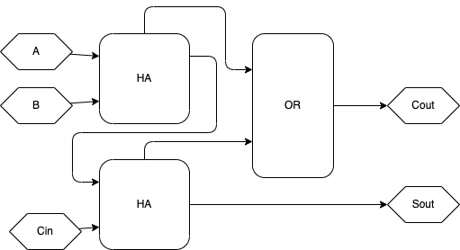
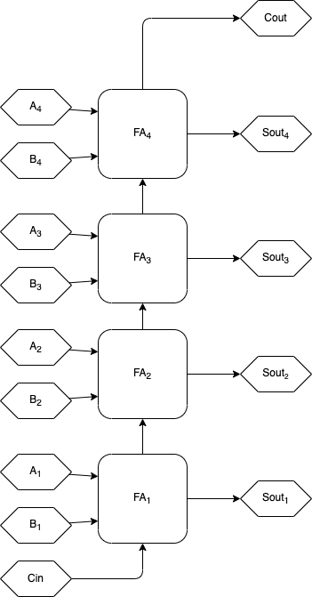
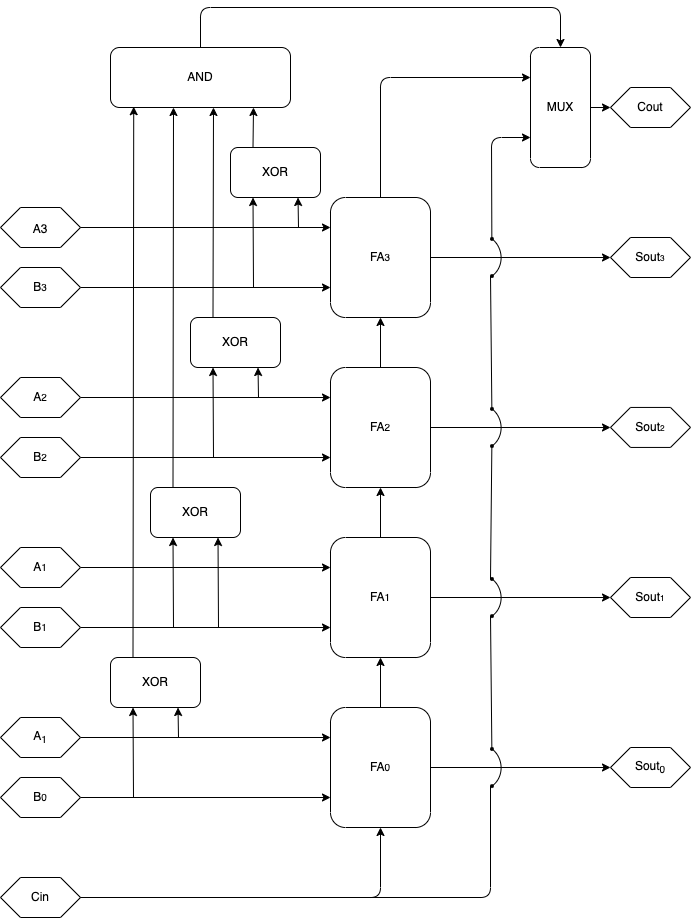
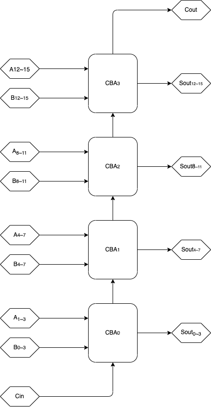
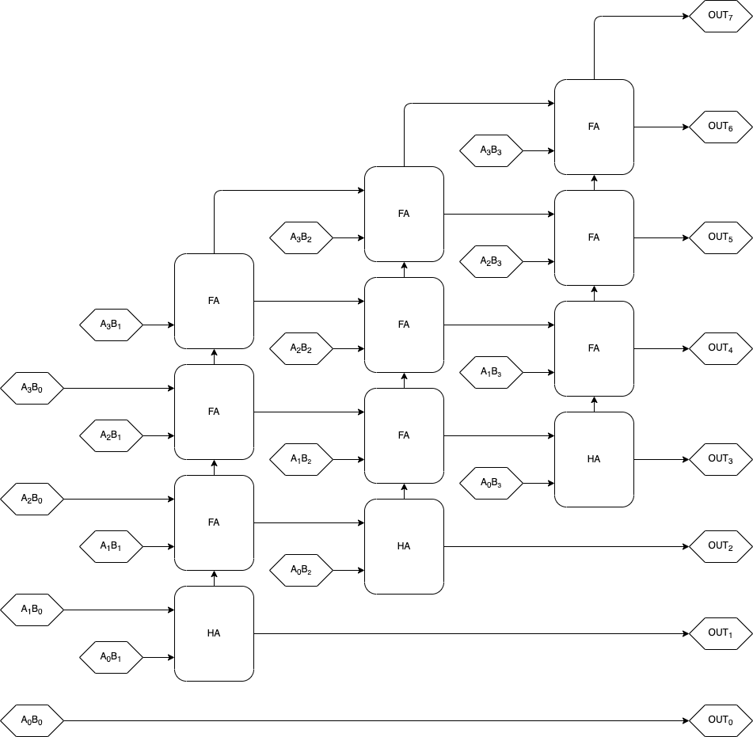
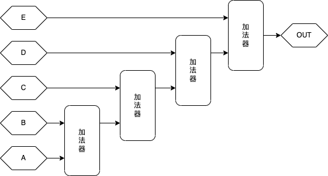
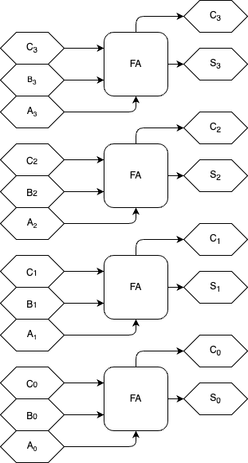
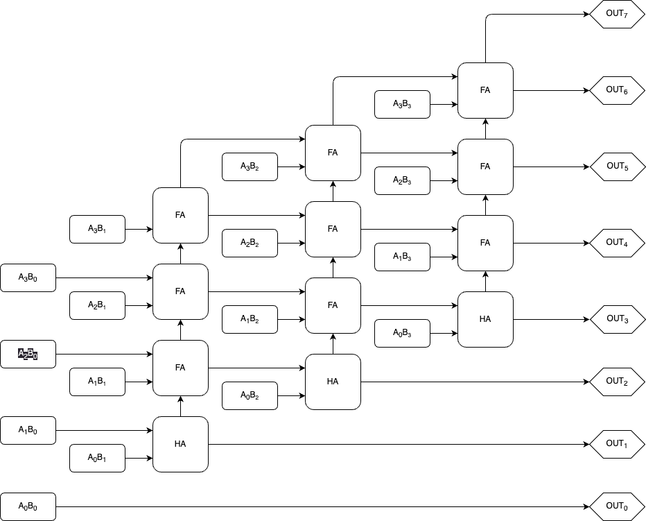
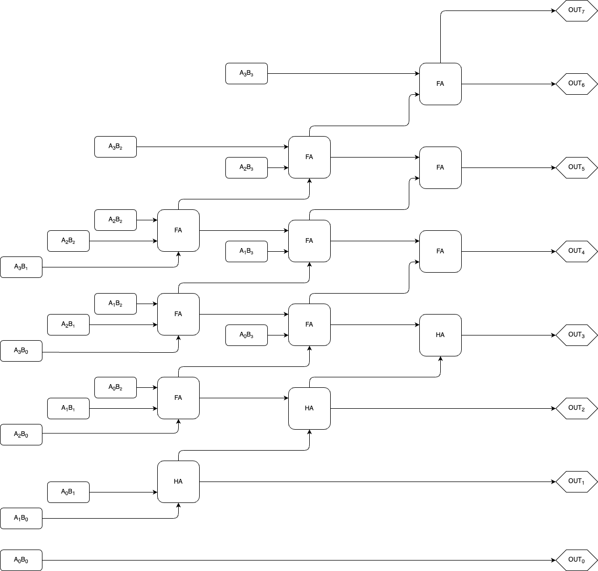
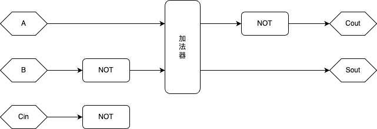

## 5 基础运算器(BASIC OPERATOR)
### 5.1 前言

从这一章开始，我们将初步尝试利用前面所学的知识，设计一些基础的运算器电路。如果前面学的很扎实，那本章的内容会很轻松。 本章起我们将使用数字电路符号以及逻辑表达式来描述设计，如果忘了请去复习一下。

### 5.1.1
 一些术语在实际应用中，我们会用到许多术语来描述电路的特征，或者作为改进的指标。这里列举其中的一些，现在看看就行:

| 术语名称   	|  描述                                                	|  说明                                                                                              	|
|------------	|------------------------------------------------------	|----------------------------------------------------------------------------------------------------	|
|  稳健性    	|  模块越不容易出错、出错的后果越小，则稳健性越高。    	|  有条公式是：${模块可用性} =\dfrac{平均无故障时间}{平均无故障时间+平均修复时间}$，稳健性别名售棒性。  	|
|  改善比    	|  对原设计改动后，新设计较原设计改善了多少。          	|  改善可以是不同方面的，通常单个调整不能改善所有方面，甚至对某些方面有负改善比。                    	|
|  布线密度  	|  局部或全局的导线密度。                              	|  实际电路设计中如果某处的布线密度过高会导致很多问题。                                              	|
|  导线长度  	|  两器件问导线（互联导线）的长度。                    	|  导线本身具有一定的性能，具有信号传播延迟并且占据一定的空间。                                      	|
|  元件数    	|  一个模块使用的元件数。                              	|  元件和导线都会占用空间。                                                                          	|
|  元件性能  	|  一个元件的性能。                                    	|  如工作频率等。                                                                                    	|
|  耦合      	|  模块间的相互依赖/影响程度，或者说相关联度。         	|  有时候这种关系是单方向的，例如A控制B，B却不控制A。                                                	|
|  内聚      	|  模块内各部分彼此结合的紧密程度，或者说相关联度。    	|  一个模块的内聚越高，它的内部越像是一个整体。                                                      	|
|  延沢      	|  从开始到结束的时问差。                              	|  除了元件本身的延迟，导线也存在延迟（主要是互联导线）。                                            	|
|  频率      	|  单位时问内执行操作的次数。                          	|  频率不成整数比的模块之间在时序上较不容易配合。                                                    	|
|  功率      	|  物理量，单位时间所作功。                            	|  相关物理量还有能耗、功耗、负载等，许多因素都会影响它们，它们也会影响你的设计。                    	|
|  噪吉      	|  预期外的，千扰电路正常工作的环境因素。              	|  如果电路可能处于某些千扰严重的恶劣环境，请确保电路的稳健性能够对抗这些噪声。                      	|
|  理想电路  	|  理想中的电路，通常会忽略噪声、线延迟等因素。        	|  理想的假设可以简化我们的工作，但不要忘了，现实中的是实际电路，条件没有那么理想！                  	|
|  实际电路  	|  实际中的电路。                                      	|  设计理想电路时，也要尽可能考虑到其对应的实际电路涉及的许多因素和情况。                            	|
|  扇入      	|  模块的输入直接接受了 多少来自其它模块的输入。       	|  扇入大就说明这个模块输入多。                                                                      	|
|  扇出      	|  模块的输出直接输出到了多少其他模块的输入。          	|  扇出大就说明这个模块输出多。                                                                      	|
|  扇入系数  	|  门电路的扇出系数指门电路允许的输入端数目的范围。    	|  实际电路设计中单个模块过大的扇入系数容易导致很多问题。                                            	|
|  扇出系数  	|  门电路的扇出系数指门电路允许的输出端数目的范围。    	|  实际电路设计中单个模块过大的扇出系数容易导致很多问题。                                            	|
|  信号毛刺  	|  一些短时间内、正常功能外的信号输出震荡。            	|  好的设计可以减少信号毛刺。必须将信号毛刺降低到可以容忍的地步。                                    	|
|  信号抖动  	|  较理想情况，实际情况下信号在某位置的小幅偏离。      	|  可能由于噪声千扰等导致。设计时必须保证电路能容忍信号抖动等干扰因素。                              	|
|  信号偏斜  	|  一条线路上的信号比预期提前/延迟到达。               	|  可能由于导线延迟等导致。设计时序时必须考虑信号偏斜等实际中可能发生的误差因素。                    	|
|  信号漂移  	|  两个同步信号间的相位差越来越大。                    	|  可能由于周期不同步导致。                                                                          	|
|  到达时间  	|  信号到达电路指定位置所需时间。                      	|  到达时问通常涉及一对数据，即信号改变后可能的最早和最晚到达时间（一个范围）。                      	|
|  关键路径  	|  模块中最值得关注的一条线路。                        	|  例如模块中延迟或线路最长的线路，针对关键路径进行改进通常可以获得较大改善比。                      	|
|  需求时间  	|  信号根据预期按时到达电路指定位置所需时间。          	|  要确保待处理的输入数据己经稳定到达了输入端，才能开始处理输入端的值，否则会出错。                  	|
|  建立时间  	|  输入信号到达输入后，被模块使用前需保持不变的时间。  	|  就像自拍，自拍前必须把脸贴在摄像机前面，以让摄像机定位调整焦距。                                  	|
|  保持时间  	|  输入信号在被使用时，需要保持不变的时间。            	|  又像自拍，拍照时不能乱动，不然拍出来的照片就花了。                                                	|
|  响应时间  	|  触发某一电路后，自触发开始到电路产生响应的时间。    	|  响应可以定义为预期中电路要做的事情，触发可以定义为该电路输入端的某个状态等。                      	|
|  复位时间  	|  电路恢复到某一状态所需时问。                        	|  比如撤离输入后，电路恢复到初始态所需的时间。                                                      	|
|  上升时间  	|  信号从低电平变到高电平所需时间。                    	|  实际的电平改变当然是有延迟的。如果在电平改变时对信号采样，会采出不稳定的结果。                    	|
|  下降时间  	|  信号从高电平变到低电平所需时间。                    	|  如果你的电路不止高低两个电平，这个概念可以拓展到更多不同的电平问。                                	|
|  稳定时间  	|  信号到达某电平后，电平稳定所需时间。                	|  电平改变后通常不会立即稳定，而是伴随一定的震动。经过稳定时间后才会稳定。                          	|

一些术语的描述与说明。做了一些个人解读，但最终还是符合这些术语的目的。觉得没描述清楚可以在网上搜索相关资料，会有更详细的描述。

出于篇幅，这些描述术语的描述地很仓促，如果要用，读者可以通过搜索引擎详细了解它们。在后文我也会重新详细讨论它们。

这些术语主要与电路分析、验证与优化相关(如静态时序优化)，初学者可能无法完全领悟这些概念的意义(其实，这些词的应用讨论与能展成好几本书)，但在实践中最终会体会到它们的重要性(用到你吐!)，这些重要概念值得你定时回顾!

可用于复习、参考或寻找灵感的书:"[COMPUTER ARITHMETIC: Algorithms and Hardware Designs](https://ashkanyeganeh.com/wp-content/uploads/2020/03/computer-arithmetic-algorithms-2nd-edition-Behrooz-Parhami.pdf)"也可以先看我写的[COMPUTER ARITHMETIC: Algorithms and Hardware Designs](COMPUTER_ARITHMETIC:Algorithms_and_Hardware_Designs_chapter_reading.md)章节阅览
### 5.2 加法器

### 5.2.1 半加器(HA、Half Adder)、全加器(FA，Full Adder)与逐位进位加法器(RCA，Ripple-Carry Adder)

图A

半加器逻辑电路图

功能是计算A与B的和

A，B是标准输入

Sout是标准输出

Cout是进位输出

逻辑表达式：

Sout=A$\oplus$B

Cout=A$\oplus$B

图B

半加器模块符号

功能定义见图A

图C

全加器逻辑电路图，功能是计算A与B与Cin的和

A，B是标准输入

Cin是迸位输入

Sout是标准输出

Cout是进位输出

逻辑表达式：

Sout=A$\oplus$B$\oplus$C

Cout=A$\oplus$B+A$\oplus$Cin+B$\oplus$Cin

图D

全加器模块符号

功能定义见图C

图E

4bits的逐位进位加法器，由4个全加器串成

能计算一个4位无符号加法

An和Bn是标准输入，sout n是标准输出

Cin是最低位进位输入，cout是最高位进位输出

### 5.2.1.1 全加器(FA，Full Adder)

F A 的电路如上图 C，它的功能就是处理单个位的加法。联想一下二进制加法竖式的计算，F A 的功能实际上就是单个位上二进制加法的计算过程，且包括进位的传递。

这里再多说一句，这些模块的内部实现并不是唯一的，只要电路的功能符合定义即可。实际上，针对不同的实际情况，一个模块的不同内部实现可以表现出不同的优劣势，应该在不同实现中权衡出最合适的选择。至于如何权衡，那又是门学问。

### 5.2.1.2 逐位进位加法器(RCA，Ripple-Carry Adder)

将 n 个 FA 的进位输入和输出按照上图 E 的方式分别将每位加法器的 Cin 和 Cout 串起来，就得到了一个 n bit(s)的二进制无符号加法器。这就是逐位进位加法器 RCA，这个名字是根据它逐位的进位方式得来的，它的功能就是计算两个 n bit(s)无符号二进制数的和。

在图 C 中，An 和 Bn 分别是操作数的输入，而 Sout n 则是运算结果的输出。图 C 中电路的功能就是计算 Sout=A+B。

此外，图 E 中的 Cin 端能提供一个额外的+1 输入，当 Cin=1 时，就有 Sout=A+B+1(这里的+还是二进制加法的意思)，求补码的时候可以利用 Cin 来实现+1。Cout 则是最高位的进位输出，如果它的输出为 1，那就说明这次计算溢出了，可以用它来判断是否溢出。

### 5.2.1.3 RCA 的弊端

RCA 很慢，因为它的进位是一位一位从最低位向高位传递的，想象一下让一个 RCA 计算 1111 1111+0000 0001 会怎么样?进位从最低位产生，逐位传递最终到达最高位并且产生溢出，期间必须经过 7 个 FA。如果是 64 位加法器，最坏的情况下 Cin 的进位将逐位经过 64 个 FA 逐位传递，实在是太慢了!

RCA 速度低下的原因在于必须逐位传递进位，那有没有办法不逐位传递进位?当然有，而且特别多。据我所知的就有不下十种有关的加法器设计方案。这些加法器无一例外都改进了进位链以减少进位延迟，且不同的设计方案有不同的优缺点，需要因地制宜。

### 5.2.1.4 RCA 的简单分析

RCA 有一条特别长的线路，就是最低位进位输入 Cin 到最高位进位输出 Cout 这条，我们可以把它看作是这个电路的关键路径。如 图 E，最坏情况是:Cin 输入的信号将逐位地经过每位 FA，最终到达 Cout。如果每跨过 1 个全加器都会经过 1 个与门和 1 个或门，最坏情 况下 Cin 到 Cout 的信号将跨过 n 个与门和 n 个或门，n 是 RCA 中 FA 的数量。

RCA 的优势在于它的元件数量特别少，一个 n bit(s)的逐位进位加法器只需要将 n 个 FA 的进位链串联起来即可。

RCA 的内部信号很不同步，假如 A、B 输入端同时输入信号，那么每个 FA 都同时可能产生输出和进位输出，但进位输出又会输出到下一个加法器的进位输入，于是下一个加法器的输出和进位输出又被改变...直到有一个 FA 不产生进位，这种震荡才结束。

### 5.2.2 超前进位加法器(CLA，Carry Lookahead Adder)

CLA 的思路很暴力，就是把整个进位链彻底展开成并行电路。想一下，RCA 中哪些情况下第 n 个全加器的进位输入为 1?CLA 展开进位链的办法就是用逻辑门分别判断所有进位生成的情况。

由于 CLA 的电路规模比较大，我这里仅用公式描述它。如果你想看它的电路图的话，可以在网上自行查找。这里推荐一个不错的资料(它把 CLA 叫做 LCA，其实是一个东西):<https://zhuanlan.zhihu.com/p/101332501>

现在我们写出一个 N 位 CLA 对应的逻辑表达式。假设 $A_n$ 和 $B_n$ 是第 n 位的输入，$OUT_n$ 是第 n 位的输出，$c_0$ 是最低位的进位输入， $c_{N+1}$ 是最高位的进位输出，则有:

$n = 0，1，2，3 \dots N − 2, N − 1, N$

$G_n = A_nB_n \  ,\ 𝑃_n = 𝐴_n \oplus 𝐵_n$

$c_1 = G_0 + c_0P_0$

$c_2 = G_1 + c_1P_1 = G_1 + G_0P_1 + c_0P_1P_0$

$c_3 = G_2 + c_2P_2 = G_2 + G_1P_2 + c_0P_2P_1 + c_0P_2P_1P_0$

$c_4 = G_3 + c_3P_3 = G_3 + G_2P_3 + c_1P_3P_2 + c_0P_3P_2P_1 + c_0P_3P_2P_1P_0$

$c_{N} = G_{N-1} + c_{N-1}P_{N-1}$

$c_{N+1} = G_N + c_NP_N = \dots$

$OUT_n = P_n \oplus c_n$

为了让公式更简洁，我让下标 n 从 0 开始而不是从 1 开始，就是说最低位输入输出分别是 $A_0、B_0、OUT_0$ 而不是 $A_1、B_1、OUT_1$。

上式中的 $c_n$ 就是 CLA 的进位链部分，$c_n$ 最右边就是一大堆的与运算和或运算，如果对应到电路中，就是一大堆的与门和或门。所以 CLA 的元件数非常大。随着位数增加，$c_n$ 最右边的式子会越来越长，对应电路的规模也会越来越大。

运算时可以直接根据 $G_n = A_nB_n , P_n = A_n \oplus B_n$得到 $G_n$ 和 $P_n$。然后根据 $c_n$ 最右边的那个越来越长的式子直接得到 $c_n$ 的值，再根据$OUT_n = P_n \oplus c_n$直接得到运算输出。这样就不需要逐位传递进位了，也就不需要担心进位传递的延迟了。

### 5.2.2.1 CLA 的分析

CLA 能直接同时生成所有位的进位输入(式中的 $c_n$)，而不需要花时间传递进位。但它的缺点也很明显，就是电路的规模特别大!请利想象一下 64 bits CLA 的样子。况且，导线延迟也是一个不可忽视的问题。

RCA 和 CLA 可以算是两个相反方向的极端。前者规模小延迟大，后者规模大但延迟小。但在实际情况中，一般既不能让延迟太大，也不能让规模太大。所以在实际设计中通常会选择更为折中的方案，将延迟和规模都控制在合理范围内。

### 5.2.3 进位旁路加法器(CBA，Carry Bypass Adder)

囹A

CBA单元模块的内部实现

(不是唯一的实现方法)

MUX在本模块中的功能：

当AND的输出为1时，输出Cin的信号

当AND的输出为0时，输出FA$_3$的进位输出

图B

用4个CBA单元模块（定义见图A） 实现的16位加法器

单个CBA单元不一定仅完成4位加法，取决于方案如何设计

进位旁路加法器的例子

CBA 的结构如上图。相较于 RCA 和 CLA，它是一种更为折中的设计，更适合用于位数高一些的加法器的实现。RCA 需要逐位传进位，图 A 中的 CBA 单元内部也是如此。但在 CBA 单元间(如图 B)，CBA 通过旁路让跨位较大的进位跳过了 CBA 模块内 FA 的进位链， 从而大大减少了较坏情况下的进位延迟。

想象一下 64 bits 的加法器，如果是 RCA，那么最低位进位输入到最高位的进位将经过 64 个加法器，但如果是 CBA，则只需要经过 大约64个 CBA 单元(n 是单个 CBA 单元的位宽)。由于进位信号可以直接跨过 CBA 单元内部。CBA 得以在不增加过多元件数的情况下，大大减少了进位延迟。

组成 CBA 的每个单元的位数不一定非得一致，比如可以让第一个 CBA 单元是 5bits 的，第二个却是 3bits 的。
也可以在 CBA 单元内用 CLA 实现 CBA 单元的功能，低位数 CLA 的规模还不是非常大。

还可以在多个 CBA 单元之间添加旁路，让这些 CBA 单元组合变成一个更大的 CBA 单元。这在大位数的情况下可以进一步改善性能。 有关加法器的讨论在此暂告一段落，更多的加法器方案会在将来中讨论。

### 5.3 乘法器

#### 5.3.1 基于加法器的阵列乘法器(Array Multiplier)

图A

基于加法器(这里用的是逐位进位加法器，可以采用别的加法器实现)

的4bits 乘4bits阵列乘法器。图中的"$A_nB_n$"模块输出的是逻辑表达式"$A_nB_n$"的值，也就是$A_n$和$B_n$的与运算的结果。

(FA是全加器，HA是半加器)

阵列乘法器的例子

请回忆一下二进制乘法竖式的计算过程，这个阵列乘法器的原理跟竖式是一样的。令 $A_n$ 和 $B_n$ 是二进制数 A 和 B 的第 n 位数，n 从 0 开始数，则有:

$w_n = 2^n$

$A \times B=w_0 A B_0+w_1 A B_1+w_2 A B_2+w_3 A B_3+ \dots +w_n A B_n$

你应该还记得 $w_n = 2^n$ 其实就是二进制位权的公式。(这里为了公式的简洁性，n 也是从 0 开始数的)

于是再根据移位运算在不导致溢出情况下的性质$w_n A=2^n A=A \ll n$，就能得到:

$A \times B=(A \ll 0)B_0+(A \ll 1)B_1+(A \ll 2)B_2+(A \ll 3)B_3+ \dots +(A \ll n)B_n$

这样就用更为简单的移位运算代替了部分乘法操作，而 $B_n$ 非 1 即 0，因此:

$(A \ll n)B_n = \begin{cases} \ \ \ \ \ 0, \ \ \ \ \ B_n=0 \\ A \ll n,B_n=1 \end{cases}$

可以用与门来完成这步运算:当 $B_n=0$ 时候，输出 0。$B_n=1$ 时，输出$A \ll n$的值。有关移位，实际上把线路歪一下(第 n 位输出接到第 n+1 位输入)就能实现这个移位运算，就如上图那样。最后再将每个 $(A \ll n)B_n$ 用加法器加起来，就得能到运算结果了。整个过程只用到了移位加法还有与位运算，这就是上图中阵列乘法器的原理。如果你不喜欢公式，记住电路图就行了，这个电路图很规则。

最后一步中用到了 n-1 个 n bit(s)的加法器来完成所有项的求和。求出 n 个数的和的模块可以叫做 n 操作数加法器。(这个 n 就是有多少个被加数的意思)图中的阵列乘法器的做法是将 n-1 个加法器的输入输出串联以求出所有项的合，但 n 操作数加法器除了这种做法以外，还有其他一些性能更好的设计(如基于结合律的)，马上就会讨论。

### 5.3.1.1.基于加法器的阵列乘法器的分析，在运算器中运用交换律

首先将它的公式写出来，我们令 B 是一个 n bits 的二进制数，A 是一个 k bits 的二进制数:

$A \times B=(A \ll 0)B_0+(A \ll 1)B_1+(A \ll 2)B_2+(A \ll 3)B_3+ \dots +(A \ll n)B_n$

我们发现，等式右边的项数是由 B 的位数控制的，也就是说 B 有多少位，右边就有多少个项。如果对应到电路中，那么 B 有 n 位就意味着电路中存在 n-1 个加法器。而 A 的位数 k 则决定了每个加法器是多少位的。

如果 A 和 B 的位数不等，那么我们可以在设计时交换 A 和 B，则有:

$BA=(𝐵 \ll 0)A_0 + (B \ll 1)A_1 + (B \ll 2)A_2 + (B \ll 3)A_3 + \dots + (B \ll n)A_n$

于是情况就变成了 A 的位数决定电路中有多少个加法器，B 的位数决定每个加法器有多少位。所以在 A 和 B 的位数不等时，我们可以选择是否交换乘数与被乘数，以选择降低加法器数量或者降低加法器的位宽(输入端的位数)。交换操作数这种做法在输入位数不对称的运算器中很有用，可能仅仅只是运用了一下运算的交换律，就大大改善了模块的各种指标。

在图 A 中的阵列加法器中，第一个加法器的最低位输入到最后一个加法器的最高位输出这个路径最长，可以被认为是关键路径。当然，如果阵列乘法器用的不是 RCA，那么关键路径可能会有所不同。

### 5.3.2.基于进位保留加法器(CSA，Carry Save Adder)的阵列乘法器

囹A

用4个加法器计算 $OUT=A+B+C+D+E$。

图B

模块“CSA〞(进位保留加法器)的内部结构跟逐位进位加法器很像

但直接把每位的进位输入和输出拉了出来。

图C

用3个CSA模块(如图B)和一个加法器实现的5操作数加法器。

功能是计算 $OUT=A+B+C+D+E$

请将图C与图A进行对比。

图D

基于逐位进位全加器的4bits乘4bits阵列乘法器

图E

基于进位保留加法器的4bits乘4bits阵列乘法器

基于进位保留的阵列乘法器虽然用的元件跟基于逐位进位全加器的阵列乘法器一样。但却拥有更好的性能。

图A中的乘法器的最长路径是：$A_0 B_1$ 到 $OUT_7$

图B中的乘法器的最长路径也是：$A_0 B_1$ 到 $OUT_7$

但如果稍作分析，就会发现图B的这个路径更短，因为基于进位保留的阵列乘法器只有最后一级的全加器是逐位进位的。

如果考虑更大规模的乘法器（输入位数更大），那么基于进位保留的乘法器会较基于逐位进位的乘法器拥有更大的优势。

* 进位保留加法器与基于进位保留加法器的阵列乘法器，还有作为对比的逐位进位加法器与基于逐位进位加法器的阵列乘法器

    * 如上图 E，基于 CSA 设计的阵列加法器相较于图 D 中的阵列乘法器，在不增加使用元件数的前提下获得了更好的性能。 

    * 如上图 C，CSA 不仅可用于阵列乘法器中，也可用于计算 n 个数的求和。

    * 基于 CSA 的乘法器或 n 操作数加法器的原理涉及到了冗余数表示系统，在将来会做深入的讨论。

### 5.3.3.加法树，在运算器中运用结合律

实数的加法和乘法有结合律:

$A + B + C = (A + B) + C$

$A(BC) = (AB)C$

这意味着:

$A_0 + A_1 + A_2 + A_3 + A_4 + A_5 + \dots = (A_0 + A_1) + (A_2 + A_3) + (A_4 + A_5) + \dots$

就是说如果要求出 K 个数的和，可以用 $\frac{K}{2}$ 个 2 操作数的加法器分别独立计算 $A_i+A_{i+1}$， 经过一轮计算后，K 个变成了 $\frac{K}{2}$ 个数，然后再重复一次这个操作，$\frac{K}{2}$ 个数变成了 $\frac{K}{4}$ 个数...经过不断的求和最终得到了结果。可以看出这种并行求和需要大约计算 $log_2K$ 轮，如果运算器是阵列运算器的话，会用到大量的加法器，但性能上的改善是显著的。

基于这种结合律原理的电路结构叫做加法树。想象一个树的样子!树枝末端是数据输入，在树枝分叉处树枝通过运算结合律将两根 或多根树枝合并为一。最终所有树枝都合并到了最下方的树干上，这个树干就对应着加法器的运算输出。

显然，只要运算满足结合律，就能在其中运用这种树型结构提升性能。加法树在乘法器和加法器等各种运算器中运用广泛。

有关乘法器的讨论也暂告一段落，更多的乘法器方案会在将来讨论。

### 5.4 减法器(SUBTRACTOR)与加减混合器(ADDERSUBTRACTOR)

图A

基于加法器的减法器，功能是计算 $A-B$，其中A和B都是无符号数。利用了补码原理和加法器的进位输入。

算法就是先将A和B转为补码，然后利用补码 $A-B=A+(-B)$ 的性质用加法求出 $Sout=A-B=A+(-B)$。

我们知道当 $N_原>0$ 时，$[N]_补=[N]_原$。因为A是正数，所以A不需要经过转换。

因为要计算 $A+(-B)$，所以需要假定B的符号位为1，即B为负，然后按照负原码转补码的方式处理它，也就是取反再+1。

结果输出 $Sout$ 也是补码，所以当结果为负时，如果需要原码表示的结果，需要额外电路将 $Sout$ 转回原码表示。

$Cout$ 是最高位进位，也就是 $[Sout]_补$ 的符号位。我们也可以利用这个符号位来判断A和B的大小。

$A>B$ 时结果为正数，因此 $Sout=1$。 $A<B$ 时候结果为负数，因此 $Sout=0$。

$A=B$ 时, $Sout=0$.

* 基于补码的减法器与加减混合器

如图 A，在数字电路中，利用补码原理就可以用加法器来计算减法。如果将图 A 的每个 $NOT$ 换成异或门，然后用一个控制线接入这个异或门的另一个输入，就可以实现加减混合器，它能控制电路完成 $A+B$ 和 $A-B$ 两种运算。

如果在设计之初就考虑图 A 中减法器的非门，那么可以利用逻辑化简将这些非门和加法器合并到一起，以减少一定的元件数。基于此可以设计出专用的减法器，如果需要可以参考: <https://zhuanlan.zhihu.com/p/112654170>

在数字电路中几乎所有的减法器和加减混合器(也可能没有几乎)都是基于补码原理设计的，所以只要搞懂了补码原理和加法器的做法，你也就搞懂了减法器和加减混合器的做法。

### 5.5 Divider

为了交流方便,以后的文章都会使用英语(其实本来是想维护英、汉两个语言版本的,但作者没有那么多精力和时间)

For the convenience of communication, future articles will be in English (in fact, I originally wanted to maintain English and Chinese language versions, but the author does not have so much energy and time)

### 5.5.1 Restoring Array Divider

Figure A
Flowchart of recovery remainder division algorithm

$A \ge B$