

# Digital Circuit Specialty

## 前言

### 关于本书

传统数字电路教材会伴随大量与物理器件有关的篇幅，但现在电路工艺和实现方法发展迅速，某些物理电路原理不再是必修，因为我们需要根据实际情境选择适合的实现方法，而不同实现方法间的细节区别又非常大。但另一方面，它们背后的数字电路原理是一致的。

因此本书只会介绍电路背后的抽象结构和设计原理，但不会讨论与实现工艺有关方面的东西。例如，本书会介绍算术电路的结构，并且讨论它的数学原理，但不会讨论这些电路如何通过物理工艺实现。

删除物理电路相关的部分后，数电教材变得非常简短，于是本书就可以用更多电路结构来填充这些空白，让大家在相同甚至更短的时间内，学会更多的数字电路设计。

也就是说，本书的特点在于篇幅简短，读者可以快速学会各种电路的设计原理与结构，本书的页数，就是本书篇幅简短的直接证明。

学会数字电路的抽象原理后，再去学习某个具体工艺相关的特性，就轻松多了。这也是作者我给大家的建议。因为不同工艺背后的 数字电路原理都是一致的，所以我们只需要根据工艺特性，稍微调整我们的抽象设计，就能得到一个具体的方案。

另一方面，现在电路自动化工具发展迅速，很多时候，我们只需要负责抽象设计，而具体的物理电路结构，则可交给软件自动生成，或者交给专精某种工艺的工程师，让他们来考虑具体电路实现。

另一方面，抽象设计本身是很灵活的，我们只需要稍微调整电路设计的参数和结构，就可以产生大量不同的设计。对于具体工艺，我们可以基于工艺特性调整，或选择我们的抽象设计，使得它最适配实现工艺。

所以，抽象设计还具有更高的可移植性:抽象设计只需要针对某个特定工艺稍作调整，就可以生成对应的专用设计，但某个特定工 艺下的专用设计，很难通过调整，而移植到其它工艺上。

下图展示了电路设计的不同抽象层次间的关系:

当然，我们也可以从应用角度看待:

电路背后的数学原理

↓

抽象的电路结构

具体工艺下的电路结构

受限于作者的水平，这本书会有相当多错误与不足之处!!请大家理解!!

## 1 目录

2 第一部分导读 (ntroduction to The Part 1)

* 2.1 第一部分导读

* 2.2 自主学习的建议

* 2.3 动机与问题

* 2.4 总结

3 数字电路的基础元件(Basic Circuit in Digital Circuit)

* 3.1 前言

* 3.2 基础锁存器与触发器

* 3.3 逻辑表达式及其化简

* 3.4 物理电路中的数宇电路

4 数字电路的基础知识(Basic In Digital Circuit)

* 4.1 前言

* 4.2 进制符号(Symbol of Number)

* 4.3 数制(Number System)、数码 （Digit）、基数(Radix)、位权(Weight)

    * 4.3.1 位权与进制转换 (Radix Transfer)

    * 4.3.2 进制的正式定义

* 4.4 二进制数(Binary)的运算

* 4.5 二进制小数

* 4.6 有限位数 (Finite Number System)与比特(Bit)

* 4.7 位运算(Bit Operation)

* 4.8 有符号数 (Signed Number)

* 4.9 原码（Sign Magnitude）、反码（IScomplement）、补码(2's complement)

5 基础运算器(Basic Operator)

* 5.1 前言

 * 5.2 加法器

    * 5.2.1 半加器(HA、Half Adder)、全加器(FA， Full Adder)与逐位进位加法器(RCA, Ripple-Carry Adder)

    * 5.2.2 超前进位加法器 (CLA, Carry Lookahead Adder)

    * 5.2.3 进位旁路加法器 (CBA, Carry Bypass Adder)

* 5.3 乘法器

    * 5.3.1 基于加法器的阵列乘法器 (Array Multiplier)

    * 5.3.2 基于进位保留加法器 (CSA, Carry Save Adder) 的阵列乘法器

    * 5.3.3 加法树，在运算器中运用结合律

* 5.4 减法器(Subtractor)与加减混合器(Adder Subtractor)

* 5.5 除法器

    * 5.5.1 恢复余数阵列除法器 (Restoring Array Divider)

    * 5.5.2不恢复余数阵列除法器 (Non-restoring Array Divider)

    * 5.5.3 除法慢于乘法

* 5.6 十进制加法器 (Decimal Adder)

    * 5.6.1 BCD码简介

    * 5.6.2 8421BCD 码加法器

* 5.7 进制转换 (Radix Transfer)

    * 5.7.1 特殊情况直接转换 (Direct Conversion in Special Case)

    * 5.7.2 位权相加法 (Weighted Sum)

    * 5.7.3 短除法 (Short Division)

    * 5.7.4 Double-Dabble 算法

* 5.8 移位器

    * 5.8.1 逻辑移位、算数移位与循环位移

    * 5.8.2 桶型移位器

6 存储器 (Memory)

* 6.1 前言

* 6.2 奇存器(Register)、寄存器组(Register set)与寻址器 (Addresser)

    * 6.2.1 寄存器 （Register）与寄存器组 (Register Set)

    * 6.2.2 译码器(Decader)

* 6.3 随机存取存储器与只读存储器

    * 6.3.1 随机存取存储器 (RAM, Random Access Memory) 与只读存储器 (ROM, Read Only Memory)的简单介绍

    * 6.3.2 大规模存储器的组织

* 6.4 FIFO与FILO

    * 6.4.1 FIFO

    * 6.4.2 FILO

* 6.5 查找表与内容可寻址单元

    * 6.5.1 查找表 (LUT, Look Up Table)

    * 6.5.2 内容可寻址单元 (CAM, Content Addressable memory)

* 6.6 带特殊功能的寄存器

    * .6.1 计数器 (Counter)

    * 6.6.2 移位寄存器 (Shift Register)

    * 6.6.3 线性反馈移位寄存器 (LFSR, Linear Feedback Shift Register)

7 时序电路设计

* 7.1 前言

* 7.2 时序电路基础

    * 7.2.1 时钟 （CLK, Clock）、同步 (SYNC, Synchronization)与异步 (ASYNC, Asynchronous)

    * 7.2.2 节拍发生器 (Sequence Timer)

* 7.3 串行运算器

    * 7.3.1 串行运算器的结构

    * 7.3.2 串行运算器的优势与劣势

* 7.4 有限状态机

    * 7.4.1 状态转移图(STD， State Transition Diagram)与有限状态机 (FSM, Finite State Machine)

    * 7.4.2 FSM的电路实现与应用.

* 7.5 时序电路的描述

    * 7.5.1 时序电路的状态转移图、状态转移表、时序图

    * 7.5.2 用方程描述时序电路

    * 7.5.3 时序电路的分析与优化

8 数据交换 (Data Transfer)

* 8.1前言

* 8.2 接口标准 (nterface Standard)与接口协议 (nterface Protoco)

* 8.3 交换节点

    * 8.3.1 交换节点的使用场景

    * 8.3.2 网络(Network)与图论(Graph Theory)，一些术语

    * 8.3.3 交换节点的功能与结构。

* 8.4 交换协议

    * 8.4.1 仲裁协设

9 第二部分导读

* 9.1 第二部分导读

* 9.2 计算机体系结构中的重要思想

10 认识计算机与 CPU与 RISC-V

* 10.1 前言

* 10.2 计算机的工作流程

    * 10.2.1 简化的计算机模型与工作流程

    * 10.2.2 计算机的工作流程拓展

* 10.3 RV321指令集

    * 10.3.1 RV321 的用户执行环境

    * 10.3.2 RV321 的指令格式

    * 10.3.3 RV321 指令集

    * 10.3.4 RV321 的伪指令(Pseudo Instruction)

* 10.4 认识 RV321 汇编

    * 10.4.1 汇编语言(Assembly Language)概述

    * 10.4.2 从高级语言到机器语言

* 10.5 内存中的数据

    * 10.5.1 大小端序

    * 10.5.2 数据对齐

    * 10.5.3 内存空间的划分

    * 10.5.4 内存空间的管理

11 一个简单的 RV321 处理器

* 11.1 前言

* 11.2一个单周期 RV321 处理器的内部抽象结构

    * 11.2.1 抽象的内部架构视图

    * 11.2.2 抽象的执行过程

* 11.3 CPU的更多细节

    * 11.3.1 CPU与计算机上的数据交换

    * 11.3.2 计算机总线的时序控制

    * 11.3.3 计算机中的1/0接口与外设

12 引用声明

* 12.1 图片

    * 12.1.1 普通图片

    * 12.1.2 具体专业性图片

* 12.2 表格

* 12.3 内容

13 随后编写的文章总体简介

## 2 第一部分导读(INTRODUCTION TO THE PART 1)

### 2.1 第一部分导读

第一部分讨论的是数字电路设计的一些基础理论与概念以及一些基础的数字电路结构。

### 2.2 自主学习的建议

为了帮助一些年幼而学习能力有限的同学，我在这里先教大家如何自主学习。为了方便，我把这些建议都总结成了表格!

解决一个问题的步骤

1. 确定问题是什么，准确地描述出你的问题，越准确越好。

2. 确定这个问题有哪些特殊的要求和需求，存在哪些限制，越清楚越好。

3. 确定解决这个问题可能需要哪些知识和工具，准备好它们。

4. 先设计出一个可行的解决方案，能解决问题，大致正确即可。

5. 检查你的方案是否满足特殊要求，是否存在 bug。并且确定如何改进这些问
题。

6. 修复 bug 并改进方案。

7. 如果你对这个方案满意了，就进入下一步。否则返回第 5 步。

8. 你把一个问题解决了。

解决一个问题中可能产生新的问题，那么新问题同样按照上述步骤进行一遍。

自主解决问题的各种途径

必应:可以在搜索页面选择国内版(中文结果)或国际版(英文结果)。比百度好用。

谷歌:英文搜索结果很好，中文搜索结果也不错。可惜国内上不了。

很容易搜出搜盗版 pdf 电子书。

百度:中文搜索结果还不错，英文搜索结果很少。

维基百科:很优秀，英文词条比较全。国内上不了。

百度百科:在墙内，维基百科的劣质代替品。

知乎:可以搜到很多不错的文章。

B站:可以搜到不少视频资源。

Stack Overflow:一个 IT 技术问答网站。

Stack Exchange:Stack Overflow 的父板块，涵盖内容不局限于 IT。

谷歌学术:用于搜索论文文献。

SCI-hub:提供 DOI 就能免费下载许多论文。类似的论文盗版网站还有很多。

Library Genesis:能搜到很多英文资料书的 pdf 格式文件，能找到大部分你想找的英文书资料。

英语烂如何看懂英文资料

1. 提高英文水平，水平越高阅读越流畅，即使不能完全理解所有词汇语法。

2. 使用翻译器/网页翻译/划词翻译，越 NB 的翻译器越好。

3. 对照翻译结果与原文，排除翻译错误。

4. 翻译错误的句子或单词，单独复制出来单独翻译一遍，可能就对了。

5. 还是翻不出某个单词是什么意思，就百度或者谷歌查这个单词。

6. 及时记笔记记下你理解出的东西。以防复习时又要重新翻译一遍。

你提的问题是不是问题(提问的智慧:<http://www.catb.org/~esr/faqs/smart-questions.html>)

你提的问题在逻辑上合理吗?

你提问的表述真的准确表述了你想问的问题吗?

你提的问题有价值吗?

回答这个问题有什么意义?

回答这个问题会对你有哪些帮助?

这个问题是否更适合在将来知识储备更丰富的时候讨论?

这个问题是否更应该由自己来找到答案?

自学的方法

1. 不要害怕晦涩，不要把理解停留在表面。不要不懂却故作装懂。最好能清晰认识自己会什么、不会什么、清楚什么、不清楚什么。

2. 把厚的书读薄，提炼出背后的思想与哲理。死记硬背只会过目而忘，走形式无法领悟精髓。比起知识点，更重要的是背后的思想哲理。

3. 把薄的书读厚，充分运用提炼出来的精髓，结合实际情况与更多思想，碰撞出更多火花。要学会应用和推广思想。

4. 搞清楚你学的知识是用来干什么的，解决什么问题的，如何被运用的。既要提高知识水平，也要提高实践水平。

5. 少读没用的书，一本书的薄厚在于你能从其中学到多少新的知识与思想，而不取决于它的页数或难度。

6. 明确你的学习目的，明确你学习的主线。明确你要学的东西和要解决的问题。

7. 让自己的学习保持在主线上，明白自己需要用什么知识，需要学什么知识。用不到的知识可能真就一直都用不到。

8. 保持学习的耐心和兴趣，你知道支持你学习的动力是什么吗?

### 2.3 动机与问题

初学者容易遇到的一个问题就是不知道自己所学的知识是为什么服务的。所以在“动机与问题”这一部分里，我会列出与本书有关的 一些问题，以让读者明白有哪些问题应该被注意:

电路是为什么服务的?

* 为它的应用场景服务的。需要什么电路，就要准备什么电路。

电路的优化目标?

* 取决于实际情况，利用有限的资源(比如有限的电路面积)在情境中最大化效益。不同情况下的优化目标是不同的。

为什么要改善电路的处理延迟?

* 有的情景对延迟很敏感，以现实中的餐厅为例，顾客如果等太久就会不满意。为此需要控制好延迟。

如何改善电路的处理延迟?

* 很多电路的延迟都取决于这个电路中延迟最大的那条路线，针对此进行优化一般就能明显地改善延迟。

为什么要改善电路的处理频率?

* 处理频率是指单位时间内玩成的操作次数，频率与延迟不冲突，电路可能频率高但同时延迟也很高。

如何改善电路的处理频率?

* 比如将整块的大电路划分为头尾接在一起的多个小电路，通常小的电路的频率比整块的大电路更高。

为什么要减小电路的面积?

* 有的应用对电路面积很敏感，比如硅基工艺的 CPU，CPU 面积过大会带来包括成本等各种方面的许多问题。

如何减小电路的面积?

* 比如采用更紧凑的电路布局，或者面积更小的电路设计。

为什么要改善电路的功耗?

* 一方面是减少电费开销。另一方面，功耗也通常与性能有关，例如高功耗的 CPU 通常发热也会很严重，就容易过热导致必须降频。

如何改善电路的功耗?

* 比如采用低功耗的电路设计。

什么是电路算法?

* 简单来说就是电路功能的数学描述。好的算法能让电路性能产生质的飞跃，事半而功倍。

电路算法的重要性?

* 电路算法与电路的延迟、频率、面积、功耗等都密切相关。通常不会有完美的通用算法，而是针对某种情景特定设计的算法。

运算器是干什么的?

* 电路中的运算器用来处理运算的，比如四则运算。

存储器是干什么的?

* 电路中的存储器是用来存储数据的。

能用和实用的区别?

* 做出一个满足功能的设计非常简单，但是做出满足功能的优秀设计通常很难，也很重要。希望读者有点追求，不要止步于“能用”。

### 2.4 总结

与本章有关的一些问题的描述与它们的一种回答。当然，这些问题都是开放的，所以这些问题的答案也远远不止一种。而且，本章的知识也不能完全解决它们。同样地，实际情况中也绝不仅仅只有这点问题。实际中，你应该发现并描述出自己发现的问题，然后试图给出一个符合要求的答案(很多时候不得不折中)

读者应该随时复习这张表格，以确保自己在学习设计时考虑了应该考虑的问题。通常而言，一个实用的思维过程是:先问为什么要做，再问要做什么，再问怎么做，再问怎么优化。

## 3 数字电路的基础元件(BASIC CIRCUIT INDIGITAL CIRCUIT)

可以选择先看一遍Minecraft Redstone Digital Circuits Basis Introduction One，然后跳过本章，直接学习后续内容!(从下一章:数字电路的基础知识,继续)

### 3.1 基础锁存器与触发器

锁存器:<https://en.wikipedia.org/wiki/Flip-flop_(electronics)>

触发器:<https://en.wikipedia.org/wiki/Flip-flop_(electronics)>

### 3.2 逻辑代数

逻辑代数:<https://en.wikipedia.org/wiki/Boolean_algebra>

### 3.3 物理电路中的数字电路

晶体管:<https://en.wikipedia.org/wiki/Transistor>

逻辑门:<https://en.wikipedia.org/wiki/Logic_gate>

## 4 数字电路的基础知识(BASICSINDIGITALCIRCUIT)

### 4.1 前言

这章我们会讨论一些数电的基础数学知识，这些知识一般在大学数电教材中会被放在第一章(据我所知)，但为了降低学习曲线，我把这部分内容放到了这里，希望读者能透过逻辑电路的知识更直观地理解本章中的概念及其意义。

本章内容可能稍微有点多，且大部分都是理论推导，可能略显枯燥。但这都是在为后续内容做准备。学完本章的内容后，后面有关 各种运算器和数字电路设计的内容会轻松许多。事实上，后续内容的难度取决于你对本章内容的理解程度。

如果你看完以后还是觉得没理解，认为需要更通俗的解释，可以在网上找到许多相关的通俗的科普视频。另外，为了降低学习难度， 我删去了一些不那么重要的篇幅，并且没有给出严格的数学推导过程，如果有需要也请在网上自行查找资料。

### 4.2 进制符号(SYMBOL OF DIGITS)

我们生活中最为熟悉的数，从小算到大的数，小学算术题里面的数，可以叫做十进制数。比如 19+1=20，87+12=99，这就是十进制的加法计算，大家应该非常熟悉。

那么既然有了十进制，还会不会有二进制，八进制，六进制，十六进制这些其它进制?当然是有的，我们先来讨论二进制，与我们所熟知的十进制一样，二进制也是用来表示一个数字的。与十进制不同的是，它仅由 1 和 0 构成。

<table class="tg">
<thead>
    <tr>
        <th class="tg-c3ow">10进制</th>
        <th class="tg-c3ow">0</th>
        <th class="tg-c3ow">1</th>
        <th class="tg-c3ow">2</th>
        <th class="tg-c3ow">3</th>
        <th class="tg-c3ow">4</th>
        <th class="tg-c3ow">5</th>
        <th class="tg-c3ow">6</th>
        <th class="tg-c3ow">7</th>
        <th class="tg-c3ow">8</th>
    </tr>
</thead>
<tbody>
    <tr>
        <td class="tg-c3ow">2进制</td>
        <td class="tg-c3ow">0</td>
        <td class="tg-c3ow">1</td>
        <td class="tg-c3ow">10</td>
        <td class="tg-c3ow">11</td>
        <td class="tg-c3ow">100</td>
        <td class="tg-c3ow">101</td>
        <td class="tg-c3ow">110</td>
        <td class="tg-c3ow">111</td>
        <td class="tg-c3ow">1000</td>
    </tr>
</tbody>
</table>

<table class="tg">
<thead>
    <tr>
        <th class="tg-c3ow">10进制</th>
        <th class="tg-c3ow">9</th>
        <th class="tg-c3ow">10</th>
        <th class="tg-c3ow">11</th>
        <th class="tg-c3ow">12</th>
        <th class="tg-c3ow">13</th>
        <th class="tg-c3ow">14</th>
        <th class="tg-c3ow">15</th>
        <th class="tg-c3ow">16</th>
        <th class="tg-c3ow">17</th>
    </tr>
</thead>
<tbody>
    <tr>
        <td class="tg-c3ow">2进制</td>
        <td class="tg-c3ow">1001</td>
        <td class="tg-c3ow">1010</td>
        <td class="tg-c3ow">1011</td>
        <td class="tg-c3ow">1100</td>
        <td class="tg-c3ow">1101</td>
        <td class="tg-c3ow">1110</td>
        <td class="tg-c3ow">1111</td>
        <td class="tg-c3ow">10000</td>
        <td class="tg-c3ow">10001</td>
    </tr>
</tbody>
</table>

<table class="tg">
<thead>
    <tr>
        <th class="tg-c3ow">10进制</th>
        <th class="tg-c3ow">18</th>
        <th class="tg-c3ow">19</th>
        <th class="tg-c3ow">20</th>
        <th class="tg-c3ow">21</th>
        <th class="tg-c3ow">22</th>
        <th class="tg-c3ow">23</th>
        <th class="tg-c3ow">24</th>
        <th class="tg-c3ow">25</th>
        <th class="tg-c3ow">26</th>
    </tr>
</thead>
<tbody>
    <tr>
        <td class="tg-c3ow">2进制</td>
        <td class="tg-c3ow">10010</td>
        <td class="tg-c3ow">10011</td>
        <td class="tg-c3ow">10100</td>
        <td class="tg-c3ow">10101</td>
        <td class="tg-c3ow">10110</td>
        <td class="tg-c3ow">10111</td>
        <td class="tg-c3ow">11000</td>
        <td class="tg-c3ow">11001</td>
        <td class="tg-c3ow">11010</td>
    </tr>
</tbody>
</table>

十进制数与其对应的二进制数

上表就列举了一些十进制数所对应的二进制数。如表可见，二进制仅由 1 和 0 组成。

但是你仔细一看就会发现，有一些二进制数和十进制数之间很容易混淆，比如 10 进制的“10”和二进制的“10”完全一样，但它们的意思却不同。

为了解决这个问题，我们会给每个数加一个下标，用这个下标来说明这个数是几进制的。给上面的表格添加下标后如下:

<table class="tg">
<thead>
    <tr>
        <th class="tg-c3ow">10进制</th>
        <th class="tg-c3ow">010</th>
        <th class="tg-c3ow">110</th>
        <th class="tg-c3ow">210</th>
        <th class="tg-c3ow">310</th>
        <th class="tg-c3ow">410</th>
        <th class="tg-c3ow">510</th>
        <th class="tg-c3ow">610</th>
        <th class="tg-c3ow">710</th>
        <th class="tg-c3ow">82</th>
    </tr>
</thead>
<tbody>
    <tr>
        <td class="tg-c3ow">2进制</td>
        <td class="tg-c3ow">02</td>
        <td class="tg-c3ow">12</td>
        <td class="tg-c3ow">102</td>
        <td class="tg-c3ow">112</td>
        <td class="tg-c3ow">1002</td>
        <td class="tg-c3ow">1012</td>
        <td class="tg-c3ow">1102</td>
        <td class="tg-c3ow">1112</td>
        <td class="tg-c3ow">10002</td>
    </tr>
</tbody>
</table>

<table class="tg">
<thead>
    <tr>
        <th class="tg-c3ow">10进制</th>
        <th class="tg-c3ow">910</th>
        <th class="tg-c3ow">1010</th>
        <th class="tg-c3ow">1110</th>
        <th class="tg-c3ow">1210</th>
        <th class="tg-c3ow">1310</th>
        <th class="tg-c3ow">1410</th>
        <th class="tg-c3ow">1510</th>
        <th class="tg-c3ow">1610</th>
        <th class="tg-c3ow">1710</th>
    </tr>
</thead>
<tbody>
    <tr>
        <td class="tg-c3ow">2进制</td>
        <td class="tg-c3ow">10012</td>
        <td class="tg-c3ow">10102</td>
        <td class="tg-c3ow">10112</td>
        <td class="tg-c3ow">11002</td>
        <td class="tg-c3ow">11012</td>
        <td class="tg-c3ow">11102</td>
        <td class="tg-c3ow">11112</td>
        <td class="tg-c3ow">100002</td>
        <td class="tg-c3ow">100012</td>
    </tr>
</tbody>
</table>

<table class="tg">
<thead>
    <tr>
        <th class="tg-c3ow">10进制</th>
        <th class="tg-c3ow">1810</th>
        <th class="tg-c3ow">1910</th>
        <th class="tg-c3ow">2010</th>
        <th class="tg-c3ow">2110</th>
        <th class="tg-c3ow">2210</th>
        <th class="tg-c3ow">2310</th>
        <th class="tg-c3ow">2410</th>
        <th class="tg-c3ow">2510</th>
        <th class="tg-c3ow">2610</th>
    </tr>
</thead>
<tbody>
    <tr>
        <td class="tg-c3ow">2进制</td>
        <td class="tg-c3ow">100102</td>
        <td class="tg-c3ow">100112</td>
        <td class="tg-c3ow">101002</td>
        <td class="tg-c3ow">101012</td>
        <td class="tg-c3ow">101102</td>
        <td class="tg-c3ow">101112</td>
        <td class="tg-c3ow">110002</td>
        <td class="tg-c3ow">110012</td>
        <td class="tg-c3ow">110102</td>
    </tr>
</tbody>
</table>

十进制数与其对应的二进制数(加了下标)

如上，现在我给每个十进制数都加了一个“10”的下标，给每个二进制都加了一个“2”的下标。而对于其他进制，我们也采用类似的做 法:我们给某个数加上下标“k”以表明这个数是 k 进制的。

说完了二进制，我们再来看看其它进制是什么样的:

<table class="tg">
<thead>
    <tr>
        <th class="tg-c3ow">10进制</th>
        <th class="tg-c3ow">0</th>
        <th class="tg-c3ow">1</th>
        <th class="tg-c3ow">2</th>
        <th class="tg-c3ow">3</th>
        <th class="tg-c3ow">4</th>
        <th class="tg-c3ow">5</th>
        <th class="tg-c3ow">6</th>
        <th class="tg-c3ow">7</th>
        <th class="tg-c3ow">8</th>
    </tr>
</thead>
<tbody>
    <tr>
        <td class="tg-c3ow">2进制</td>
        <td class="tg-c3ow">0 </td>
        <td class="tg-c3ow">1 </td>
        <td class="tg-c3ow">10 </td>
        <td class="tg-c3ow">11 </td>
        <td class="tg-c3ow">100 </td>
        <td class="tg-c3ow">101 </td>
        <td class="tg-c3ow">110 </td>
        <td class="tg-c3ow">111 </td>
        <td class="tg-c3ow">1000 </td>
    </tr>
    <tr>
        <td class="tg-c3ow">8进制</td>
        <td class="tg-c3ow">0</td>
        <td class="tg-c3ow">1</td>
        <td class="tg-c3ow">2</td>
        <td class="tg-c3ow">3</td>
        <td class="tg-c3ow">4</td>
        <td class="tg-c3ow">5</td>
        <td class="tg-c3ow">6</td>
        <td class="tg-c3ow">7</td>
        <td class="tg-c3ow">10</td>
    </tr>
    <tr>
        <td class="tg-c3ow">16进制</td>
        <td class="tg-c3ow">0</td>
        <td class="tg-c3ow">1</td>
        <td class="tg-c3ow">2</td>
        <td class="tg-c3ow">3</td>
        <td class="tg-c3ow">4</td>
        <td class="tg-c3ow">5</td>
        <td class="tg-c3ow">6</td>
        <td class="tg-c3ow">7</td>
        <td class="tg-c3ow">8</td>
    </tr>
</tbody>
</table>

<table class="tg">
<thead>
    <tr>
        <th class="tg-c3ow">10进制</th>
        <th class="tg-c3ow">9</th>
        <th class="tg-c3ow">10</th>
        <th class="tg-c3ow">11</th>
        <th class="tg-c3ow">12</th>
        <th class="tg-c3ow">13</th>
        <th class="tg-c3ow">14</th>
        <th class="tg-c3ow">15</th>
        <th class="tg-c3ow">16</th>
        <th class="tg-c3ow">17</th>
    </tr>
</thead>
<tbody>
    <tr>
        <td class="tg-c3ow">2进制</td>
        <td class="tg-c3ow">1001</td>
        <td class="tg-c3ow">1010</td>
        <td class="tg-c3ow">1011</td>
        <td class="tg-c3ow">1100</td>
        <td class="tg-c3ow">1101</td>
        <td class="tg-c3ow">1110</td>
        <td class="tg-c3ow">1111</td>
        <td class="tg-c3ow">10000</td>
        <td class="tg-c3ow">10001</td>
    </tr>
    <tr>
        <td class="tg-c3ow">8进制</td>
        <td class="tg-c3ow">11</td>
        <td class="tg-c3ow">12</td>
        <td class="tg-c3ow">13</td>
        <td class="tg-c3ow">14</td>
        <td class="tg-c3ow">15</td>
        <td class="tg-c3ow">16</td>
        <td class="tg-c3ow">17</td>
        <td class="tg-c3ow">20</td>
        <td class="tg-c3ow">21</td>
    </tr>
    <tr>
        <td class="tg-c3ow">16进制</td>
        <td class="tg-c3ow">9</td>
        <td class="tg-c3ow">a</td>
        <td class="tg-c3ow">b</td>
        <td class="tg-c3ow">c</td>
        <td class="tg-c3ow">d</td>
        <td class="tg-c3ow">e</td>
        <td class="tg-c3ow">f</td>
        <td class="tg-c3ow">10</td>
        <td class="tg-c3ow">11</td>
    </tr>
</tbody>
</table>

十进制数与其对应的不同进制数

这个表格就列出了一些十进制数所对应的二进制、八进制、十六进制数，可以发现 k 进制数的每位只可能有 k 种符号。比如二进制 的每位只可能是 0、1，而 8 进制可能是 0、1、2、3、4、5、6、7，十进制则是 0、1、2、3、4、5、6、7、8、9。十六进制有整整 16 种， 分别是 0、1、2、3、4、5、6、7、8、9、a、b、c、d、e、f。显然对于十六进制来说阿拉伯数字已经不够用了，所以这里用字母作为十六 进制剩下的五个数的符号。

你会发现这个表格里我并没有增加下标，比如十六进制的 11 应该写成 1116 这样以防混淆。为什么这里我就没加呢?因为我懒。而且 有时候给每个数都写上进制下标的话，公式会变丑而影响阅读。所以有时候我并不会明确写出某个数是几进制的，但你应该根据上下文的 说明判断某个数是几进制的。

现在我们才知道十进制外居然还有这么多不同的进制。但请记住，不同进制仅仅是同一个数的不同表示方式，不同进制之间是相互 等价的，进制之间也可以相互转换。

### 5.3 数制(NUMBER SYSTEM)、数码(DIGIT)、基数(RADIX)、位权(WEIGHT)

现在我们知道 k 进制每位有 k 种符号了。通过之前的表格我们已经对进制的规律管窥一斑，但应该如何准确描述这些东西呢?这就是接下来要学习的东西。为了准确描述“k 进制”的基本特征，我们需要用到以下术语:

| 术语      | 解释                                                                                                      |
|---------  |---------------------------------------------------------------------------------------------------------  |
|   数制    |   各种进制的总称，如二进制、十进制等等，它们的总称就叫数制。                                             |
|   数码    |   别名数字，表示数的符号。比如十进制有 10 个数码，分别是 0、1、2、3、4、5、6、7、8、9。                  |
|   基数    |   数制拥有的数码的数量，比如十进制有 10 个数码，那它的基数为 10。同理 16 进制的基数为 16。               |
|   位权    |   第 n 位的权重，比如十进制第 2 位的位权是 10，第 3 位的位权是 100。以此类推。 其实就是第 n 位的大小。    |

数制、数码、基数与位权的解释

上表解释了这四个术语的含义。接下来重点关注一下位权，这里用一张表展示不同进制第 n 位的位权:

不同进制的第 n 位的位权 (k 进制的第 n 位的位权为k(n−1)，表中数据均为十进制数)

|         | 第 1 位   |  第 2 位    |  第 3 位    |  第 4 位    |  第 5 位    |  第 6 位    |  第 7 位    |  第 8 位    |   第 n 位   |
|:------: |:--------: |:---------:  |:---------:  |:---------:  |:---------:  |:---------:  |:---------:  |:---------:  |:----------: |
| 10进制  |     1     |     10      |    100      |    1000     |   10000     |   100000    |  1000000    |  10000000   | $10^{n-1}$  |
|  2进制  |     1     |     2       |     4       |     8       |     16      |     32      |     64      |    128      |  $2^{n-1}$  |
|  8进制  |     1     |     8       |     64      |    512      |    4096     |   32768     |   262144    |  2097152    |  $8^{n-1}$  |
| 16进制  |     1     |     16      |    256      |    4096     |   65536     |  1048576    |  16777216   | 268435456   | $16^{n-1}$  |

表中贴心地直接告诉了你 k 进制第 n 位位权的计算公式是k$^{n-1}$，也就是说现在你可以用这个公式计算出 k 进制第 n 位代表的大小(即位权)是多少了。位权是沟通不同进制的一栋桥梁，利用位权可以转换进制。

### 5.3.1 位权与进制转换(Radix Transfer)

已知这里有一个二进制数 $1001_2$，如何才能求出它对应的十进制数呢?根据位权公式我们知道，二进制数前四位的位权分别是 1$_10$、2$_10$ 、4$_10$ 、8$_10$。于是我们让二进制的每位乘上所对应的位权，得到:

$1_{10} \times 8_{10} + 0_{10} \times 4_{10} + 0_{10} ×2_{10}  + 1_{10} \times 1_{10} = 9_{10}$

这样就知道了 10012 对应的十进制数是 910。 再举个例子，现在求出 2510 所对应的二进制数:

$2_{10} ×10_{10} +5_{10} ×1_{10} = 10_{2} ×1010_{2} +101_{2} ×1_{2} = 11001_{2}$

因为要求得的是二进制数，所以还得先把十进制数转换成二进制数，然后在二进制下进行计算求出结果。虽然暂时还没学二进制的 运算，但这不是现在的重点。

在这个计算步骤中可以注意到，我们只需要列出 0、1、2、3、4、5、6、7、8、9 和 10、100、1000、10000...这些十进制数对应的 二进制数就可以把左边的十进制数式转换成右边的二进制数式，因为式中就只出现了这些数。

0、1、2、3、4、5、6、7、8、9 这些数对应的二进制数可以直接事先算出来然后存在一张表里，计算时如果需要直接查表即可，这 种思想叫做查表法。查表法事先将计算结果存在表中，而在计算时直接查表得到结果，从而避免了繁琐的计算过程。

在计算结果较小的情况下，对于 10、100、1000、10000...也可以采用查表法。但即使不用查表法也可以专门推理出这些数与二进制 的对应规律关系。显然这比直接找出所有十进制数与二进制数的对应规律关系要简单得多。

进制转换的算法非常多，但都是基于位权原理的，在后文讨论进制转换器时会介绍更多进制转换算法。

#### 5.3.2 k 进制的正式定义

k 进制:基数为 k，第 n 位位权为 k(n-1)的数制。

5.4 二进制数(BINARY)的运算 现在我们就来学习如何计算二进制数。其实不同进制的运算方法都是一样的，还记得你小时候用的加减乘除竖式吗?二进制也可以用竖式来解决加减除，如:

$
\begin{array}{ccc}
&1&1\\
+&1&0\\
\hline
1&0&1
\end{array}
$

$
\begin{array}{ccc}
&1&1\\
-&1&0\\
\hline
&0&1
\end{array}
$

$
\begin{array}{ccc}
&1&1\\
\times&1&0\\
\hline
1&1&0
\end{array}
$

除法竖式也一样，我就不列了。类似地，其它进制也可以这样列竖式来计算加减乘除。

关于进位，在十进制中有 $9+1=10$，这叫逢 10 进 1。而在二进制中有 $1+1=10$，这叫逢 2 进 1。以此类推，在 k 进制中就有逢 k 进 1。这就是 k 进制的进位规律。

至于加减乘除以外的算法，也可以类似地从十进制算法推广得到。或者你也可以先将其它进制数转换为十进制数，然后用我们熟悉的十进制算法计算出结果，最后再将结果转回原进制表示。(用抽象代数的话说，不同数制是同构的。)

数字电路中几乎所有的运算器都是在二进制下进行运行的，这是因为用二进制的运算器更容易实现(其实不止运算器，其它电路模 块也是)。所以我们主要关注的也是二进制运算器的算法。

### 5.5 二进制小数

不同进制的第 n 位小数的位权 (k 进制的第 n 位小数的位权为𝑘−𝑛，表中数据均为十进制数)

|            |    第 1 位小数     |    第 2 位小数     |    第 3 位小数     |     第 4 位小数    |     第 5 位小数    |     第 6 位小数    |     第 7 位小数      |     第 8 位小数      |   第 n 位小数    |
|:------------: |:-------------------:  |:-------------------:  |:-------------------:  |:--------------------: |:--------------------: |:--------------------: |:---------------------:  |:---------------------:  |:-----------------:  |
|   10进制   |        0.1         |        0.01        |       0.001        |       0.0001       |       0.00001      |      0.000001      |      0.00000001      |     0.000000001      |    $10^{-n}$     |
|    2进制   |   $\frac{1}{2}$    |   $\frac{1}{4}$    |   $\frac{1}{8}$    |   $\frac{1}{16}$   |   $\frac{1}{32}$   |   $\frac{1}{64}$   |   $\frac{1}{128}$    |   $\frac{1}{256}$    |     $2^{-n}$     |

上表给出了 k 进制第 n 位小数位权的公式𝑘−𝑛，它的形式跟 k 进制第 n 位数位权公式𝑘(𝑛−1)很像。实际上，如果把第 1 位小数改名叫 第 0 位数，第 n 位小数叫第 1-n 位数的话，带入𝑘(𝑛−1)也可以算出小数的位权。这样来看小数和整数的位权公式其实是统一的。

不同进制的小数的计算也可以通过列竖式来完成，就跟十进制小数的竖式一样。小数的进制转换思路跟整数的进制思路一样，都是 每位乘与对应位权然后求和。

### 5.6 有限位数(FINITE NUMBER SYSTEM)与比特(BIT)

所谓的有限位数就是位数有限的数。比特是一个单位，符号为 bit 或者简写为 b，复数形式为 bits。比特可以用于描述一个有限位二进制数有多少位，比如我们可以用 8bits 来形容一个 8 位的有限位二进制数。此外还有一些其它单位，它们与 bit 之间的关系是:

* 1byte = 8bits

* 1KiB = 1024bytes

* 1MiB = 1024KiB

* 1GiB = 1024MiB

* 1TiB = 1024GiB

是不是很熟悉?它们就是你的电脑硬盘的存储大小单位。但是你的电脑上显示的是 MB 而不是 MiB，是 GB 而不是 GiB，这是为什么 呢?除了可能只是有的地方单纯习惯省略中间的 i 外，也有可能是因为它们采用了这套标准(SI 标准):

* 1KB = 1000Bytes

* 1MB = 1000KB

* 1GB = 1000MB

* 1TB = 1000GB

某些骗子会混淆这两种标准来忽悠外行人。此外，它们其实还有更大的单位比如 PB，感兴趣可以自己去了解。

回到正题，有限位数只能在它的位数范围内表示数，如果计算超出了它的表示范围，那么超出表示范围的数值就会被抛弃。

比如一个 8bits 的有限位数算式是 $1111 1111 +1=0000 0000$，式中结果的表示范围只有 8bits，于是正确结果 $1 0000 0000$ 中的第九位被丢失了。

有限位数因为表示范围有限而丢失数值或导致计算结果出错的情况叫做溢出。

除了刚才这种情况，小数精度不足也同样可以导致溢出。例如让一个精确到第二位小数的有限位数表示 $\frac{1}{99999}$ 的话，它只能四舍五入到零，因为它本身最多只能精确表示到第二位小数。

另外，减法也可以导致溢出，比如一个有限位数的表示范围在 $+127$ 到 $-127$ 之间 的话，那么它肯定不能表示小于 $-127$ 的数，因此在计算时产生小于 $-127$ 的结果时就会导致结果出错，也就是溢出。

### 5.7 位运算(BITOPERATION)

|     名称      |      符号       |  解释                                                               |
|:------------: |:--------------: |-------------------------------------------------------------------- |
|      与        |   A $\And$ B    | A 和 B 的每位分别进行与逻辑运算。如 $1101 \And 0100 = 0100$。       |
|      或        |   A $\mid$ B    | A 和 B 的每位分别进行或逻辑运算。如 $1000 \mid 0001 = 1001$。       |
|      非        |   $\bar{A}$     | A 的每位分别取反。如 $\overline{0100}$ = 1011。                     |
|     异或      |  A $\oplus$ B   | A 和 B 的每位分别进行异或逻辑运算。如 1001 $\oplus$ 1011 = 0010。    |
|     同或      |   A $\odot$ B   | A 和 B 的每位分别进行同或逻辑运算。如 1001 $\odot$ 1011 = 1101。     |
|  (逻辑)左移   |    A $\ll$ B    | 让A左移s位，移出的空位用0补充。如 $00001101 \ll 410 =11010000$。    |
|  (逻辑)右移   |    A $\gg$ B    | 让A右移s位，移出的空位用0补充。如 $10100000 \gg 410 =00001010$。    |

8bits 有符号数的结构。其中 A 和 B 均为 n bit(s)的有限位二进制数，s 必须大等于 0。除了逻辑移位还有算数移位，但这里暂不讨论算数移位。

上表总结了各种位运算的定义，你会发现它们其实就是以前学的逻辑运算的拓展，就连符号都一样。逻辑运算只负责处理 1bit 的运 算，而位运算能处理 n bit(s)的运算。左移和右移是新的东西，它们叫移位运算，用于移动二进制位。有时如果移太多位会导致溢出，如 0001<<510=0000，数值被移到了表示范围外所以溢出了。为方便有时会规定在溢出时自动拓展位数，如 01<<210=100，以避免溢出。

(逻辑)左移和(逻辑)右移还有两个有用的性质，在不溢出或者自动拓展位数的情况下有:

$A \ll S= A \times 2^S$

$A \gg S= \frac{A}{2^S}$

在运算器中这两条性质常被用于代替一些特殊的乘法和除法，因为移位运算电路很简单。想一想，这两条性质是如何成立的呢?

### 5.8 有符号数(SIGNEDNUMBER)

在计算机中可以用有符号数表示有符号的数值。相对地，无符号数用于表示没有符号的数。有符号数是一个 n bit(s)的有限位数，通常用它的最高位(第 n 位)用来表示符号，一般规定最高位为 0 时为正，为 1 时为负。以一个 8bits 的有符号数为例:

<table class="tg">
<thead>
    <tr>
        <td class="tg-c3ow">第 8 位(符号位) </td>
        <td class="tg-c3ow"> 第 7 位 </td>
        <td class="tg-c3ow"> 第 6 位 </td>
        <td class="tg-c3ow"> 第 5 位 </td>
        <td class="tg-c3ow"> 第 4 位 </td>
        <td class="tg-c3ow"> 第 3 位 </td>
        <td class="tg-c3ow"> 第 2 位 </td>
        <td class="tg-c3ow"> 第 1 位 </td>
    </tr>
</thead>
</table>

一个 8bits 有符号数的结构

它的最高位变成了符号位，所以它只有 7 个位来表示实际的数值。一个无符号 8bits 数的表示范围是 255 到 0，而 8bits 的有符号数的表示范围是+127 到-127。而且，有符号数有+0 和-0 之分。以 8bits 的有符号数为例，0000 0000 表示+0，1000 0000 表示-0。

有符号数的符号位不应该接受或产生进位，否则可能出错。以 8bits 有符号数的一个加法算式为例，如果符号位接受进位，那么会有:0100 0000+0100 0010=1000 0010，转换成十进制表示就是 64+66=-2，显然是错的。

有符号数还有个问题，那就是它不能直接计算 A+(-B)。以两个 8bits 有符号数的加法 0011 0011+1011 0000 为例，正确的结果应该是0000 0011，但是如果直接用加法竖式去算 0011 0011+1011 0000 的话显然得不到这个正确结果。

有符号数如果要计算 A+(-B)，只能先把它变成 A-B 再计算出结果。还是以 0011 0011+1011 0000 为例，正确的计算过程应该是:

0011 0011 + 1011 0000 = 0011 0011 − 0011 0000 = 0000 0011

那么有没有一种表示方法，能够直接计算 A+(-B)呢?答案是有的，它就是接下来要介绍的补码。

### 5.9 原码(SIGN MAGNITUDE)、反码(1‘s COMPLEMENT)、补码(2‘s COMPLEMENT)

|  名称  	|    符号    	| 求法                                                                                                                                                                                                                                             	|
|:------:	|:----------:	|--------------------------------------------------------------------------------------------------------------------------------------------------------------------------------------------------------------------------------------------------	|
|  原码  	|  $[N]_原$  	| 原码就是有符号数。                                                                                                                                                                                                                               	|
|  反码  	|  $[N]_反$  	| $[N]_原>0 或[N]_原=+0$ 时:$[N]_反=[N]_原$。 $[N]_原<0 或[N]_原=-0$ 时:将 $[N]_原$ 符号位以外的其它位取反就能得到 $[N]_反$。                                                                                                          	|
|  补码  	|  $[N]_补$  	| $[N]_原>0 或[N]_原=+0$ 时:$[N]_补=[N]_原$。 $[N]_原<0$ 时:$[N]_补=[N]_反+1$。(对于小数，请将+1 改为加上最低位的位权，如 0.111+0.001,就是给小数的最低位加个 1。)  $[N]_原=-0$ 时:将 $[N]_原$ 的符号位设置为 0 就能得到 $[N]_补$。 	|

原码、反码与补码的求法。后文我们会系统地介绍各种不同的数表示系统，届时我们会发现，上表中的反码和补码只是广义的补码表示系统的特例

| 十进制数 	|  +7  	|   +6 	|  +5  	|  +4  	|  +3  	|  +2  	|  +1  	|  +0  	|  -0  	|  -1  	|  -2  	|  -3  	|  -4  	|  -5  	|  -6  	|  -7  	|  -8  	|
|:--------:	|:----:	|:----:	|:----:	|:----:	|:----:	|:----:	|:----:	|:----:	|:----:	|:----:	|:----:	|:----:	|:----:	|:----:	|:----:	|:----:	|:----:	|
|   原码   	| 0111 	| 0110 	| 0101 	| 0100 	| 0011 	| 0010 	| 0001 	| 0000 	| 1000 	| 1001 	| 1010 	| 1011 	| 1100 	| 1101 	| 1110 	| 1111 	|  无  	|
|   反码   	| 0111 	| 0110 	| 0101 	| 0100 	| 0011 	| 0010 	| 0001 	| 0000 	| 1111 	| 1110 	| 1101 	| 1100 	| 1011 	| 1010 	| 1001 	| 1000 	|  无  	|
|   补码   	| 0111 	| 0110 	| 0101 	| 0100 	| 0011 	| 0010 	| 0001 	| 0000 	|  无  	| 1111 	| 1110 	| 1101 	| 1100 	| 1011 	| 1010 	| 1001 	| 1000 	|

一些十进制数(+7 到-8)所对应的原码、反码、补码(原码、反码、补码都被限定为了 4bits 的有限位数)

上面给出了原码、反码、补码的符号和求法。(严格来说这里讨论的补码叫 2 的补码，此外还有模 M 补码等，反码也叫 1 的补码)

与不同数制一样，这些不同码制也很容易被混淆，比如上表中的 1111 既可以是补码中的 1111 也可以是原码或反码中的 1111。和区分进制的做法类似，我们用方括号将数值圈起来，并且在右下角标注这个数的码字以区分码制。例如 $[0101]_补$，看到这个数的右下角我们就知道它是补码，而不是反码或者原码。

你可能会被第一张表中的 $[N]_原、[N]_反、[N]_补$ 绕晕。如果会的话，请记住 N 是抽象的，N 本身不涉及具体的表示。$[N]_原、[N]_反、[N]_补$ 的意思分别是 N 这个数的原、反、补码表示。原、反、补码本质上只是有符号数的不同表示方式，就跟不同数制一样。

运算时，原码和反码的符号位都不会接受进位。但补码的符号位会接受进位。也就是说补码符号位会接受上一位的进位，且一般会忽略补码产生的溢出。这些规定很自然，例如按规定(忽略溢出)有:$[1111]_补+[0001]_补=[0000]_补$，用十进制表示就是 $-1+1=0$，完全正确。

如果你想问不同码制间的运算是什么情况(如 $[N]_原+[N]_反$)，那我会告诉你这是未定义的。运算的前提就是参与运算的数的码制相同，就好比二进制不能跟十进制直接相加(如 $101_{(2)}+12_{(10)}$)，必须先把数制统一再来计算。虽然它们可以相互转换，但也需要先统一后计算。

如果这里有两个 n bit(s)的原码 $[A]_原$ 和 $[B]_原$，那么根据定义可以知道它们分别对应的补码具有以下性质(读者可尝试自行推导):

$[A]_补 + [B]_补 = [A + B]_补$

$[A]_补 −[B]_补 = [A]_补 +[−A]_补 = [A−B]_补$

第二条公式说明补码可以直接计算 A+(-B)。利用这点，可以先取 -B 的值，然后用加法替代减法(A+(-B)代替 A-B)。在设计运算器时如果利用这条性质，可以让单独一个加法器完成加法和减法两种运算。

补码没有+0 和-0 之分，因此它的表示范围比原码和反码要稍微大那么一点(如上面的表)。以 8bits 的原码、反码、补码为例，原码和反码的表示范围是+127 到-127，而补码的表示范围则是+127 到-128。n bit(s)的情况以此类推。

正是补码具有如此多的良好性质，在计算机中一般都会统一用补码来表示带正负的数，而不是直接用有符号数。

可以把补码理解成一个时钟。假如现在它的时间在 13:00，要把时间调到 11:00 该怎么做?有两个办法，第一种方法就是让时针 逆时针拨动 2 小时，第二种方法是将时针往前顺时针拨动 22 小时。补码计算 A+(-B)的办法本质上跟第二种方法一样，以增代减。

有限位数跟时钟一样，都是循环的，以 4bits 无符号数为例，因为溢出，1111+0001=0000。就像 24:00 的下一点是 1:00 一样，从终点又回到了起点。如果不停给这个无符号数+1，那它会在这 4bits 里像时钟一样不停循环。(数学中类似的概念叫商群)

## 6 基础运算器(BASIC OPERATOR)
### 6.1 前言

从这一章开始，我们将初步尝试利用前面所学的知识，设计一些基础的运算器电路。如果前面学的很扎实，那本章的内容会很轻松。 本章起我们将使用数字电路符号以及逻辑表达式来描述设计，如果忘了请去复习一下。

### 6.1.1
 一些术语在实际应用中，我们会用到许多术语来描述电路的特征，或者作为改进的指标。这里列举其中的一些，现在看看就行:

| 术语名称   	|  描述                                                	|  说明                                                                                              	|
|------------	|------------------------------------------------------	|----------------------------------------------------------------------------------------------------	|
|  稳健性    	|  模块越不容易出错、出错的后果越小，则稳健性越高。    	|  有条公式是：${模块可用性} =\dfrac{平均无故障时间}{平均无故障时间+平均修复时间}$，稳健性别名售棒性。  	|
|  改善比    	|  对原设计改动后，新设计较原设计改善了多少。          	|  改善可以是不同方面的，通常单个调整不能改善所有方面，甚至对某些方面有负改善比。                    	|
|  布线密度  	|  局部或全局的导线密度。                              	|  实际电路设计中如果某处的布线密度过高会导致很多问题。                                              	|
|  导线长度  	|  两器件问导线（互联导线）的长度。                    	|  导线本身具有一定的性能，具有信号传播延迟并且占据一定的空间。                                      	|
|  元件数    	|  一个模块使用的元件数。                              	|  元件和导线都会占用空间。                                                                          	|
|  元件性能  	|  一个元件的性能。                                    	|  如工作频率等。                                                                                    	|
|  耦合      	|  模块间的相互依赖/影响程度，或者说相关联度。         	|  有时候这种关系是单方向的，例如A控制B，B却不控制A。                                                	|
|  内聚      	|  模块内各部分彼此结合的紧密程度，或者说相关联度。    	|  一个模块的内聚越高，它的内部越像是一个整体。                                                      	|
|  延沢      	|  从开始到结束的时问差。                              	|  除了元件本身的延迟，导线也存在延迟（主要是互联导线）。                                            	|
|  频率      	|  单位时问内执行操作的次数。                          	|  频率不成整数比的模块之间在时序上较不容易配合。                                                    	|
|  功率      	|  物理量，单位时间所作功。                            	|  相关物理量还有能耗、功耗、负载等，许多因素都会影响它们，它们也会影响你的设计。                    	|
|  噪吉      	|  预期外的，千扰电路正常工作的环境因素。              	|  如果电路可能处于某些千扰严重的恶劣环境，请确保电路的稳健性能够对抗这些噪声。                      	|
|  理想电路  	|  理想中的电路，通常会忽略噪声、线延迟等因素。        	|  理想的假设可以简化我们的工作，但不要忘了，现实中的是实际电路，条件没有那么理想！                  	|
|  实际电路  	|  实际中的电路。                                      	|  设计理想电路时，也要尽可能考虑到其对应的实际电路涉及的许多因素和情况。                            	|
|  扇入      	|  模块的输入直接接受了 多少来自其它模块的输入。       	|  扇入大就说明这个模块输入多。                                                                      	|
|  扇出      	|  模块的输出直接输出到了多少其他模块的输入。          	|  扇出大就说明这个模块输出多。                                                                      	|
|  扇入系数  	|  门电路的扇出系数指门电路允许的输入端数目的范围。    	|  实际电路设计中单个模块过大的扇入系数容易导致很多问题。                                            	|
|  扇出系数  	|  门电路的扇出系数指门电路允许的输出端数目的范围。    	|  实际电路设计中单个模块过大的扇出系数容易导致很多问题。                                            	|
|  信号毛刺  	|  一些短时间内、正常功能外的信号输出震荡。            	|  好的设计可以减少信号毛刺。必须将信号毛刺降低到可以容忍的地步。                                    	|
|  信号抖动  	|  较理想情况，实际情况下信号在某位置的小幅偏离。      	|  可能由于噪声千扰等导致。设计时必须保证电路能容忍信号抖动等干扰因素。                              	|
|  信号偏斜  	|  一条线路上的信号比预期提前/延迟到达。               	|  可能由于导线延迟等导致。设计时序时必须考虑信号偏斜等实际中可能发生的误差因素。                    	|
|  信号漂移  	|  两个同步信号间的相位差越来越大。                    	|  可能由于周期不同步导致。                                                                          	|
|  到达时间  	|  信号到达电路指定位置所需时间。                      	|  到达时问通常涉及一对数据，即信号改变后可能的最早和最晚到达时间（一个范围）。                      	|
|  关键路径  	|  模块中最值得关注的一条线路。                        	|  例如模块中延迟或线路最长的线路，针对关键路径进行改进通常可以获得较大改善比。                      	|
|  需求时间  	|  信号根据预期按时到达电路指定位置所需时间。          	|  要确保待处理的输入数据己经稳定到达了输入端，才能开始处理输入端的值，否则会出错。                  	|
|  建立时间  	|  输入信号到达输入后，被模块使用前需保持不变的时间。  	|  就像自拍，自拍前必须把脸贴在摄像机前面，以让摄像机定位调整焦距。                                  	|
|  保持时间  	|  输入信号在被使用时，需要保持不变的时间。            	|  又像自拍，拍照时不能乱动，不然拍出来的照片就花了。                                                	|
|  响应时间  	|  触发某一电路后，自触发开始到电路产生响应的时间。    	|  响应可以定义为预期中电路要做的事情，触发可以定义为该电路输入端的某个状态等。                      	|
|  复位时间  	|  电路恢复到某一状态所需时问。                        	|  比如撤离输入后，电路恢复到初始态所需的时间。                                                      	|
|  上升时间  	|  信号从低电平变到高电平所需时间。                    	|  实际的电平改变当然是有延迟的。如果在电平改变时对信号采样，会采出不稳定的结果。                    	|
|  下降时间  	|  信号从高电平变到低电平所需时间。                    	|  如果你的电路不止高低两个电平，这个概念可以拓展到更多不同的电平问。                                	|
|  稳定时间  	|  信号到达某电平后，电平稳定所需时间。                	|  电平改变后通常不会立即稳定，而是伴随一定的震动。经过稳定时间后才会稳定。                          	|

一些术语的描述与说明。做了一些个人解读，但最终还是符合这些术语的目的。觉得没描述清楚可以在网上搜索相关资料，会有更详细的描述。

出于篇幅，这些描述术语的描述地很仓促，如果要用，读者可以通过搜索引擎详细了解它们。在后文我也会重新详细讨论它们。

这些术语主要与电路分析、验证与优化相关(如静态时序优化)，初学者可能无法完全领悟这些概念的意义(其实，这些词的应用讨论与能展成好几本书)，但在实践中最终会体会到它们的重要性(用到你吐!)，这些重要概念值得你定时回顾!

可用于复习、参考或寻找灵感的书:"[COMPUTER ARITHMETIC: Algorithms and Hardware Designs](https://ashkanyeganeh.com/wp-content/uploads/2020/03/computer-arithmetic-algorithms-2nd-edition-Behrooz-Parhami.pdf)"也可以先看我写的[COMPUTER ARITHMETIC: Algorithms and Hardware Designs](COMPUTER_ARITHMETIC:Algorithms_and_Hardware_Designs_chapter_reading.md)章节阅览
### 6.2 加法器

### 6.2.1 半加器(HA、Half Adder)、全加器(FA，Full Adder)与逐位进位加法器(RCA，Ripple-Carry Adder)

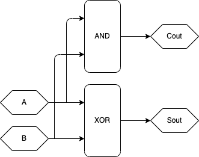

图A

半加器逻辑电路图

功能是计算A与B的和

A，B是标准输入

Sout是标准输出

Cout是进位输出

逻辑表达式：

Sout=A$\oplus$B

Cout=A$\oplus$B

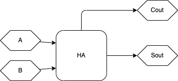

图B

半加器模块符号

功能定义见图A

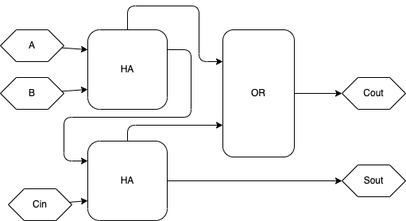

图C

全加器逻辑电路图，功能是计算A与B与Cin的和

A，B是标准输入

Cin是迸位输入

Sout是标准输出

Cout是进位输出

逻辑表达式：

Sout=A$\oplus$B$\oplus$C

Cout=A$\oplus$B+A$\oplus$Cin+B$\oplus$Cin

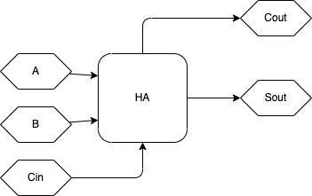

图D

全加器模块符号

功能定义见图C

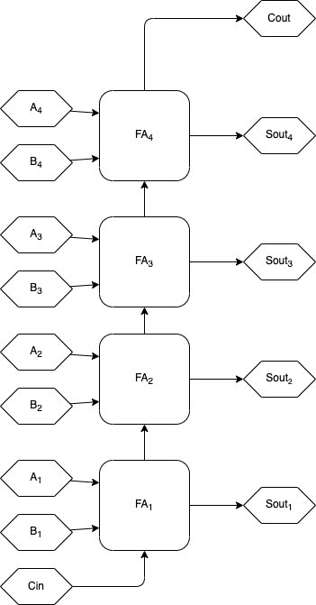

图E

4bits的逐位进位加法器，由4个全加器串成

能计算一个4位无符号加法

An和Bn是标准输入，sout n是标准输出

Cin是最低位进位输入，cout是最高位进位输出

### 6.2.1.1 全加器(FA，Full Adder)

F A 的电路如上图 C，它的功能就是处理单个位的加法。联想一下二进制加法竖式的计算，F A 的功能实际上就是单个位上二进制加法的计算过程，且包括进位的传递。

这里再多说一句，这些模块的内部实现并不是唯一的，只要电路的功能符合定义即可。实际上，针对不同的实际情况，一个模块的不同内部实现可以表现出不同的优劣势，应该在不同实现中权衡出最合适的选择。至于如何权衡，那又是门学问。

### 6.2.1.2 逐位进位加法器(RCA，Ripple-Carry Adder)

将 n 个 FA 的进位输入和输出按照上图 E 的方式分别将每位加法器的 Cin 和 Cout 串起来，就得到了一个 n bit(s)的二进制无符号加法器。这就是逐位进位加法器 RCA，这个名字是根据它逐位的进位方式得来的，它的功能就是计算两个 n bit(s)无符号二进制数的和。

在图 C 中，An 和 Bn 分别是操作数的输入，而 Sout n 则是运算结果的输出。图 C 中电路的功能就是计算 Sout=A+B。

此外，图 E 中的 Cin 端能提供一个额外的+1 输入，当 Cin=1 时，就有 Sout=A+B+1(这里的+还是二进制加法的意思)，求补码的时候可以利用 Cin 来实现+1。Cout 则是最高位的进位输出，如果它的输出为 1，那就说明这次计算溢出了，可以用它来判断是否溢出。

### 6.2.1.3 RCA 的弊端

RCA 很慢，因为它的进位是一位一位从最低位向高位传递的，想象一下让一个 RCA 计算 1111 1111+0000 0001 会怎么样?进位从最低位产生，逐位传递最终到达最高位并且产生溢出，期间必须经过 7 个 FA。如果是 64 位加法器，最坏的情况下 Cin 的进位将逐位经过 64 个 FA 逐位传递，实在是太慢了!

RCA 速度低下的原因在于必须逐位传递进位，那有没有办法不逐位传递进位?当然有，而且特别多。据我所知的就有不下十种有关的加法器设计方案。这些加法器无一例外都改进了进位链以减少进位延迟，且不同的设计方案有不同的优缺点，需要因地制宜。

### 6.2.1.4 RCA 的简单分析

RCA 有一条特别长的线路，就是最低位进位输入 Cin 到最高位进位输出 Cout 这条，我们可以把它看作是这个电路的关键路径。如 图 E，最坏情况是:Cin 输入的信号将逐位地经过每位 FA，最终到达 Cout。如果每跨过 1 个全加器都会经过 1 个与门和 1 个或门，最坏情 况下 Cin 到 Cout 的信号将跨过 n 个与门和 n 个或门，n 是 RCA 中 FA 的数量。

RCA 的优势在于它的元件数量特别少，一个 n bit(s)的逐位进位加法器只需要将 n 个 FA 的进位链串联起来即可。

RCA 的内部信号很不同步，假如 A、B 输入端同时输入信号，那么每个 FA 都同时可能产生输出和进位输出，但进位输出又会输出到下一个加法器的进位输入，于是下一个加法器的输出和进位输出又被改变...直到有一个 FA 不产生进位，这种震荡才结束。

### 6.2.2 超前进位加法器(CLA，Carry Lookahead Adder)

CLA 的思路很暴力，就是把整个进位链彻底展开成并行电路。想一下，RCA 中哪些情况下第 n 个全加器的进位输入为 1?CLA 展开进位链的办法就是用逻辑门分别判断所有进位生成的情况。

由于 CLA 的电路规模比较大，我这里仅用公式描述它。如果你想看它的电路图的话，可以在网上自行查找。这里推荐一个不错的资料(它把 CLA 叫做 LCA，其实是一个东西):<https://zhuanlan.zhihu.com/p/101332501>

现在我们写出一个 N 位 CLA 对应的逻辑表达式。假设 $A_n$ 和 $B_n$ 是第 n 位的输入，$OUT_n$ 是第 n 位的输出，$c_0$ 是最低位的进位输入， $c_{N+1}$ 是最高位的进位输出，则有:

$n = 0，1，2，3 \dots N − 2, N − 1, N$

$G_n = A_nB_n \  ,\ 𝑃_n = 𝐴_n \oplus 𝐵_n$

$c_1 = G_0 + c_0P_0$

$c_2 = G_1 + c_1P_1 = G_1 + G_0P_1 + c_0P_1P_0$

$c_3 = G_2 + c_2P_2 = G_2 + G_1P_2 + c_0P_2P_1 + c_0P_2P_1P_0$

$c_4 = G_3 + c_3P_3 = G_3 + G_2P_3 + c_1P_3P_2 + c_0P_3P_2P_1 + c_0P_3P_2P_1P_0$

$c_{N} = G_{N-1} + c_{N-1}P_{N-1}$

$c_{N+1} = G_N + c_NP_N = \dots$

$OUT_n = P_n \oplus c_n$

为了让公式更简洁，我让下标 n 从 0 开始而不是从 1 开始，就是说最低位输入输出分别是 $A_0、B_0、OUT_0$ 而不是 $A_1、B_1、OUT_1$。

上式中的 $c_n$ 就是 CLA 的进位链部分，$c_n$ 最右边就是一大堆的与运算和或运算，如果对应到电路中，就是一大堆的与门和或门。所以 CLA 的元件数非常大。随着位数增加，$c_n$ 最右边的式子会越来越长，对应电路的规模也会越来越大。

运算时可以直接根据 $G_n = A_nB_n , P_n = A_n \oplus B_n$得到 $G_n$ 和 $P_n$。然后根据 $c_n$ 最右边的那个越来越长的式子直接得到 $c_n$ 的值，再根据$OUT_n = P_n \oplus c_n$直接得到运算输出。这样就不需要逐位传递进位了，也就不需要担心进位传递的延迟了。

### 6.2.2.1 CLA 的分析

CLA 能直接同时生成所有位的进位输入(式中的 $c_n$)，而不需要花时间传递进位。但它的缺点也很明显，就是电路的规模特别大!请利想象一下 64 bits CLA 的样子。况且，导线延迟也是一个不可忽视的问题。

RCA 和 CLA 可以算是两个相反方向的极端。前者规模小延迟大，后者规模大但延迟小。但在实际情况中，一般既不能让延迟太大，也不能让规模太大。所以在实际设计中通常会选择更为折中的方案，将延迟和规模都控制在合理范围内。

### 6.2.3 进位旁路加法器(CBA，Carry Bypass Adder)

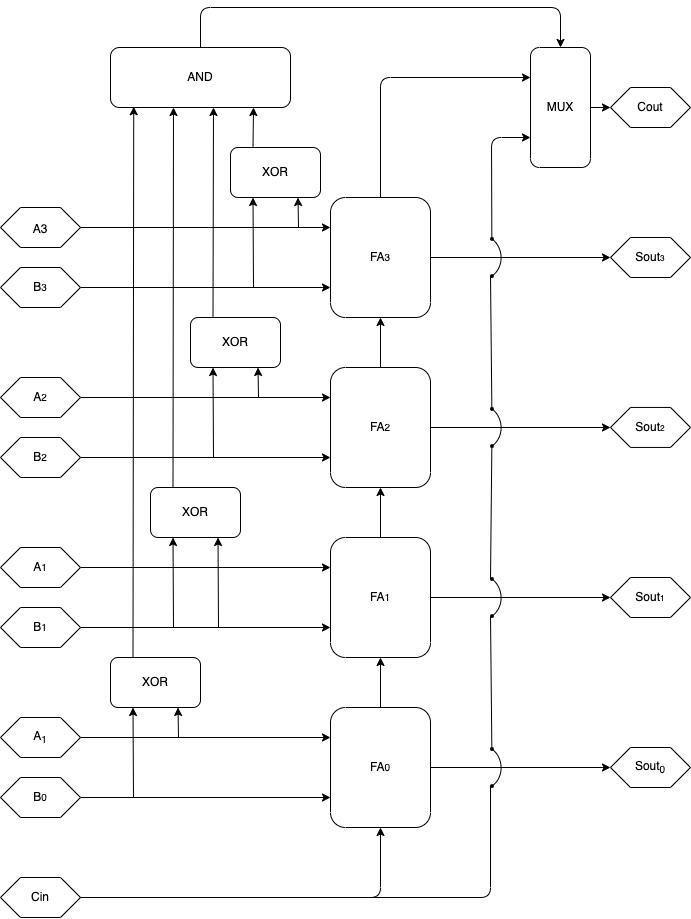

囹A

CBA单元模块的内部实现

(不是唯一的实现方法)

MUX在本模块中的功能：

当AND的输出为1时，输出Cin的信号

当AND的输出为0时，输出FA$_3$的进位输出

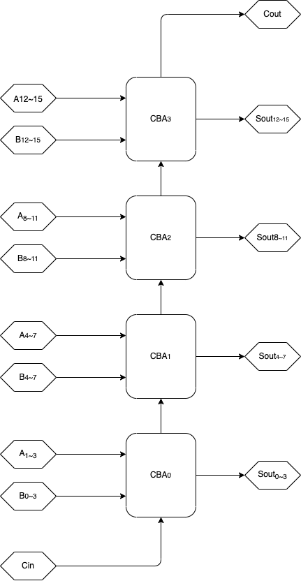

图B

用4个CBA单元模块（定义见图A） 实现的16位加法器

单个CBA单元不一定仅完成4位加法，取决于方案如何设计

进位旁路加法器的例子

CBA 的结构如上图。相较于 RCA 和 CLA，它是一种更为折中的设计，更适合用于位数高一些的加法器的实现。RCA 需要逐位传进位，图 A 中的 CBA 单元内部也是如此。但在 CBA 单元间(如图 B)，CBA 通过旁路让跨位较大的进位跳过了 CBA 模块内 FA 的进位链， 从而大大减少了较坏情况下的进位延迟。

想象一下 64 bits 的加法器，如果是 RCA，那么最低位进位输入到最高位的进位将经过 64 个加法器，但如果是 CBA，则只需要经过 大约64个 CBA 单元(n 是单个 CBA 单元的位宽)。由于进位信号可以直接跨过 CBA 单元内部。CBA 得以在不增加过多元件数的情况下，大大减少了进位延迟。

组成 CBA 的每个单元的位数不一定非得一致，比如可以让第一个 CBA 单元是 5bits 的，第二个却是 3bits 的。
也可以在 CBA 单元内用 CLA 实现 CBA 单元的功能，低位数 CLA 的规模还不是非常大。

还可以在多个 CBA 单元之间添加旁路，让这些 CBA 单元组合变成一个更大的 CBA 单元。这在大位数的情况下可以进一步改善性能。 有关加法器的讨论在此暂告一段落，更多的加法器方案会在将来中讨论。

### 6.3 乘法器

#### 6.3.1 基于加法器的阵列乘法器(Array Multiplier)

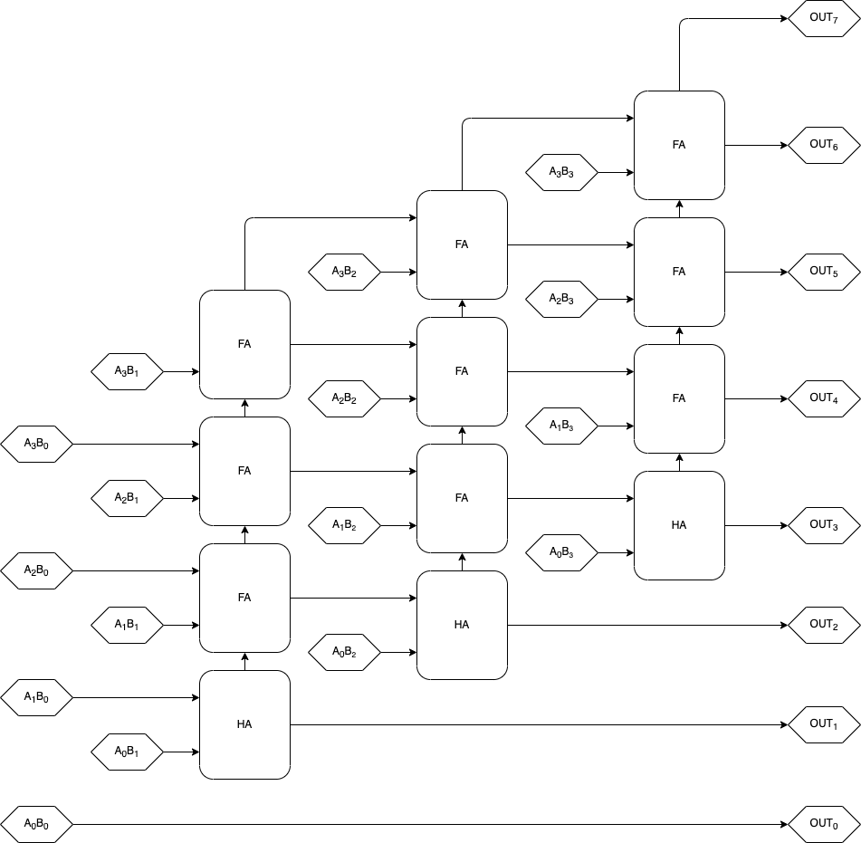

图A

基于加法器(这里用的是逐位进位加法器，可以采用别的加法器实现)

的4bits 乘4bits阵列乘法器。图中的"$A_nB_n$"模块输出的是逻辑表达式"$A_nB_n$"的值，也就是$A_n$和$B_n$的与运算的结果。

(FA是全加器，HA是半加器)

阵列乘法器的例子

请回忆一下二进制乘法竖式的计算过程，这个阵列乘法器的原理跟竖式是一样的。令 $A_n$ 和 $B_n$ 是二进制数 A 和 B 的第 n 位数，n 从 0 开始数，则有:

$w_n = 2^n$

$A \times B=w_0 A B_0+w_1 A B_1+w_2 A B_2+w_3 A B_3+ \dots +w_n A B_n$

你应该还记得 $w_n = 2^n$ 其实就是二进制位权的公式。(这里为了公式的简洁性，n 也是从 0 开始数的)

于是再根据移位运算在不导致溢出情况下的性质$w_n A=2^n A=A \ll n$，就能得到:

$A \times B=(A \ll 0)B_0+(A \ll 1)B_1+(A \ll 2)B_2+(A \ll 3)B_3+ \dots +(A \ll n)B_n$

这样就用更为简单的移位运算代替了部分乘法操作，而 $B_n$ 非 1 即 0，因此:

$(A \ll n)B_n = \begin{cases} \ \ \ \ \ 0, \ \ \ \ \ B_n=0 \\ A \ll n,B_n=1 \end{cases}$

可以用与门来完成这步运算:当 $B_n=0$ 时候，输出 0。$B_n=1$ 时，输出$A \ll n$的值。有关移位，实际上把线路歪一下(第 n 位输出接到第 n+1 位输入)就能实现这个移位运算，就如上图那样。最后再将每个 $(A \ll n)B_n$ 用加法器加起来，就得能到运算结果了。整个过程只用到了移位加法还有与位运算，这就是上图中阵列乘法器的原理。如果你不喜欢公式，记住电路图就行了，这个电路图很规则。

最后一步中用到了 n-1 个 n bit(s)的加法器来完成所有项的求和。求出 n 个数的和的模块可以叫做 n 操作数加法器。(这个 n 就是有多少个被加数的意思)图中的阵列乘法器的做法是将 n-1 个加法器的输入输出串联以求出所有项的合，但 n 操作数加法器除了这种做法以外，还有其他一些性能更好的设计(如基于结合律的)，马上就会讨论。

### 6.3.1.1.基于加法器的阵列乘法器的分析，在运算器中运用交换律

首先将它的公式写出来，我们令 B 是一个 n bits 的二进制数，A 是一个 k bits 的二进制数:

$A \times B=(A \ll 0)B_0+(A \ll 1)B_1+(A \ll 2)B_2+(A \ll 3)B_3+ \dots +(A \ll n)B_n$

我们发现，等式右边的项数是由 B 的位数控制的，也就是说 B 有多少位，右边就有多少个项。如果对应到电路中，那么 B 有 n 位就意味着电路中存在 n-1 个加法器。而 A 的位数 k 则决定了每个加法器是多少位的。

如果 A 和 B 的位数不等，那么我们可以在设计时交换 A 和 B，则有:

$BA=(𝐵 \ll 0)A_0 + (B \ll 1)A_1 + (B \ll 2)A_2 + (B \ll 3)A_3 + \dots + (B \ll n)A_n$

于是情况就变成了 A 的位数决定电路中有多少个加法器，B 的位数决定每个加法器有多少位。所以在 A 和 B 的位数不等时，我们可以选择是否交换乘数与被乘数，以选择降低加法器数量或者降低加法器的位宽(输入端的位数)。交换操作数这种做法在输入位数不对称的运算器中很有用，可能仅仅只是运用了一下运算的交换律，就大大改善了模块的各种指标。

在图 A 中的阵列加法器中，第一个加法器的最低位输入到最后一个加法器的最高位输出这个路径最长，可以被认为是关键路径。当然，如果阵列乘法器用的不是 RCA，那么关键路径可能会有所不同。

### 6.3.2.基于进位保留加法器(CSA，Carry Save Adder)的阵列乘法器

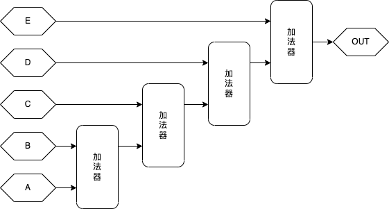

囹A

用4个加法器计算 $OUT=A+B+C+D+E$。

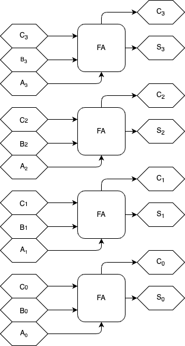

图B

模块“CSA〞(进位保留加法器)的内部结构跟逐位进位加法器很像

但直接把每位的进位输入和输出拉了出来。

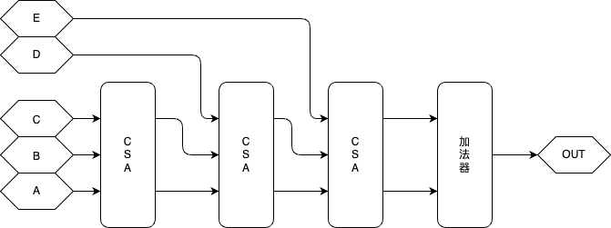

图C

用3个CSA模块(如图B)和一个加法器实现的5操作数加法器。

功能是计算 $OUT=A+B+C+D+E$

请将图C与图A进行对比。

图D

基于逐位进位全加器的4bits乘4bits阵列乘法器

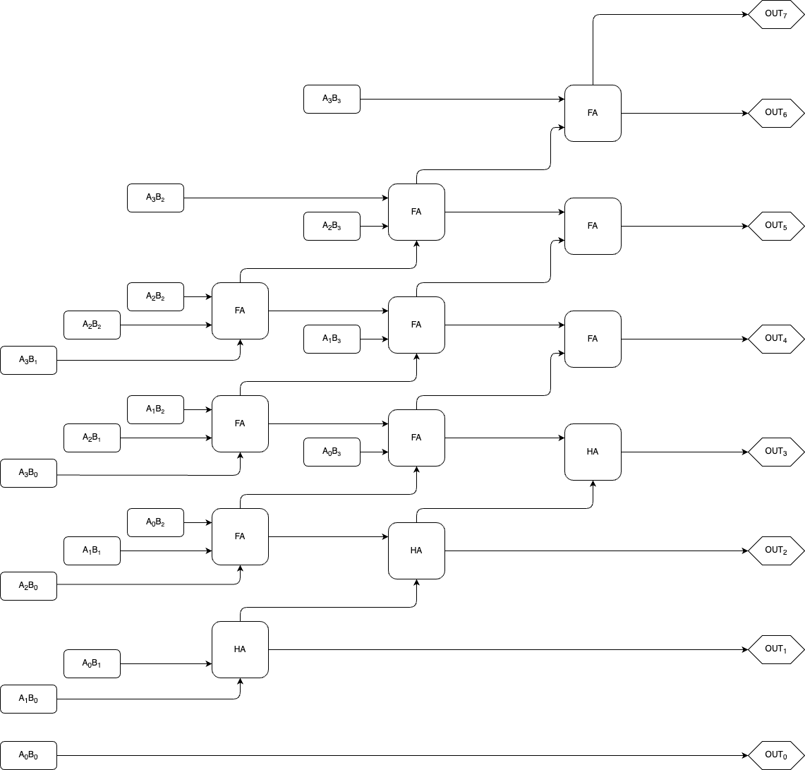

图E

基于进位保留加法器的4bits乘4bits阵列乘法器

基于进位保留的阵列乘法器虽然用的元件跟基于逐位进位全加器的阵列乘法器一样。但却拥有更好的性能。

图A中的乘法器的最长路径是：$A_0 B_1$ 到 $OUT_7$

图B中的乘法器的最长路径也是：$A_0 B_1$ 到 $OUT_7$

但如果稍作分析，就会发现图B的这个路径更短，因为基于进位保留的阵列乘法器只有最后一级的全加器是逐位进位的。

如果考虑更大规模的乘法器（输入位数更大），那么基于进位保留的乘法器会较基于逐位进位的乘法器拥有更大的优势。

* 进位保留加法器与基于进位保留加法器的阵列乘法器，还有作为对比的逐位进位加法器与基于逐位进位加法器的阵列乘法器

    * 如上图 E，基于 CSA 设计的阵列加法器相较于图 D 中的阵列乘法器，在不增加使用元件数的前提下获得了更好的性能。 

    * 如上图 C，CSA 不仅可用于阵列乘法器中，也可用于计算 n 个数的求和。

    * 基于 CSA 的乘法器或 n 操作数加法器的原理涉及到了冗余数表示系统，在将来会做深入的讨论。

### 6.3.3.加法树，在运算器中运用结合律

实数的加法和乘法有结合律:

$A + B + C = (A + B) + C$

$A(BC) = (AB)C$

这意味着:

$A_0 + A_1 + A_2 + A_3 + A_4 + A_5 + \dots = (A_0 + A_1) + (A_2 + A_3) + (A_4 + A_5) + \dots$

就是说如果要求出 K 个数的和，可以用 $\frac{K}{2}$ 个 2 操作数的加法器分别独立计算 $A_i+A_{i+1}$， 经过一轮计算后，K 个变成了 $\frac{K}{2}$ 个数，然后再重复一次这个操作，$\frac{K}{2}$ 个数变成了 $\frac{K}{4}$ 个数...经过不断的求和最终得到了结果。可以看出这种并行求和需要大约计算 $log_2K$ 轮，如果运算器是阵列运算器的话，会用到大量的加法器，但性能上的改善是显著的。

基于这种结合律原理的电路结构叫做加法树。想象一个树的样子!树枝末端是数据输入，在树枝分叉处树枝通过运算结合律将两根 或多根树枝合并为一。最终所有树枝都合并到了最下方的树干上，这个树干就对应着加法器的运算输出。

显然，只要运算满足结合律，就能在其中运用这种树型结构提升性能。加法树在乘法器和加法器等各种运算器中运用广泛。

有关乘法器的讨论也暂告一段落，更多的乘法器方案会在将来讨论。

### 6.4 减法器(SUBTRACTOR)与加减混合器(ADDERSUBTRACTOR)

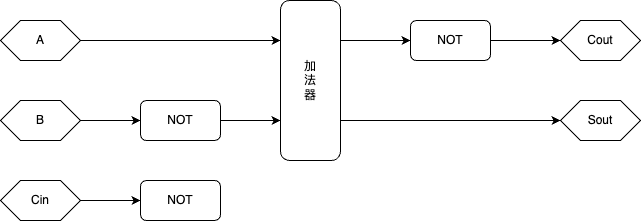

图A

基于加法器的减法器，功能是计算 $A-B$，其中A和B都是无符号数。利用了补码原理和加法器的进位输入。

算法就是先将A和B转为补码，然后利用补码 $A-B=A+(-B)$ 的性质用加法求出 $Sout=A-B=A+(-B)$。

我们知道当 $N_原>0$ 时，$[N]_补=[N]_原$。因为A是正数，所以A不需要经过转换。

因为要计算 $A+(-B)$，所以需要假定B的符号位为1，即B为负，然后按照负原码转补码的方式处理它，也就是取反再+1。

结果输出 $Sout$ 也是补码，所以当结果为负时，如果需要原码表示的结果，需要额外电路将 $Sout$ 转回原码表示。

$Cout$ 是最高位进位，也就是 $[Sout]_补$ 的符号位。我们也可以利用这个符号位来判断A和B的大小。

$A>B$ 时结果为正数，因此 $Sout=1$。 $A<B$ 时候结果为负数，因此 $Sout=0$。

$A=B$ 时, $Sout=0$.

* 基于补码的减法器与加减混合器

如图 A，在数字电路中，利用补码原理就可以用加法器来计算减法。如果将图 A 的每个 $NOT$ 换成异或门，然后用一个控制线接入这个异或门的另一个输入，就可以实现加减混合器，它能控制电路完成 $A+B$ 和 $A-B$ 两种运算。

如果在设计之初就考虑图 A 中减法器的非门，那么可以利用逻辑化简将这些非门和加法器合并到一起，以减少一定的元件数。基于此可以设计出专用的减法器，如果需要可以参考: <https://zhuanlan.zhihu.com/p/112654170>

在数字电路中几乎所有的减法器和加减混合器(也可能没有几乎)都是基于补码原理设计的，所以只要搞懂了补码原理和加法器的做法，你也就搞懂了减法器和加减混合器的做法。

### 6.5 Divider

为了交流方便,以后的文章都会使用英语(其实本来是想维护英、汉两个语言版本的,但作者没有那么多精力和时间)

For the convenience of communication, future articles will be in English (in fact, I originally wanted to maintain English and Chinese language versions, but the author does not have so much energy and time)

### 6.5.1 Restoring Array Divider

Figure A
Flowchart of recovery remainder division algorithm

$A \ge B$
