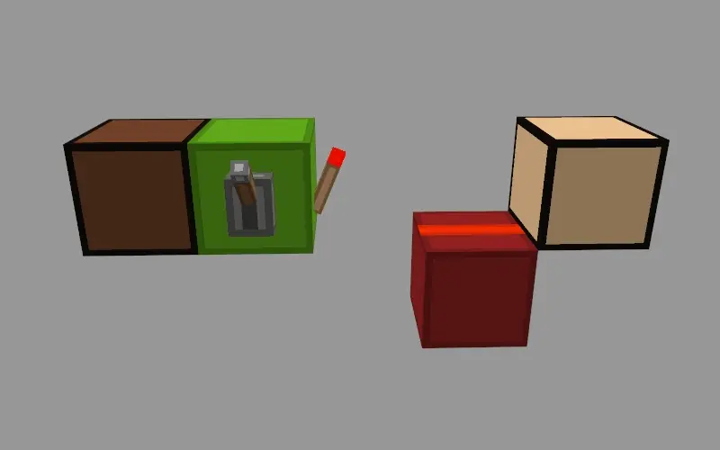
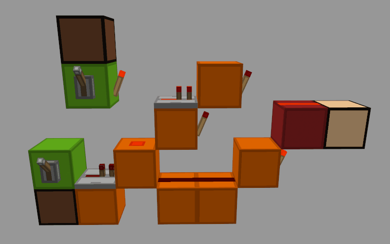

# ♟02丨在MC中的基础逻辑门元件方案

[<Previous](01.md) - [Index](index.md) - [Next>](03.md)

---

下文图中方块各颜色含义

为了方便理解电路,我们今后约定在图中:

绿色方块表示数据输入   红色方块表示数据输出   粉色方块表示触发或控制输入   橙色方块表示电路本体

在描述中,我们约定:用"1"表示红石信号强度非零.(即红石灯能亮)

用"0"表示红石信号强度为零.(即红石灯不能亮)

(可以将这几个约定复制到备忘录📕里,在阅读下文时方便随时对照参考)

## ■ 非门,与门,或门

与,或,非门是3个最基础的逻辑门,下面就分别展示了它们的功能和电路:

非门,输入反转为输入,输入亮则输出灭(或者说有一个输入1,输出0),输入灭则输出亮(或者说有一个输入0,输出1),因此得名"非"门(图见下)

与门,两输入都亮(或者说输入都为1)时才有输出(或者说输出为1).因此得名"与"门(图见下)

或门,只要两输入中有一个亮(或者说有一个输入为1),就会有输出(或者说输出为1).因此得名"或"门(图见下)

• 非门: 输出与输入相反

• 与门: 输入都为亮,时输出才亮

• 或门: 只要有一个输入为亮,输出就会亮

其中或门电路用到了半砖只能单向传递信号的性质防止了信号的回流.
这是一个非常有用的性质,因为它没有延迟(如果用中继器防止了信号回流,那将有延迟)

## ■ 异或门,同或门

异或,同或门比与,或,非门稍复杂一些,它们的功能和电路如下:

异或门,两输入不同时输出亮起(或者说两输入不同时输出为1).因此得名"异"或门(图见下)

同或门,两输入相同时输出亮起(或者说两输入相同时输出为1),因此得名"同"或门(图见下)

• 异或门: 仅两个输入中仅有一个亮起时,输出才会亮

• 同或门: 仅两个输入中仅有一个亮起时,输出才不亮

也可以这样把同或门变成异或门:用红石火把(或者说非门)反转异或门的输出就能把异或门变成同或门

▶附页补充了其它逻辑门设计◀

## ■ 用逻辑门设计电路

现在让我们来用逻辑门做简易几个电路,以熟悉它的使用

• 例: 三控开关

描述:用3个开关同时控制一个灯,相当于一个3输入的异或门(图见下)

注:

1. 本三控开关如图,其实就是2个异或门连起来了

2. 本三控开关可延伸至加法器

• 例: 1010判断器

描述:当电路输入为1010时候,输出为1,否则为0(图见下)

注:

1. 本1010判断器在红石数字电路上没有用处

• 例: 数据选择器

描述:这个数据选择器有A和B共2个数据输入和1个数据选择.
当数据选择为1时,这个电路将输出A,否则输出B(图见下)

注:

1. 为了能看清内部电路细节,粉色输入相连的线上用了一些透明方块,实际上它们是屏障方块.
可以替换为普通实心方块(数据选择器)

2. 本数据选择器可延伸至解析器(如下图)

---

[<Previous](01.md) - [Index](index.md) - [Next>](03.md)
