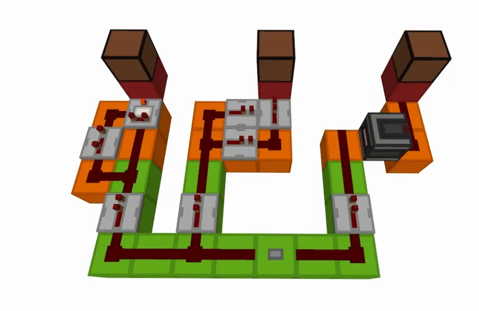
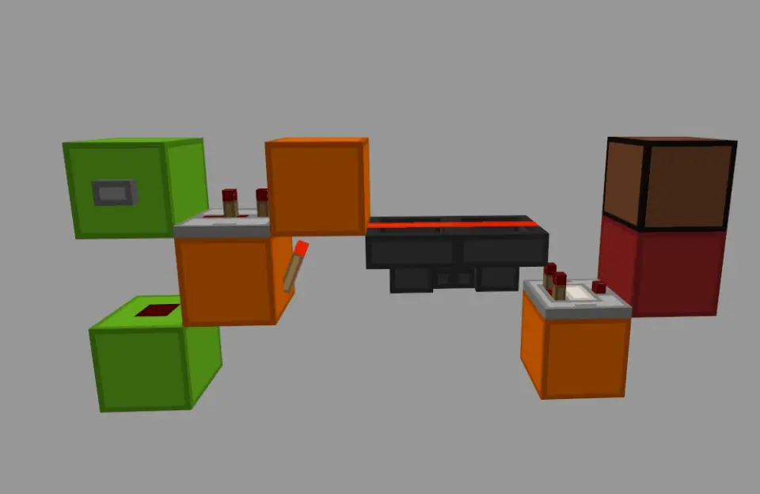
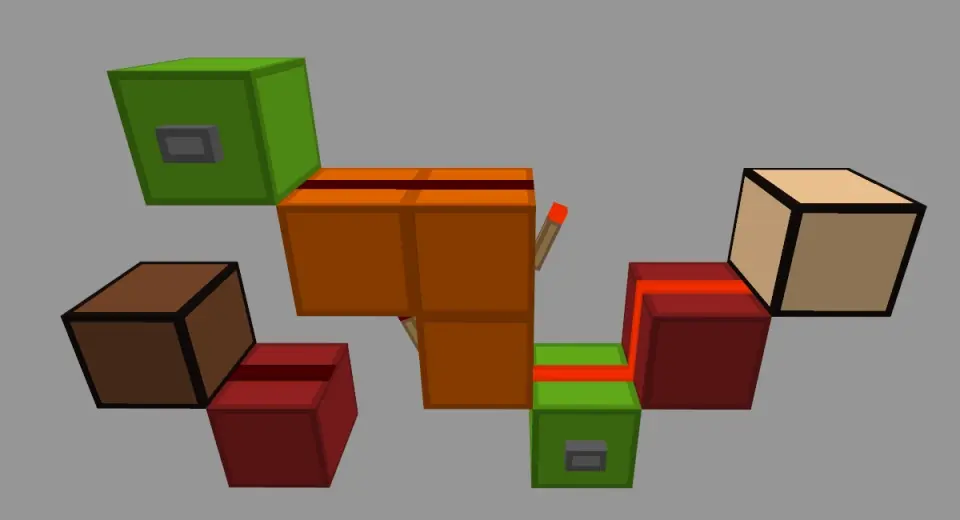
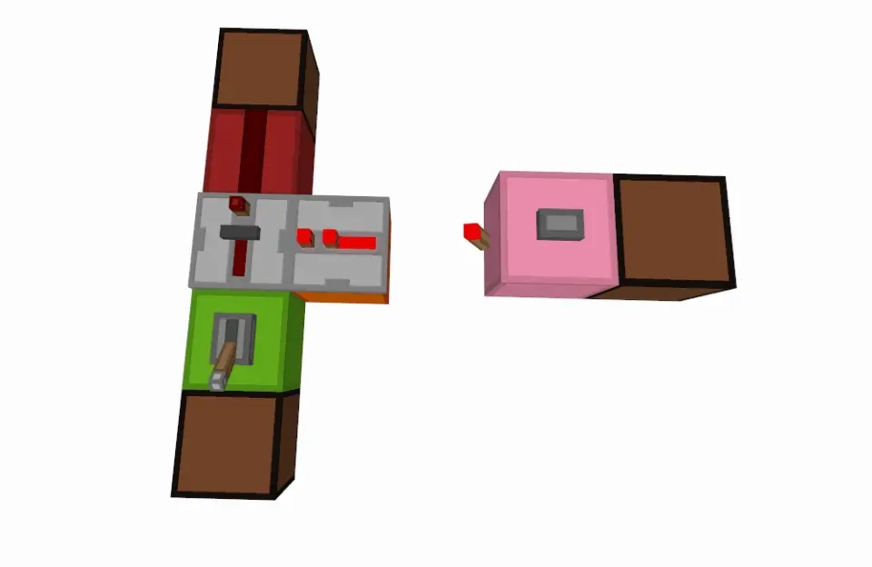

# ♟03丨在Minecraft中的基础触发器与锁存器元件方案

[<Previous](02.md) - [Index](index.md) - [Next>](04.md)

---

如果说逻辑门主要是用来实现经典逻辑的,那么触发器与锁存器就是主要用来实现时态逻辑的

• 触发器和锁存器与逻辑门的区别

对于单个逻辑门,其输出完全取决于当下的输入,而不取决于曾经的输入

但对于触发器和锁存器,其输出不仅取决于输入,还取决于其内部的状态.
触发器和锁存器可以存储状态

过去的输入会改变触发器和锁存器的内部状态,而触发器和锁存器的输出会被内部状态影响(一般就是直接根据它的内部状态产生输出)

所以对于触发器和锁存器,以前的输入会影响到现在的输出,由此沟通了过去,现在,未来

## ■ 触发方式

我们先来讨论边沿触发方式,边沿触发分别为:上升沿触发,下降沿触发,双边沿触发

上升沿和下降沿分别对应信号变化的两个相反的过程:

• 上升沿: 信号从"0"变为"1"的过程

• 下降沿: 信号从"1"变为"0"的过程

• 双边沿: 上升沿和下降沿的统称

直观的例子如下图:

如上图边沿触发的例子,左边是上升沿触发,中间是下降沿触发,右边是双边沿触发.
观察者方块能直接实现双边沿检测,是非常有用的方块

如果按下按钮的瞬间,红石灯闪一下,就说这个红石灯是上升沿触发的

如果按钮按下后,按钮回弹的瞬间,红石灯才闪,就说这个红石灯是下降沿触发的

如果按下瞬间,回弹瞬间都会闪一下,就说这个红石灯是双边沿触发的

除了边沿触发方式还有别的触发方式,在这里一起总结它们:

• 边沿触发方式: 在信号跳变的一瞬间触发

• 电平触发方式: 在信号为"1"的时间内,电路保持触发,为"0"时保持不触发.
这叫高电平触发(这句话的"1"和"0"互换后同样也可以成立,叫低电平触发)

• 其它触发方式: 当然也可以有其它触发方式,只要电路需要某种其它的触发方式.
但这些其它触发方式可能相对特殊,运用不广.
只需要在用某个元件时能明白它的触发方式就行了!

## ■ T触发器
T触发器能实现按钮变拉杆的效果(按一下亮,再按一下灭),它的作用如下图: 

如上图T触发器,按一下翻转一下.
图中方案没有使用到活塞瞬推特性(属于能正常在现实中复制的机器),因此在BE和JE通用.
两个漏斗间有一个漏斗里有物品,按下按钮会让这个物品传到对面那个漏斗

• 这个T触发器涉及的红石特性

这个T触发器用到了漏斗的一个特性:漏斗被充能时会锁住里面的物品而不漏出去

所以左边输入让漏斗上方的红石线就会突然熄灭一下,然后漏斗解锁一下,把物品传到对面,然后马上又被锁住了.
在游戏里试试就知道是什么情况了

• 这个T触发器的功能

T触发器有"1","0"两种状态,我们根据这个电路输出的判断T触发器状态.
输出"1"就说明处于状态"1",输出"1"说明处于状态"0".
按下按钮则会让T触发器状态翻转

翻转的意思就是状态在"1"和"0"之间翻转,比如,当前状态为"1",翻转一下就成"0"了,反之亦然

习惯上,图里T触发器的绿色按钮对应的输入被称为"时钟端"之所以叫时钟端,因为在现实中它经常被连到时钟电路上

本来T触发器还应该有一个"T端",T端为0时,时钟端触发不能翻转内部状态.
为1时,时钟端触发才能翻转内部状态.但为了优化体积,删去了.
或者说有个隐含的,永远为1的T端

• 以这个T触发器为例讨论触发器触发方式

T触发器可以有"上升沿T触发器"和"下降沿T触发器"两种子类型

从名字我们就知道它们分别采用了上,下边沿触发的触发方式.
"上升沿T触发器"在时钟端上升沿触发,"下降沿T触发器"在时钟端下降沿触发

从动图可以看出,图中的红石T触发器属于"上升沿T触发器"

• 触发器和锁存器的触发方式之分

触发器和锁存器的触发有触发方式之分,可能是上升沿,下降沿,双边沿触发.
或者是电平触发等其它触发方式.
等下我们要介绍的D锁存器就属于电平触发方式

在下节会详细讨论触发器和锁存器两者之间的区别,有很多人混淆二者!

一般来说,触发器都是边沿触发,锁存器都是电平触发

我们也可以通过调整电路结构可以改变电路的触发方式.
在实践中请自行考虑

## ■ RS锁存器

RS锁存器如下图:

RS锁存器有两个按钮输入,按下可让RS锁存器进入对应状态.
RS锁存器有两个输出,分别叫"正逻辑输出"和"负逻辑输出",一般我们只使用两个输出中的一个

• 这个RS锁存器涉及的红石特性

这个RS锁存器其实就是两个首尾相接的红石火把.
事实上,在MC里只要把两个非门元件首尾相接起来,就可以做一个RS锁存器

在现实电路中就不能直接用两个非门首尾相接了!因为现实中不能随意支持所谓的"线或",这个话题后文会进行讨论

并且同时,在两个非门(图中是红石火把)那里放输入按钮,这样按一下就可以转换RS锁存器的状态.
然后再把两个非门的输出拉出来,就得到了电路的输出,就像图中那样

• 这个RS锁存器的功能

RS锁存器本身可能处于"1"或者"0"两种状态之一.
按下两输入端上的按钮可以改变RS触发器的状态.
两按钮中的一个按钮能把RS锁存器状态重置为"1",另一个则相反,重置为"0"

输出端输出了RS锁存器的状态,图中的RS锁存器有两个输出,我们一般只使用其中一个,因为很显然其中一个输出为"1"时,另一个输出必为"0"

所以只需要给其中一个输出加一个非门反转,就能得到另一个输出的值

习惯上,图中两个绿色按钮输入分别可以称为"R端"和"S端".
能分别将RS锁存器状态设置为"0"和"1"

• 正逻辑和负逻辑

图中的RS锁存器有两个输出,它们分别是"正逻辑输出"和"负逻辑输出".
顾名思义,它们是相反的,一般来说我们只会用到其中的一个

如果内部状态为"1",却输出"0",而状态为"0"时输出"1".
就说这个输出是负逻辑的

反之,如果状态为"1"输出"1",状态为"0"时候输出"0".
就说这个输出是正逻辑的

总之正,负逻辑是相反的.
有时电路元件会同时提供正,负逻辑两种输出

也正因为正,负逻辑是相反的,所以正逻辑输出加一个非门就能得到负逻辑输出,负逻辑输出同理.
它们之间可以相互推导得出,因此一般只需要两者之一,通常用正逻辑,有时用负逻辑

正,负逻辑也不一定就体现在输出上,一些电路输入也会标注是正逻辑或者负逻辑的,如果某个电路输入是负逻辑的,那就相当于这个输入被取反了.
就相当于加了个非门

## ■ D锁存器

D锁存器如下图:

电平触发的D锁存器,在MC中可以利用中继器的锁存态制造出又小又快的D触发器

• 这个D锁存器涉及的红石特性

这个方案用到了中继器锁存态的特性.
如果你看到中继器上面多出了一个奇怪的小棒子,就说明这个中继器处于锁存态,这个中继器的信号被"锁住了"

当中继器被另一个中继器或者比较器在侧面充能时候,他会进入锁存态并保持住自己的状态(亮或者灭),并且忽略输入端的输入,在游戏里试试就知道是什么情况了

• 这个D锁存器的功能

D锁存器也有"1","0"两状态,我们也同样直接根据输出判断它的状态是什么

按下图中的按钮后,D锁存器的状态会被更新到输入.
比如说,如果现在输入是"1",按一下按钮,锁存器状态就变成"1"了,如果输入是"0",按下按钮,锁存器状态就会变成"0"

也就是说,按下那个按钮,D锁存器的状态就会更新为输入的值

图中绿色的拉杆输入习惯上被叫做"D端"

• 以这个D锁存器为例讨论电平触发

先把前文中电平触发的定义搬下来,方便你懒得翻来翻去:

• 电平触发方式: 
在信号为"1"的时间内,电路保持触发,为"0"时保持不触发.
这叫高电平触发.
(这句话的"1"和"0"互换后同样也可以成立,叫低电平触发)

那么我们就来结合实例讨论电平触发

图中的D锁存器就是"电平触发"的.
因为在粉输入端"持续输入1"时,图中的中继器被"解锁"了.
此时它变回了普通的中继器,是亮是灭全取决于输入.
也就是说处于"保持触发"中

而当粉输入端恢复到"持续输入0"时,中继器又进入了锁存态,于是内部状态被锁住了,也就是说处于"保持不触发"中.
这就是电平触发方式

如果说边沿触发检测的是信号改变的一瞬间,那么电平触发就是直接检测信号是什么,为"1"时该做什么,为"0"时该做什么

电平触存在一些缺点,所以在现实中的设计时常会避免使用电平触发方式.
但在Minecraft中我们一般可以忽略

▶附页补充了其它触发器设计◀

## ■ 用触发器和锁存器设计电路

• 例: 4位暂存器

描述:用D锁存器设计一个4位的暂存器,电路会输入4个1或0.要求按下控制输入端按钮时,电路能将内部的存储数据更新为电路的输入.
且能输出内部的存储数据

4位暂存器,其实就是4位"二进制"暂存器,竖着布线的

• 例: 1010时序脉冲发生器

现在我们来做一个"1010时序脉冲发生器",它的功能就是循环输出1,0,1,0,1,0...

描述:电路会提供一个按钮输入,按一下输出1,再按一下输出0,再按一下输出1,以此类推

1010节拍发生器,没错它就是一个T触发器

我们发现T触发器刚好可以直接实现这个功能,所以就直接用T触发器了

---

[<Previous](02.md) - [Index](index.md) - [Next>](04.md)