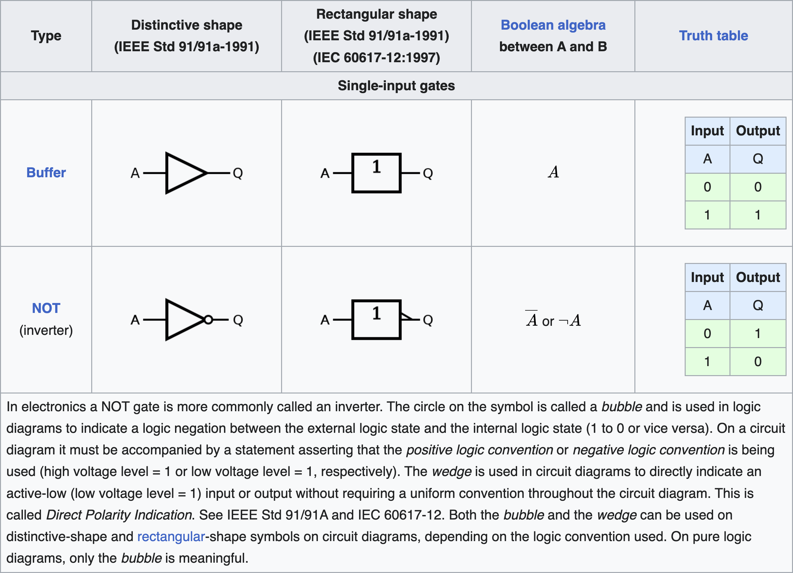
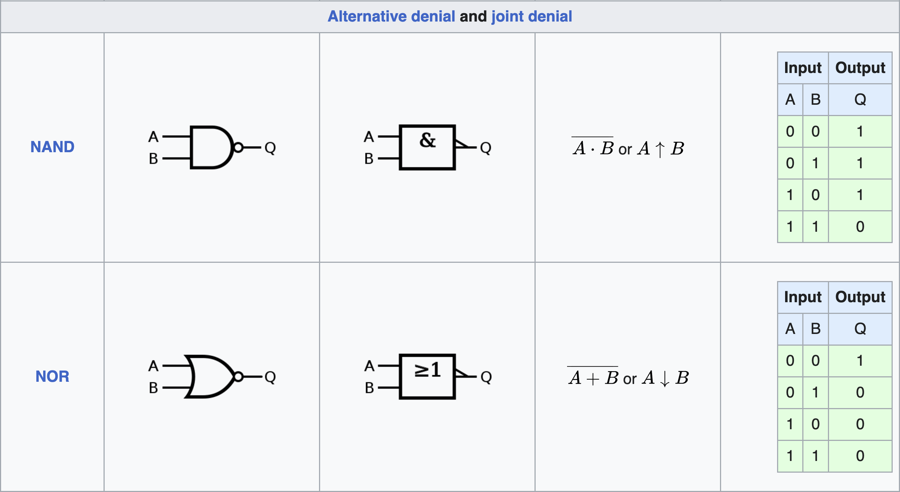

# ♟04丨电路符号,模块化

[<Previous](03.md) - [Index](index.md) - [Next>](05.md)

---

电路符号是实际电路的抽象符号,为了方便我们设计电路,我们一般需要绘制所谓的"电路图",以抽象符号的形式表示电路的结构

对于较复杂的电路设计,几乎不可能离开电路图(HDL除外!)的帮助,电路图还能导入到某些软件进行仿真测试,为我们的设计检测错误以及优化

下图就是一个电路图的例子,它的功能就是曾经给过的例子"三控开关"

逻辑电路图,左边的方块表示输入,右边的圆圈表示输出,中间的符号意思其实是异或门,我们马上就会了解到

为了理解电路图的含义,我们就要搞懂这些电路符号的意思

## ■ 逻辑门符号

(上图源至<https://en.wikipedia.org/wiki/Logic_gate>强烈推荐👀原文,因为我只转载了符号部分,原文更全面)

## ■ 触发器符号

我只讲最简单的图(其他都可以以此类推,暂且相信各位得很聪明🤪),因为我懒得转载(实在是太多了),追求完美的请👀<https://en.wikipedia.org/wiki/Logic_gate>

一些触发器符号,JK触发器我们用不到不用了解.
左边的方块是输入,右边的圆圈是输出.触发器下面3根线我们也不用管,用不到.(符号来自"Logisim"内置库)

可以发现这些现实触发器符号的输入输出跟我们之前讲的不太一样,比我们的红石元件多出了一些其它的输入输出.
红石元件不提供完整的输入输出,主要是为了优化体积速度

跟逻辑门符号一样,触发器同样也有不同的符号标准,根据自己的习惯以其中一套为主就行

• 锁存器与触发器的区别(上)

之前介绍的是RS锁存器和D锁存器,图里却变成了触发器,这是为什么呢?

其实锁存器和触发器完全是两个东西,但在Minecraft中我们很少区分

这就涉及到锁存器和触发器的区别.
很明显,我们之前介绍的RS锁存器没有时钟端,但是图里这个RS触发器有.
有无时钟端,这就是锁存器与触发器的最大区别

我们先了解图中这些触发器的功能,再继续讨论这个问题

• 图中触发器的功能

现在我们来看看,当图里这些触发器的时钟端触发时,会怎么样:

时钟端触发,就比如举例来说,假设时钟端是"上升沿触发"的,那当时钟端信号"由0变1"时,这个触发器就会被触发.
如果把这个例子中的"上升沿触发"换成下降沿触发等,"由0变1"换成"由1变0"等,也同理!以此推广.

1. 对于图中T触发器,时钟端触发时:

   如果触发器的T端为1则翻转触发器状态,为0则不翻转

2. 对于图中RS触发器,时钟端触发时:

   如果R端为1,则置触发器状态为0,S端为1则置为1.
   如果触发时R,S两个端口同时为1或者同时为0,则触发器状态保持不变

3. 对于图中D触发器,时钟端触发时:

   触发器内部状态将更新为D端输入的值.
   D为1就置为1,为0就置为0

总之,当时钟端改变信号时,如果触发方式的触发条件符合,那么在触发的一瞬间,触发器就会根据其输入端(D,T,R,S,J,K这些输入端)的值来改变触发器的内部状态

因此,这些触发器都是提供一个边沿触发的"时钟端"来控制电路的

• 锁存器与触发器的区别(下)

现在你知道触发器的功能了,也知道它们有所谓的"时钟端",并且仅在"时钟端"信号改变的一瞬间工作(边沿触发方式)

拿之前的红石D锁存器做对比,D锁存器是电平触发的,它在控制端信号为"1"的整个周期里,都是一直保持触发

而图中的D触发器,仅仅在"时钟端"信号改变的一瞬间触发

通俗来讲:

触发器的触发机制只关注信号改变的一瞬间(边沿触发方式)

锁存器的触发机制关注信号是"1"还是"0"(电平触发方式)

我不提供锁存器的符号(其实是没找到),但是感兴趣可以自己找

• 为什么叫时钟端

之所以叫时钟端,因为在现实中它通常会连接到一个时钟,每隔一段时间时钟会改变一次信号,然后信号改变被触发器捕捉.
这样的话,统一时钟就能让电路同步到一个固定的节拍上

• 为什么红石元件跟图里不太一样,少了这么多输入输出?

在MC中,由于红石电路的限制,且为了让电路体积和性能更加优越,我们通常不会提供相当完整的输入输出端口,而是进行取舍,删去部分用不到的输入输出

实际上红石触发器和锁存器很少有功能完整的

比如在输出上仅提供正负逻辑输出两者其中之一.
因为一般只需要用到一个输出

或者仅提供时钟端,就比如之前的红石T触发器

或者调整触发方式,就如之前的D锁存器,简化自D触发器

在MC中,只要不影响你需要的功能,怎么改都可以.
不应该让死板的术语定义限制自己的灵感.
但也不能过于脱离实际,至少最终产生的概念还是应该用标准化术语来进行描述

要注意到你的最终目标是效果与最终成品,而不是某个细节的吹毛求疵.
过分遵循某些严格的"规定",术语的"概念"只会限制设计的自由度

## ■ 模块化

实际设计中经常会重复用到一些电路结构,这时候我们就可以把它们封装为"模块"

所谓模块化,就是用一个自定义的新符号抽象表示某个电路结构,如下图:

将左边的电路封装成右边的那个"模块"后,看起来就舒服多了.
这样进行重复的复制粘贴时就只需要复制粘贴右边的那个模块.
而无需关注模块内部的电路细节.
通常会有很多别人事先做好的,预先封装的模块给你直接用.
这时候就只需要了解模块功能,而无需关注内部电路的设计细节(尽管一般也不会给你看)

将电路封装为"模块"以后,我们在需要用到这个电路的时候就能直接使用这个模块,而无需重复再将这个电路设计一遍.
从而大大减少工作量,并且让电路图可读性大大提升

• MC中的模块化(其实就是复制粘贴)

在MC里,我们可以借助/clone之类的指令,或者插件模组还有第三方工具帮我们像这样快速复制粘贴电路,被复制的样本姑且称为模块,我在下节就会介绍一些这样的好文明

要注意的是,MC并没有真正的"封装",因为红石电路粘贴出来后,电路内部是完全暴露的,可以随便修改电路

这也不是什么坏事,实际上,我们经常会直接修改粘贴出来的模块,让它跟周围的电路更适配.
MC不能自动接线和生成布局,连电路间的接线都需要一根根手动接好

细小的优化会消耗大量的宝贵时间,所以最好还是妥当安排好设计流程的时间表,把时间花在最值得优化的部分,防止电路做不完(如果是有组织的大团队,就当我没说🤪)

---

[<Previous](03.md) - [Index](index.md) - [Next>](05.md)